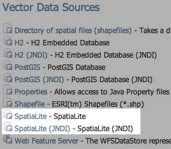

.. _community_spatialite:

SpatiaLite
==========

`SpatiaLite <http://http://www.gaia-gis.it/spatialite/>`_ is the spatial 
extension of the popular `SQLite <http://www.sqlite.org>`_ embedded relational 
database.

.. note:: GeoServer does not come built-in with support for SpatiaLite; it must be installed through an extension. Furthermore it requires that additional native libraries be available on the system. Proceed to :ref:`spatialite_install` for installation details.

SpatiaLite version
------------------

The GeoServer SpatiaLite extension includes its own versions of SQLite (3.7.2) and SpatiaLite (2.4.0) and 
therefore these libraries need not be installed on the system in order to use the extension. However this 
internal version of SpatiaLite is compiled against the `PROJ <proj.osgeo.org>`_ and 
`GEOS <http://geos.osgeo.org>`_   libraries so they must be installed on the system in order for the 
extension to function. See :ref:`nativelibs` for more details.

Supported platforms
-------------------

This extension is supported for Windows, Linux, and Mac OS X. Both 32-bit and 64-bit platforms are supported.
For Mac OS X only Intel based machines are supported (ie. not PowerPC).
 
 .. _spatialite_install:

Installing the SpatiaLite extension
-----------------------------------

#. Download the SpatiaLite extension from the `nightly GeoServer community module builds <https://build.geoserver.org/geoserver/master/community-latest/>`_.

   .. warning:: Make sure to match the version of the extension to the version of the GeoServer instance.

#. Extract the contents of the archive into the ``WEB-INF/lib`` directory of the GeoServer installation.

#. Ensure the native library dependencies are satisfied.

.. _nativelibs:

Native Libraries
----------------

The version of SpatiaLite included in the extension is compiled against the 
`GEOS <http://geos.osgeo.org>`_ and `PROJ <proj.osgeo.org>`_ libraries so they 
must be installed on the system. If the libraries are not installed on the 
system the extension will not functionand remain disabled.

.. note::

   Pre-compiled libraries are available for the following platforms and can be 
   found `here <http://docs.geotools.org/latest/userguide/library/jdbc/spatialite.html#native-libraries>`_.

In general if the libraries are installed in a "default" location then they 
should be picked up by java with no problem. However some systems will require
further configuration that differs based on operating system.

Windows
^^^^^^^

The DLL's must be copied into the ``C:\WINDOWS\system32`` directory.

Linux
^^^^^

If the libraries are not installed in a default search location like ``/usr/lib`` 
then the ``LD_LIBRARY_PATH`` environment variable must be set and visible to Java.

Mac OS X
^^^^^^^^

Same as Linux except that the ``DYLD_LIBRARY_PATH`` environment variable is used.

Adding a SpatiaLite database
----------------------------

Once the extension is properly installed ``SpatiaLite`` will show up as an option when creating a new data store.

   *SpatiaLite in the list of vector data sources*

Configuring a SpatiaLite data store
-----------------------------------

.. figure:: images/spatialiteconfigure.jpg
   :align: center

   *Configuring a SpatiaLite data store*

.. list-table::
   :widths: 20 80

   * - ``database``
     - The name of the database to connect to. See :ref:`notes <database_notes>` below.
   * - ``schema``
     - The database schema to access tables from. Optional.
   * - ``user``
     - The name of the user to connect to the database as. Optional.
   * - ``password``     
     - The password to use when connecting to the database. Optional, leave blank for no password.
   * - ``max connections``
 
       ``min connections``

     - Connection pool configuration parameters. See the :ref:`connection_pooling` section for details.

.. _database_notes:

The *database* parameter may be specified as an absolute path or a relative one.
When specified as a relative path the database will created in the 
``spatialite`` directory, located directly under the root of the GeoServer data
directory.
