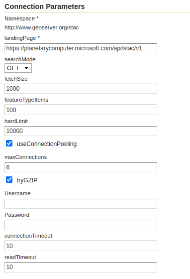

.. _stac_data_store:

STAC data store
=================

Configuring a Store 
-------------------

In addition to the parameters common to each ``DataStore`` configuration such as ``workspace``, ``name`` and ``description``, and the common HTTP connector parameters, such as connection pooling, using GZIP, user name and password, the page shows the following connection parameters in the dedicated section:

* ``landingPage``: this should point to the landing page of the target STAC API

* ``fetchSize``: how many items the store will try to fetch per page. The actual number is in control of the server, the store will simply try to suggest this value. 

* ``featureTypeItems``: how many items to read in order to guess the structure of the feature type (GeoServer in general needs a predictable structure)

* ``hardLimit``: maximum amount of items to fetch from the STAC store, in any request (it's a good idea to pose a limit, as many STAC APIs host millions of items, and the data transfer is not particularly efficient due to the large size of items, and the paged transfer)

   STAC datastore configuration

STAC items are multi-temporal, so it's advisable to configure the time dimension when setting
up the layer, using the ``datetime`` attribute. This will allow time navigation and reduce the
number of items returned to a more manageable subset:

.. figure:: images/time-vector.png

   Setting up time for the layers

Mosaicking images from a STAC store
-----------------------------------

STAC items may point to actual image files among its "assets" data structure. Assets are a top
level object, not part of the Feature properties, that the store makes available to the image mosaic
for image mosaicking purposes. The images in question must be Cloud Optimized GeoTIFFs and the
COG plugin must be installed in GeoServer.

The STAC store can then be used as the index of an image mosaic, setting up two configuration files:

* A ``datastore.properties`` pointing at the configured STAC server.
* A ``indexer.properties`` indicating the collection to use, setup for the COG usage, and the location of the asset providing the images.

Simple mosaic setup
~~~~~~~~~~~~~~~~~~~

Here is an example ``datastore.properties``, pointing at an existing STAC store already configured in GeoServer::

    StoreName=stac\:dlr-eoc
    
And here is an ``indexer.properties``::

    MosaicCRS=EPSG\:4326
    TimeAttribute=datetime
    AbsolutePath=true
    Name=WSF_2019
    Cog=true
    Heterogeneous=true
    HeterogeneousCRS=false
    TypeName=WSF_2019
    UseExistingSchema=true
    LocationAttribute=assets/wsf2019/href
    MaxInitTiles=10

Notes about the file contents:

* The time dimension is set up and linked to the ``datetime`` attribute
* The mosaic is setup to allow heterogeneous resolution images, but in this particular case, assumes that all images are in the same CRS.
* The ``TypeName`` property points to the target STAC collection.
* The ``LocationAttribute`` uses a JSONPointer to the desired asset URL.
* ``MaxInitTiles`` is configured so that the image mosaic does not try to scan the entire index to figure out
  a common image structure, only the first 10 items returned by the STAC API will be used for auto-configuration.

Multi-band mosaic setup
~~~~~~~~~~~~~~~~~~~~~~~

It's also possible to mosaic images whose bands are offered as separate images and in different
coordinate reference systems, with a more complex setup. Here is an example for a false color
Sentinel 2 mosaic, using a coverage view to merge the images back into a single RGB composite.

The ``datastore.properties`` configures two new properties, enabling query caching (as the coverage
view machinery will load each band in turn, repeating the same queries)::

    StoreName=stac\:dlr-loose
    QueryCacheMaxAge=10000
    QueryCacheMaxFeatures=1000

The indexer must instead be provided in XML format, to configure multiple coverage and their 
attributes:

   .. code-block:: xml

        <?xml version="1.0" encoding="UTF-8" standalone="yes"?>
        <Indexer>
          <domains>
             <domain name="time">
               <attributes><attribute>datetime</attribute></attributes>
             </domain>
             <domain name="crs">
               <attributes><attribute>proj:epsg</attribute></attributes>
             </domain>
          </domains>
          <coverages>
            <coverage>
              <name>B04</name>
              <domains>
                <domain ref="time" />
                <domain ref="crs" />
              </domains>
              <parameters>
                  <parameter name="LocationAttribute" value="assets/B04/href" />
              </parameters>
            </coverage>
            <coverage>
              <name>B03</name>
              <domains>
                <domain ref="time" />
                <domain ref="crs" />
              </domains>
              <parameters>
                  <parameter name="LocationAttribute" value="assets/B03/href" />
              </parameters>
            </coverage>
            <coverage>
              <name>B02</name>
              <domains>
                <domain ref="time" />
                <domain ref="crs" />
              </domains>
              <parameters>
                  <parameter name="LocationAttribute" value="assets/B02/href" />
              </parameters>
            </coverage>
          </coverages>
          <parameters>
              <parameter name="MosaicCRS" value="EPSG:4326" />
              <parameter name="AbsolutePath" value="true" />
              <parameter name="Cog" value="true" />
              <parameter name="Heterogeneous" value="true" />
              <parameter name="HeterogeneousCRS" value="true" />
              <parameter name="UseExistingSchema" value="true" />
              <parameter name="TypeName" value="S2_L2A_MSI_COG" />
              <parameter name="MaxInitTiles" value="10"/>
          </parameters>
        </Indexer>

Some notes about the configuration:

* The time and crs attributes are declared as dimensions.
* Each coverage has a different ``LocationAttribute`` specification.
* The mosaic heterogeneous CRS support is enabled.

Once the mosaic is configured in GeoServer, create a new coverage view setting up the bands
according to the desired order:

.. figure:: images/coverage-view.png

   Creating a coverage view from a multi-band mosaic

Also remember to configure the time dimension for this layer, for the same reasons explained
in the vector data section above.