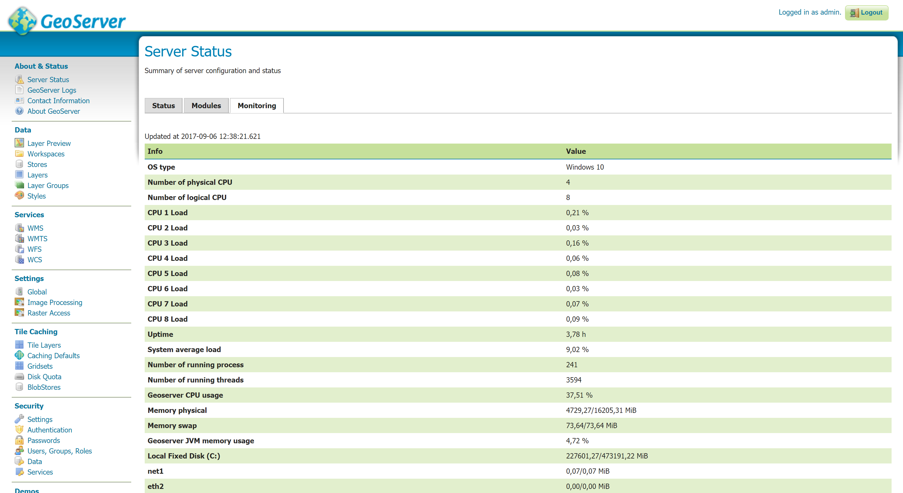

.. _status_monitoring_plugin:

Status Monitoring 
=================

The status monitoring module add some extra information about the system in the GeoServer status page in a new tab named ``Monitoring``
and make that info queryable through GeoServer REST interface. This info should allow an administrator to get a quick understanding about the status of the GeoServer instance. 

`Library OSHI <https://github.com/oshi/oshi/>`_ is used to retrieving system-level information without depending on native libraries or DLLs, relying solely on `Apache JNA <https://github.com/java-native-access/jna/>`_. Major operating systems (Linux, Windows and MacOX) are supported out of the box.

The available system information is:

.. list-table::
   :widths: 30 20 50

   * - **Info**
     - **Example**
     - **Description**
   * - Operating system
     - Linux Mint 18
     - Name of the operating system and the used version
   * - Uptime
     - 08:34:50
     - Up time of the system
   * - System average load 1 minute
     - 0.90
     - System average load for the last minute
   * - System average load 5 minutes
     - 1.12
     - System average load for the last five minute
   * - System average load 15 minute
     - 0.68
     - System average load for the last fifteen minute
   * - Number of physical CPUs
     - 4
     - Number of physical CPUs / cores available
   * - Number of logical CPUs
     - 8
     - Number of logical CPUs / cores available
   * - Number of running process
     - 316
     - Total number of process running in the system
   * - Number of running threads
     - 1094
     - Total number of threads running in the system
   * - CPU load average
     - 4.12 %
     - Average load of the CPU in the last second
   * - CPU * load
     - 11.43 %
     - Load of a specific core in the last second
   * - Used physical memory
     - 31.58 %
     - Percentage of the system memory used
   * - Total physical memory
     - 31.4 GiB
     - System total memory
   * - Free physical memory
     - 21.4 GiB
     - System memory available for use
   * - Used swap memory
     - 0.00%
     - Percentage of swap memory used
   * - Total swap memory
     - 32.0 GiB
     - System total swap memory
   * - Free swap memory
     - 32.0 GiB
     - Free swap memory
   * - File system usage
     - 65.47 %
     - File system usage taking in account all partitions
   * - Partition * used space
     - 54.8 %
     - Percentage of space used in a specific partition
   * - Partition * total space
     - 338.9 GiB
     - Total space of a specific partition
   * - Partition * free space
     - 117.0 GiB
     - Free space on a specific partition
   * - Network interfaces send
     - 42.0 MiB
     - Data send through all the available network interfaces
   * - Network interfaces received
     - 700.4 MiB
     - Data received through all the available network interfaces
   * - Network interface * send
     - 25.0 MiB
     - Data send through a specific network interface
   * - Network interface * received
     - 250.4 MiB
     - Data received through a specific network interface
   * - CPU temperature
     - 52.00 ºC
     - CPU temperature
   * - CPU voltage
     - 1.5 V
     - CPU voltage
   * - GeoServer CPU usage
     - 3.5 %
     - Percentage of CPU used by GeoServer in the last second
   * - GeoServer threads
     - 49
     - Number of threads created by GeoServer
   * - GeoServer JVM memory usage
     - 5.83 %
     - Percentage of the JVM memory used by GeoServer

If some information is not available the special term ``NOT AVAILABLE`` will appear. Values will be automatically converted to best human readable unit. 

Installing the extension
------------------------

#. Download the Status Monitoring extension from the nightly GeoServer community module builds.

#. Place the JARs into the ``WEB-INF/lib`` directory of the GeoServer installation.

Usage
-----

The system information will be available in the GeoServer status page in the ``Monitoring`` tab (the following image only shows part of the available system information):

|

If the ``Monitoring`` tab is not present, it means that the plugin was not installed correctly. The ``Monitoring`` tab content will be refreshed automatically every second.  

REST interface
--------------

It is possible to request the available system information (monitoring data) through GeoServer REST API. The supported formats are XML, JSON and HTML. 

The available REST endpoints are: ::

    /geoserver/rest/about/monitoring
    
    /geoserver/rest/about/monitoring.json

    /geoserver/rest/about/monitoring.xml

    /geoserver/rest/about/monitoring.html

The HTML representation of the system data is equal to the ``Monitoring`` tab representation:

 .. figure:: images/resthtml.png
   :align: center

|

The XML and JSON representations are quite similar, for each system information the following attributes will be available:

.. list-table::
   :widths: 40 60

   * - **Name**
     - **Description**
   * - name
     - name of the metric
   * - available
     - TRUE if the system information value is available
   * - description
     - description of this system information
   * - unit
     - unit of the system information, can be empty 
   * - category
     - category of this system information
   * - priority
     - this value can be used to render the metrics in a predefined order
   * - identifier
     - identifies the resource associated with the metric, e.g. file partition name

Example of XML representation: ::

	<metrics>
    <metric>
      <value>99614720</value>
      <available>true</available>
      <description>Partition [/dev/nvme0n1p2] total space</description>
      <name>PARTITION_TOTAL</name>
      <unit>bytes</unit>
      <category>FILE_SYSTEM</category>
      <identifier>/dev/nvme0n1p2</identifier>
      <priority>507</priority>
    </metric>
		(...)

Example of JSON representation: ::

	{
	    "metrics": {
	        "metric": [
	            {
                  "available": true,
                  "category": "FILE_SYSTEM",
                  "description": "Partition [/dev/nvme0n1p2] total space",
                  "identifier": "/dev/nvme0n1p2",
                  "name": "PARTITION_TOTAL",
                  "priority": 507,
                  "unit": "bytes",
                  "value": 99614720
              },
	            (...)

