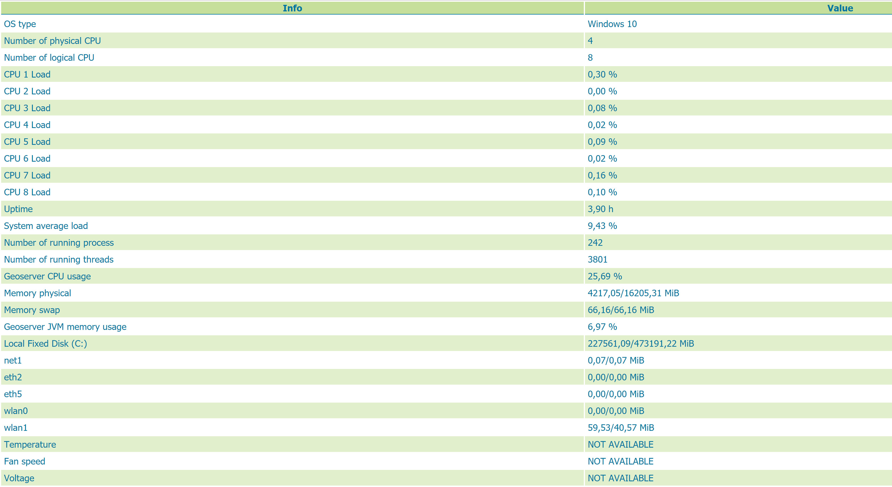

.. _status_monitoring_plugin:

Status Monitoring community module
==================================

The status monitoring module add some extra information about the system in the GeoServer status page in a new tab called **Monitoring**
and make that info queryable through GeoServer REST interface. This info should allow an administrator to get a quick understanding about the status of the GeoServer instance. 

`Library OSHI <https://github.com/oshi/oshi/>`_ is used to retrieving system-level information without depending on native libraries or DLLs, relying solely on `Apache JNA <https://github.com/java-native-access/jna/>`_.

The system informations displayed on the monitoring tab are:

#. Operating system name and version
#. Available CPUs (physical and logical)
#. Uptime
#. Number of running process \ threads
#. System load average
#. Per CPU usage
#. GeoServer Java JVM CPU usage
#. System memory usage (physical, virtual and swap)
#. GeoServer Java VM memory usage
#. Mounted filesystems usage
#. Available network interfaces and their usage
#. Sensors information when available

The informations are automatically refreshed every second.

Installing the extension
------------------------

#. Download the Status Monitoring extension from the nightly GeoServer community module builds.

#. Place the JARs into the ``WEB-INF/lib`` directory of the GeoServer installation.

Usage
-----

The status monitoring information are avaiable in the GeoServer web status page, at the top of the page there is the indication of the latest update time.

.. figure:: images/gui.png
   :align: center

REST interface
--------------

It is possible to request the monitoring informations using the GeoServer REST API. 

The monitoring informations are returned in a single document: XML, JSON and HTML formats are supported.

The endpoint URL of REST service in HTML are: ::

    /geoserver/rest/about/monitoring
    
    /geoserver/rest/about/monitoring.html

    
The endpoint URL of REST service in JSON is: ::

    /geoserver/rest/about/monitoring.json

The endpoint URL of REST service in XML is: ::

    /geoserver/rest/about/monitoring.xml

For more information about JSON and XML REST API endpoints refeers to `GeoServer swagger documentation <http://docs.geoserver.org/api/>`_.
