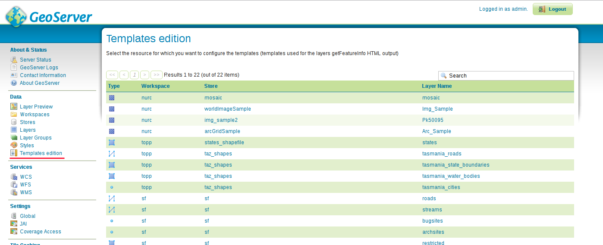
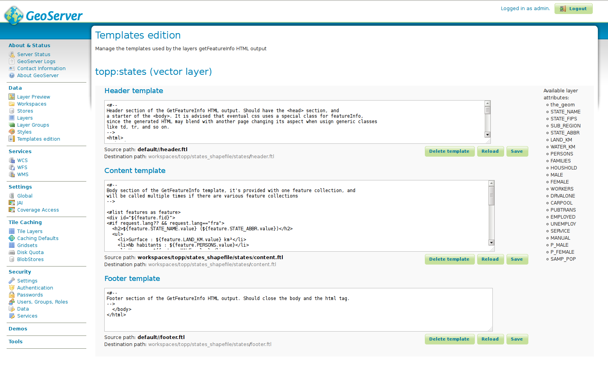

.. _community_template_editor:

Template Editor
===============

The Template Editor extension offers a basic web interface to edit and manage FreeMarker templates.

.. note:: This page does not explain how to write FreeMarker templates. For this, see :ref:`tutorials_getfeatureinfo`  and :ref:`tutorial_freemarkertemplate`.

.. note:: For now, it only supports header.ftl, content.ftl and footer.ftl resources (i.e. WMS GetFeatureInfo-related templates).


Installing the Template Editor extension
----------------------------------------

#. Download the Template Editor extension from the `nightly GeoServer community module builds <https://build.geoserver.org/geoserver/main/community-latest/geoserver-2.22-SNAPSHOT-template-editor-plugin.zip/>`_.

   .. warning:: Make sure to match the version of the extension to the version of the GeoServer instance.

#. Extract the contents of the archive into the ``WEB-INF/lib`` directory of the GeoServer installation.

#. Reload GeoServer.


Accessing the Template Editor
-----------------------------

Log in your GeoServer web UI. If the extension has been properly installed, a *Template Edition* entry should appear on the left menu, Data section, below *Styles*. You can also check in the list of Modules, in the *Server Status* menu entry.

Clicking *Template Edition* opens a page very similar to the *Layers* one:



   *Template Editor resources table*

Using this table, select the resource for which you want to edit the templates. It is possible to edit templates for layers (Vector and Raster ones), but also on the datastore and workspace levels (used for templates inheritance). Click on a resource to open its template edition page.

Template edition page
---------------------



   *Template edition page*

The page will be very similar for a workspace, datastore or layer, the only difference being that the layers have, on the right of the page, a list of the available layer attributes.

The page is composed of 3 blocks. Each block is dedicated to a *ftl* resource and features:

Edition element
```````````````

It is a plain TextArea input element in which you can edit the template's content.

Paths
`````

Right under the edition element are 2 paths, one in bold, the other grayed. At the start, the *Source path* will be bold, indicating where the template content is taken (note: a path starting with *default* means it is the default class-based templates that is used).

When you start editing, the *Source path* will be grayed and the *Destination path* will be the bold one, postfixed with a *****, indicating the content has been changed.

.. note:: The *Destination path* will always point to the resource's path.

Buttons
```````

Three buttons for each template block allow to perform the following actions on the corresponding template resource:

* Delete the template. It actually deletes the template only if the template resource is specific to the layer (or datastore or workspace) currently selected. I.e. if the *Source path* and the *Destination path* are equal.

* Reload will reload the template from the file, deleting all your changes.

* Save will persist your changes, writing the template file in the corresponding *Destination path*.

.. warning:: For now, no confirmation is asked when you click on the buttons. So, be careful with the *Delete template* button !


