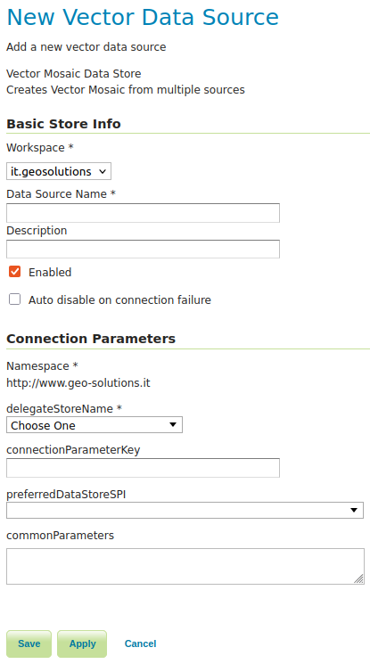

.. _community_vector_mosaic_config:

Vector Mosaic Datastore configuration
=====================================

When the extension has been installed, `Vector Mosaic Data Store` will be an option in the `Vector Data Sources` list when creating a new data store.

.. figure:: images/vector-mosaic-vector-create.png
   :align: center

   *Vector Mosaic Data Store in the list of vector data sources*

   *Configuring an Vector Mosaic data source*

.. list-table::
   :widths: 20 80

   * - **Option**
     - **Description**
   * - ``Workspace``
     - Name of the workspace to contain the Vector Mosaic store.
   * - ``Data Source Name``
     - Name of the Vector Mosaic Store as it will be known to GeoServer. 
   * - ``Description``
     - A full free-form description of the Vector Mosaic store.
   * - ``Enabled``
     -  If checked, it enables the store. If unchecked (disabled), no data in the Vector Mosaic Store will be served from GeoServer.
   * - ``delegateStoreName``
     - The data source name of the data store previously created that holds the index information about the constituent vector granules.  See `here <delegate.html>`_ for more details about delegate store requirements.
   * - ``connectionParameterKey``
     - The delegate store has a mandatory field called "params". Params can either be a URI pointing at the granule resource location or it can be a configuration string in .properties format. (See `Java Properties file <https://en.wikipedia.org/wiki/.properties>`_ for more details about the format) In the latter case this optional parameter specifies which key points at the location of the granule.  Accepted values are "file" and "url".
   * - ``preferredDataStoreSPI``
     - This optional parameter can serve as an optimization to speed up the lookup of granule data stores.  Instead of attempting to use the mandatory delegate params field (See `delegate requirements <delegate.html>`_ for more details about delegate store requirements.) to look up supported data store types, the Vector Mosaic data store will use the data store SPI specified in this field to identify the correct type.

