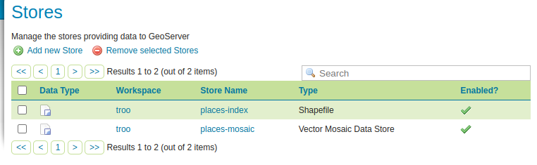
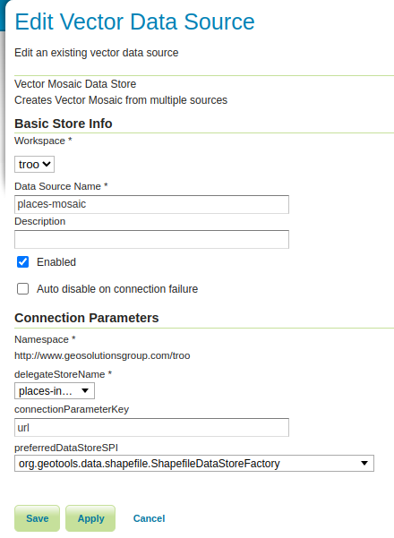
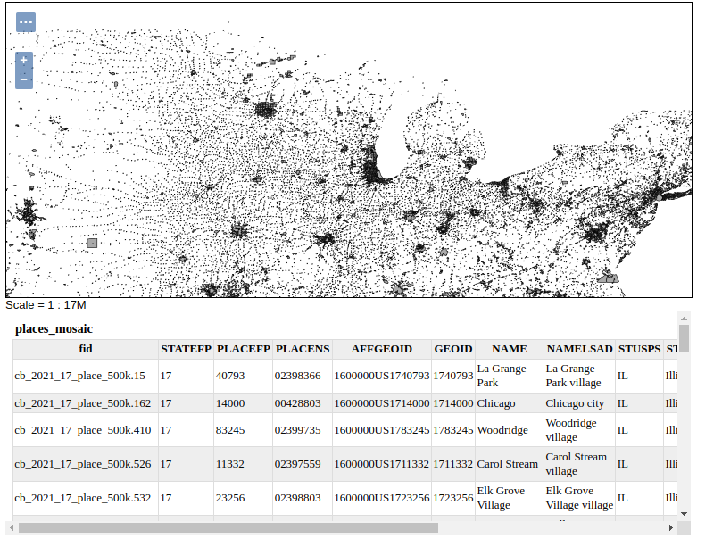

.. _community_vector_mosaic_delegate:

Vector Mosaic Datastore Delegate Requirements
=============================================

The Vector Mosaic Datastore Delegate is a datastore that contains references to the vector granule datastores, bounding polygon or multipolygon geometry to delineate the index area, and optionally other attributes that can be queried in order to return vector granules.

The delegate datastore can be in any format that GeoServer supports but there are two required fields:

* There must be a geometry field representing the index spatial area in either Polygon or MultiPolygon form. There are not requirements on the name of such field.
* There should be a field called ``params``, in text format, that contains either URIs pointing at granule resources like shapefiles -or- a configuration string in .properties format. (See `Java Properties file <https://en.wikipedia.org/wiki/.properties>`_ for more details about the format).

Any other field beyond the two required can serve as queryable/filterable attribute, and will be used to narrow the number of potential granule vectors that are searched by a query.  The non-required parameters will be combined with the vector granule parameters to create the output feature type.

An example of a delegate in property datastore format can be found `here <https://github.com/geotools/geotools/blob/main/modules/unsupported/vector-mosaic/src/test/resources/org.geotools.vectormosaic.data/mosaic_delegate.properties>`_. The ``name`` and ``type`` fields can be used to filter the granules, while ``params` contains the location of the granule file and ``geom`` its footprint. 

Creating an Index with ogrtindex
================================

The `ogrtindex <https://gdal.org/programs/ogrtindex.html>`_ commandline tool from the GDAL library can be used to collect all data sets in a directory, and create an index table for it. The format of the location is slightly different than the one GeoServer expects, as it uses a ``location,tableIndex`` format, so a quick SQL needs to be run to make it match.  

Here is an example that generates a delegate shapefile from a directory of shapefiles.  The third step below uses ``ogr2ogr`` commandline to trim a comma and number that ``ogrtindex`` appends to the end of the granule reference, and to turn the file location into a valid URL.

#. Switch to directory with the shapefiles
#. ogrtindex  -write_absolute_path -tileindex "params" delegate_raw.shp \*.shp
#. ogr2ogr delegate.shp delegate_raw.shp -dialect SQLite -sql "SELECT Geometry,'file://'||SUBSTR(params,1,LENGTH(params)-2) AS params from delegate_raw"

The ``delegate.shp`` shapefile can then be published as a store in GeoServer (no need to publish the layer), and then the mosaic store can be created, referencing to it:

For example, let's say one downloads the `TIGER shapefile <https://www.census.gov/geographies/mapping-files/time-series/geo/tiger-line-file.html>`_ for the ``PLACE`` theme, 
providing a shapefile with urban areas for each of the US states:

.. figure:: images/places-files.png
   :align: center

Scripts exist that help with the bulk download of the files for a given theme and year, e.g.
`get-tiger <https://github.com/fitnr/get-tiger>`_.

``ogrtindex`` and ``ogr2ogr`` can be used to generate a index shapefile, which will be
then configured in GeoServer, and then serve as the base for mosaic store:

   *The store containing the delegate/index table, and the mosaic store*

   *The mosaic store refers to the delegate store by name*

The ``connectionParameterKey`` is ``url``, as that's what the Shapefile datastore is looking for,
a parameter named ``url`` with the location of the shapefile to open. The preferred SPI is
setup to the Shapefile store to speed up the lookup of the granule store (it can be omitted,
with a small performance drop).

The mosaic layer can then be published in GeoServer, rendering all the required shapefiles
in a single map:

