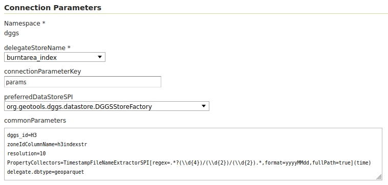

.. _community_vector_mosaic_rest:

Vector Mosaic Datastore REST ingestion
======================================
The VectorMosaic subsystem provides ingestion capabilities for vector granules, similar in spirit to the ImageMosaic module but adapted to vector datasets, 
optional DGGS indexing, and property-driven metadata.

This page describes a sample configuration for VectorMosaic and the REST endpoints used to trigger of vector datasets ingestion.
This API is intended for module integrators, automation tools, and users performing bulk or incremental ingestion of vector granules into a VectorMosaic store.

The ingestion operations are exposed via GeoServer's REST configuration API under:
``/workspaces/{workspaceName}/datastores/{storeName}/mosaic/{method}.{format}``

The REST endpoint receives a granule reference the same way as supported in imageMosaic (file, URL, S3 object, etc.).
Extracts ingestion metadata (URI, footprint, custom properties) and writes an index record into the VectorMosaic index store.

The ``method`` parameter refers to the upload method and follows same logic as the coverageStore endpoint. It can be ``url``, ``file``, ``external``, ``remote``. 

- ``file`` uploads a file from a local source. The body of the request is the file itself. A ``filename`` param can be set in the request to specify the target file name. 
- ``url`` uploads a file from a remote source. The body of the request is a URL pointing to the file to upload. This URL must be visible from the server.
- ``external`` uses an existing file on the server. The body of the request is the absolute path to the existing file. No data copy will occur.
- ``remote`` uses a direct reference to a remote url, i.e. a file on a cloud storage. No data copy will occur. The body of the request is a URL pointing to the remote dataset.
          
The ``format`` parameter represents the type of file being uploaded (e.g., "parquet")

Sample use case: DGGS GeoParquet datasets ingestion
"""""""""""""""""""""""""""""""""""""""""""""""""""
The following example requires vectormosaic, ogcapi and geoparquet community modules.

First, a PostGIS table exists, defined with the following DDL: 

.. code-block:: sql

    CREATE TABLE public.burntarea (
      id serial4 NOT NULL,
      geometry public.geometry(polygon, 4326) NULL,
      params text NULL,
      "time" timestamp NULL,
      CONSTRAINT burntarea_pkey PRIMARY KEY (id)
    );

A PostGIS datastore named burntarea_index has been created in GeoServer referring to the PostGIS DB.

A VectorMosaic datastore has been configured by specifying the following properties:

- delegateStoreName: The burntarea_index mentioned above
- connectionParameterKey: params
- preferredDataStoreSPI: org.geotools.dggs.datastore.DGGSStoreFactory 

commonParameters:: 
    
  dggs_id=H3
  zoneIdColumnName=h3indexstr
  resolution=10
  PropertyCollectors=TimestampFileNameExtractorSPI[regex=.*?(\\\\d{4})/(\\\\d{2})/(\\\\d{2}).*,format=yyyyMMdd,fullPath=true](time)
  delegate.dbtype=geoparquet

The data to be ingested is organized in folders containig YEAR\\MONTH\\DAY so we are using the ``TimestampFileNameExtractorSPI`` 
PropertyCollector configured above, which will extract the temporal information from the whole file path (``fullPath=true``) 
using the specified ``regex`` to build a ``YYYYMMdd`` date that will be assigned to the ``time`` attribute::

 TimestampFileNameExtractorSPI[regex=.*?(\\\\d{4})/(\\\\d{2})/(\\\\d{2}).*,format=yyyyMMdd,fullPath=true

Finally, the sample parquet files have not resolution attribute available within the dataset but all of them are at resolution 10 so 
we configured that as common parameter.

Once the configuration is set, a POST request can be used to ingest a vector dataset from the disk through the ``external`` method, 
which avoids copying the source data:

.. admonition:: curl request

   ::

       curl --request POST --url 'http://localhost:8080/geoserver/rest/workspaces/dggs_test/datastores/burntarea_mosaic/mosaic/external.parquet?spi=dggs' --data /mnt/data/burntarea_2024/11/29/800ffffffffffff.parquet

In contrast, the next example shows how to ingest a GeoParquet file stored in S3 by relying on the ``remote`` method:

.. admonition:: curl request

   ::

       curl --request POST --url 'http://localhost:8080/geoserver/rest/workspaces/dggs_test/datastores/burntarea_mosaic/mosaic/remote.parquet?spi=dggs' --data s3://gs-cog/parquet/2024/11/30/802bfffffffffff.parquet

