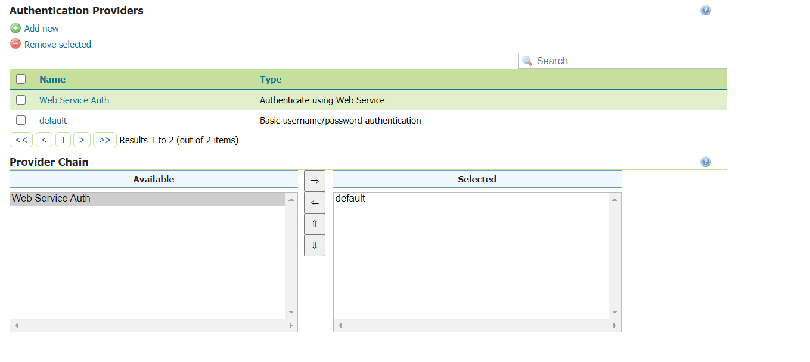

.. _webserviceauth_configuration:

HTTP Based Authorization configuration
======================================

The ``HTTP Based Authorization plug-in`` will try to authenticate the user on an configured external authentication service.
The username and the password will be sent to the service in one of the following ways:

* In a Header named ``X-HTTP-AUTHORIZATION``.
* As a query parameters or as request path. For this use case the url needs to be configured by inseritng two placeholder, namely ``{user}`` and ``{password}`` , where the username and password are expected to be provided eg. ``https://my-auth-service?username={username}&password={password}``.

The Authentication Provider will perform a ``GET`` request, sending credential Base64 encoded. If the response status returned by the external service is different from ``200`` the user will not be authenticated.

In case the external authentication service is returning the authenticated user's roles in the response body, it is possible to define a regular expression to extract them, allowing  for their usage for authorization. There is no limitation to a specific content type.

Once the plug-in is installed, it can be configured by:

* Opening the *Authentication* option in the *Security* menu
* Choosing *Authentication provider* and then *add new*. 
* Choose the ``Web Service Authentication`` option

.. figure:: images/newProvider.png

Clicking on ``Web Service Authentication`` offers the possibility to enter the provider settings.

.. figure:: images/httpProviderConf.png

Where:

* ``Service URL`` is the URL of the external service meant to be used for authentication.

* ``Timeout`` is the connection timeout.

* ``Read Timeout`` is the timeout on waiting to read response data.

* The ``Send credentials in X-HTTP-AUTHORIZATION Header`` checkbox is meant to be flagged if credentials have to be sent through the authorization header. If unchecked (default) GeoServer expects to find placeholders for username and password as ``{user}`` and ``{password}`` in the provided URL instead.

* The ``Allow HTTP connection`` checkbox if flagged will allow authentication request to be performed toward an external service that uses ``HTTP`` protocol. By default only ``HTTPS`` is allowed.

* In the ``Authorization`` section the radio button allows to define whether to use a GeoServer ``RoleService`` to read roles or if roles are meant to be returned by the external authentication service.

* In case ``Read Roles from Web Response`` is chosen, a regular expression to extract the roles from the authentication service response needs to be provided.

Once the settings are saved the new ``AuthenticationProvider`` is added to the list and needs to be added into the list of the providers' chain

