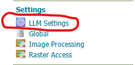
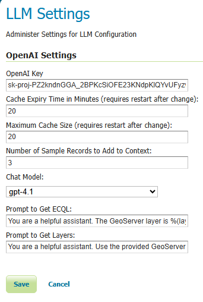

.. _openai_wps:

WPS OpenAI process
==================

The WPS OpenAI process provides the ability to generate CQL (Common Query Language) filters
from natural language questions by leveraging the OpenAI API, with the GeoServer Catalog as context.

**In addition, the process can:**

* Use GeoServer layer names and attributes to guide CQL generation
* Maintain conversational context across multiple queries using session identifiers
* Return results in JSON format, including generated CQL and GeoJSON data

Installing the WPS OpenAI process
---------------------------------

 #. If you haven't done already, install the WPS extension: :ref:`wps_install`.

 #. Download the WPS OpenAI process extension from the 
    `nightly GeoServer community module builds <https://build.geoserver.org/geoserver/main/community-latest/>`_.

    .. warning:: Make sure to match the version of the extension to the version of the GeoServer instance!

 #. Extract the contents of the archive into the ``WEB-INF/lib`` directory of the GeoServer installation.

Module description
------------------

This module provides an OpenAI-powered WPS process for interactive querying.

The process works by:

* Taking a natural language ``question`` from the user.
* Identifying the most relevant GeoServer layer(s).
* Converting the question into CQL filters referencing the chosen layer’s attributes.
* Executing the CQL against the GeoServer Catalog and returning GeoJSON results.
* Preserving conversational memory if a ``session_id`` is provided.

Process accepts following parameters:

**Required:**

#. question – the natural language question to send to the OpenAI model.

**Optional:**

#. session_id – identifier for maintaining conversational context across multiple queries.
   If not specified, a new session will be created automatically.

#. return_data – boolean that indicates whether GeoJSON data generated by applying the filter should be returned.
   If not specified, no data will be returned.

**Response contains following objects:**

#. result – JSON object containing:

   * ``sessionId`` – the unique session identifier
   * ``cqls`` – array of generated CQL filters with layer association
   * ``geoJSON`` – GeoJSON features matching the generated CQL

Each CQL object has the following fields:

#. ecql – the generated CQL filter expression
#. layerName – name of the GeoServer layer used
#. geoJSON – GeoJSON string of the filtered features

.. note::
   The OpenAI API key must be configured in the GeoServer settings under the
   LLM (Large Language Model) metadata section. Keys are stored encrypted and
   decrypted at runtime. If the key is missing or invalid, the process will raise a WPSException.

Accessing the WPS OpenAI Settings
---------------------------------

GeoServer provides a configuration page for managing OpenAI integration.
You can access it directly from the GeoServer home page by clicking on the
**WPS OpenAI Settings** link.

*Figure 1: The WPS OpenAI Settings link on the GeoServer home page.*

Configuring the LLM Settings
----------------------------

The **WPS OpenAI Settings** page allows administrators to configure how GeoServer interacts
with the OpenAI API, including authentication, caching, and prompt customization.

*Figure 2: The WPS OpenAI Settings page showing configuration options.*

The configuration page contains the following elements:

* **OpenAI key** — Your API key used to authenticate with OpenAI services.  
* **Cache Expiry Time (minutes)** — How long cached model responses remain valid.  
* **Maximum Cache Size** — The maximum number of cached responses retained.  
* **Maximum number of features to return** - The maximum number of features to return when return_data is true. A negative value (default) removes the limit but can cause out-of-memory errors because the returned JSON is fully loaded in memory.
* **Number of Sample Records to Add to Context** — The number of feature records included in prompts for better context.  
* **Chat Model** - The OpenAI LLM Model you wish to call.  
* **Prompt to Get ECQL** — The template prompt used to guide generation of ECQL filters. Available variables are: *%(layerName)* *%(fields)* *%(sampleData)*
  
  The default prompt is: **You are a helpful assistant. The GeoServer layer is %(layerName) and the layer fields are: %(fields) and here is some sample data from that layer: %(sampleData). Use this information to generate GeoServer ecql from the provided question:** 

* **Prompt to Get Layers** — The prompt used to determine which GeoServer layer(s) are relevant to a user’s question. The available variable is *%(allLayers)*  
  
  The default prompt is: **You are a helpful assistant. Use the provided GeoServer layers and return the layer that the input most closely matches: %(allLayers)** 

These controls let administrators fine-tune the behavior and efficiency of the AI-assisted WPS processes,
balancing performance, accuracy, and resource use.

Tunables and safeguards
-----------------------

The WPS OpenAI process communicates with external LLM services. To ensure stability
and secure operation, the following safeguards apply:

* ``LLM API Key``: must be set in the GeoServer settings metadata (encrypted).
* ``Session caching``: conversational history is stored in memory using the configured cache manager.
* ``Error handling``: failed API calls or invalid decryption will raise a WPSException with details.
* ``Thread-safety``: the process uses a shared cache for session context but does not spawn its own thread pools.

``OpenAIProcess`` is designed to make working with CQL more accessible by enabling
users to query GeoServer layers in plain language, while still returning precise
GeoServer-compatible filter expressions and results.
