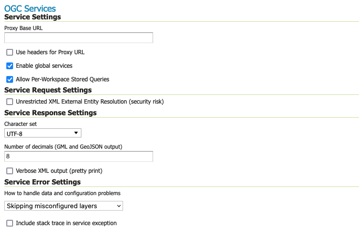
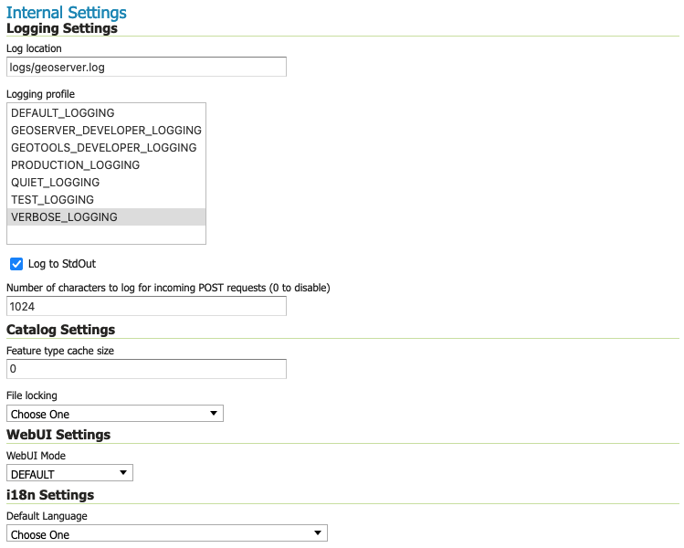
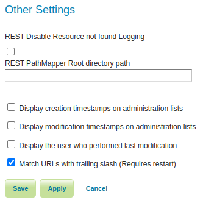

.. _config_globalsettings:

Global Settings
===============

The Global Setting page configures messaging, logging, character, and proxy settings for the entire server.

Global Settings are used to configure how OGC Web Services function.

   
   Global Settings Service Configuration

Global Settings are also used to control the GeoServer application as a whole.

   
   Global Settings Internal Configuration

Verbose Messages
----------------

Verbose Messages, when enabled, will cause GeoServer to return XML with newlines and indents. Because such XML responses contain a larger amount of data, and in turn requires a larger amount of bandwidth, it is recommended to use this option only for testing purposes. 

Verbose Exception Reporting
---------------------------

Verbose Exception Reporting returns service exceptions with full Java stack traces. It writes to the GeoServer log file and offers one of the most useful configuration options for debugging. When disabled, GeoServer returns single-line error messages.

Enable Global Services
----------------------

When enabled, allows access to both global services and :ref:`virtual services <virtual_services>`. When disabled, clients will only be able to access virtual services. Disabling is useful if GeoServer is hosting a large amount of layers and you want to ensure that client always request limited layer lists. Disabling is also useful for security reasons.

Allow Per-Workspace Stored Queries
----------------------------------

When enabled, allows to persist Stored queries per workspace, making queries created inside a workspace  available in the workspace virtual service only.

Handle data and configuration problems
--------------------------------------

This setting determines how GeoServer will respond when a layer becomes inaccessible for some reason. By default, when a layer has an error (for example, when the default style for the layer is deleted), a service exception is printed as part of the capabilities document, making the document invalid. For clients that rely on a valid capabilities document, this can effectively make a GeoServer appear to be "offline". 

An administrator may prefer to configure GeoServer to simply omit the problem layer from the capabilities document, thus retaining the document integrity and allowing clients to connect to other published layers.

There are two options:

**OGC_EXCEPTION_REPORT**: This is the default behavior. Any layer errors will show up as Service Exceptions in the capabilities document, making it invalid.

**SKIP_MISCONFIGURED_LAYERS**: With this setting, GeoServer will elect simply to not describe the problem layer at all, removing it from the capabilities document, and preserving the integrity of the rest of the document. Note that having a layer "disappear" may cause other errors in client functionality.
    This is the default setting starting with GeoServer 2.11 and allows for faster startups, as the stores connectivity does not need to be checked in advance.

Number of Decimals
------------------

Refers to the number of decimal places returned in a GetFeature response. Also useful in optimizing bandwidth. Default is **8**.

Character Set
-------------

Specifies the global character encoding that will be used in XML responses. Default is **UTF-8**, which is recommended for most users. A full list of supported character sets is available on the `IANA Charset Registry <http://www.iana.org/assignments/character-sets>`_.

Proxy Base URL
--------------

GeoServer can have the capabilities documents report a proxy properly. "The Proxy Base URL" field is the base URL seen beyond a reverse proxy.

Use headers for Proxy URL
-------------------------

Checking this box allows a by-request modification of the proxy URL using templates (templates based on HTTP proxy headers).

The supported proxy headers are:

#. **X-Forwarded-Proto** The protocol used by the request
#. **X-Forwarded-Host** The hostname and port of the proxy URL
#. **X-Forwarded-For** The client IP address
#. **X-Forwarded-Path** The path of the proxy URL (this is not an official HTTP header, although it is supported by some web-servers)
#. **Forwarded** Header that supersedes the "X-Forwarded-\*" headers above. It has these components: "by", "for", "host", "proto", "path" (this component is not official, but added for consistency with ``X-Forwarded-Path``)
#. **Host** Same as ``X-Forwarded``

For instance, to allow different protocols (``http`` and ``https``) and different hostnames, the proxy base URL field may be changed to: ``${X-Forwarded-Proto}://${X-Forwarded-Host}/geoserver``
The use of the ``Forwarded`` header is a tad more complex, as its components have to be referenced in templates with the dot-notation, as in: ``{Forwarded.proto}://${Forwarded.host}/geoserver``.

Multiple templates can be put into the "Proxy Base URL". These templates provide fall-backs, since only the first one that is fully matched is used. 
For instance, a Proxy Base URL of ``http://${X-Forwarded-Host}/geoserver http://www.foo.org/geoserver`` (Templates are space-separated.) can result in either: ``http://www.example.com/geoserver`` (if ``X-Forwarded-Host`` is set to ``www.example.com``.)  or ``http://www.foo.org/geoserver``  (if ``X-Forwarded-Host`` is not set.)

Both header names and the appended path (e.g. ``/geoserver``) in templates are case-insensitive.

Logging Profile
---------------

Logging Profile corresponds to a log4j configuration file in the GeoServer data directory. (Apache `log4j <http://logging.apache.org/log4j/1.2/index.html>`_ is a Java-based logging utility.)  By default, there are five logging profiles in GeoServer; additional customized profiles can be added by editing the log4j file. 

There are six logging levels used in the log itself. They range from the least serious TRACE, through DEBUG, INFO, WARN, ERROR and finally the most serious, FATAL. The GeoServer logging profiles combine logging levels with specific server operations. The five pre-built logging profiles available on the global settings page are:
 
#. **Default Logging** (``DEFAULT_LOGGING``)—Provides a good mix of detail without being VERBOSE. Default logging enables INFO on all GeoTools and GeoServer levels, except certain (chatty) GeoTools packages which require WARN. 
#. **GeoServer Developer Logging** (``GEOSERVER_DEVELOPER_LOGGING``)-A verbose logging profile that includes DEBUG information on GeoServer and VFNY. This developer profile is recommended for active debugging of GeoServer.
#. **GeoTools Developer Logging** (``GEOTOOLS_DEVELOPER_LOGGING``)—A verbose logging profile that includes DEBUG information only on GeoTools. This developer profile is recommended for active debugging of GeoTools.
#. **Production Logging** (``PRODUCTION_LOGGING``) is the most minimal logging profile, with only WARN enabled on all GeoTools and GeoServer levels. With such production level logging, only problems are written to the log files.
#. **Verbose Logging**  (``VERBOSE_LOGGING``)—Provides more detail by enabling DEBUG level logging on GeoTools, GeoServer, and VFNY.

Log to StdOut
-------------

Standard output (StdOut) determines where a program writes its output data. In GeoServer, the Log to StdOut setting enables logging to the text terminal that initiated the program. If you are running GeoServer in a large J2EE container, you might not want your container-wide logs filled with GeoServer information. Clearing this option will suppress most GeoServer logging, with only FATAL exceptions still output to the console log.

Log Location
------------

Sets the written output location for the logs. A log location may be a directory or a file, and can be specified as an absolute path (e.g., :file:`C:\\GeoServer\\GeoServer.log`) or a relative one (for example, :file:`GeoServer.log`). Relative paths are relative to the GeoServer data directory. Default is :file:`logs/geoserver.log`.

XML POST request log buffer 
---------------------------

In more verbose logging levels, GeoServer will log the body of XML (and other format) POST requests. It will only log the initial part of the request though, since it has to store (buffer) everything that gets logged for use in the parts of GeoServer that use it normally. This setting sets the size of this buffer, in characters. A setting of **0** will disable the log buffer.

XML Entities
------------

XML Requests sent to GeoServer can include references to other XML documents. Since these files are processed by GeoServer the facility could be used to access files on the server.

This option is only useful with the application schema extensions.

Feature type cache size
-----------------------

GeoServer can cache datastore connections and schemas in memory for performance reasons. The cache size should generally be greater than the number of distinct featuretypes that are expected to be accessed simultaneously.
If possible, make this value larger than the total number of featuretypes on the server, but a setting too high may produce out-of-memory errors. On the other hand, a value lower than the total number of your registered featuretypes may clear and reload the resource-cache more often, which can be expensive and e.g. delay WFS-Requests in the meantime.
The default value for the Feature type cache size is 100.

File Locking
------------

This configuration settings allows control of they type of file locking used when accessing the GeoServer Data Directory. This setting is used to protected the GeoServer configuration from being corrupted by multiple parties editing simultaneously. File locking should be employed when using the REST API to configure GeoServer, and can protected GeoServer when more than one administrator is making changes concurrently.

There are three options:

**NIO File locking**: Uses Java New IO File Locks suitable for use in a clustered environment (with multiple GeoServers sharing the same data directory).

**In-process locking**: Used to ensure individual configuration files cannot be modified by two web administration or REST sessions at the same time.

**Disable Locking**: No file locking is used.

Web/UI Mode
-----------

This configuration setting allows control over WebUI redirecting behaviour. By default, when the user loads a page that contains input, a HTTP 302 Redirect response is returned that causes a reload of that same with a generated session ID in the request parameter. This session ID allows the state of the page to be remembered after a refresh and prevents any occurence of the 'double submit problem'. However, this behaviour is incompatible with clustering of multiple geoserver instances.

There are three options:

**DEFAULT**: Use redirecting unless a clustering module has been loaded.

**REDIRECT**: Always use redirecting (incompatible with clustering).

**DO_NOT_REDIRECT**: Never use redirecting (does not remember state when reloading a page and may cause double submit).

Note that a restart of GeoServer is necessary for a change in the setting to have effect.

REST Disable Resource not found Logging
----------------------------------------
This parameter can be used to mute exception logging when doing REST operations and the requested Resource is not present. This default setting can be overridden by adding to a REST call the following parameter: **quietOnNotFound=true/false**.

REST PathMapper Root directory path
-----------------------------------

This parameter is used by the RESTful API as the `Root Directory` for the newly uploaded files, following the structure::

	${rootDirectory}/workspace/store[/<file>]

Display creation timestamps on administration lists
----------------------------------------------------------

These check boxes can be used to toggle Date of Creation on Workspaces,Stores,Layers,Layer Groups and Styles administration list pages
Time of can be seen by hovering mouse over the dates

Display modification timestamps on administration lists
----------------------------------------------------------

These check boxes can be used to toggle Date of Modification on Workspaces,Stores,Layers,Layer Groups and Styles administration list pages
Time of can be seen by hovering mouse over the dates
 
