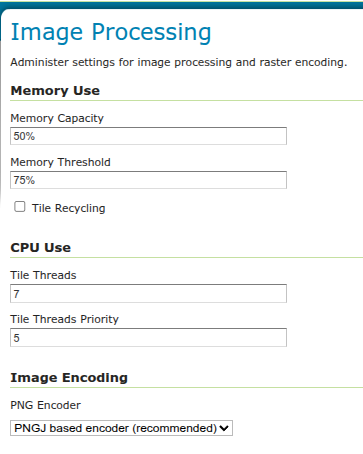

.. _ImageN:
.. _JAIEXT:
.. _JAI:

Image Processing
================
`Eclipse ImageN <https://eclipse-imagen.github.io/imagen/>`_ is an image processing library built by Sun Microsystems as "Java Advanced Imaging" and donated to the Eclipse Foundation.

Several ImageN parameters, used by both WMS and WCS operations, can be configured in the Image Processing page.

   
   Image Processing
   
Memory & Tiling 
---------------

When supporting large images it is efficient to work on image subsets without loading everything to memory. A widely used approach is tiling which basically builds a tessellation of the original image so that image data can be read in parts rather than whole. Since very often processing one tile involves surrounding tiles, tiling needs to be accompanied by a tile-caching mechanism. The following ImageN parameters allow you to manage the ImageN cache mechanism for optimized performance.   

**Memory Capacity**—For memory allocation for tiles, ImageN provides an interface called TileCache. Memory Capacity sets the global ImageN TileCache as a percentage of the available heap. A number between 0 and 1 exclusive. If the Memory Capacity is smaller than the current capacity, the tiles in the cache are flushed to achieve the desired settings. If you set a large amount of memory for the tile cache, interactive operations are faster but the tile cache fills up very quickly. If you set a low amount of memory for the tile cache, the performance degrades.

**Memory Threshold**—Sets the global ImageN TileCache Memory threshold. Refers to the fractional amount of cache memory to retain during tile removal. ImageN Memory Threshold value must be between 0.0 and 1.0. The Memory Threshold visible on the :ref:`status` page. 

**Tile Threads**—ImageN utilizes a TileScheduler for tile calculation. Tile computation may make use of multithreading for improved performance. The Tile Threads parameter sets the TileScheduler, indicating the number of threads to be used when loading tiles. 
 
**Tile Threads Priority**—Sets the global ImageN Tile Scheduler thread priorities. Values range from 1 (Min) to 10 (Max), with default priority set to 5 (Normal).

**Tile Recycling**—Enable/Disable ImageN Cache Tile Recycling. If selected, Tile Recycling allows ImageN to re-use already loaded tiles, which can provide significant performance improvement. 

**PNG Encoder Type**—Provides a selection of the PNG encoder between the Java own encoder and a `PNGJ <https://code.google.com/p/pngj/>`_ based one:

  * The Java standard encoder is always set to maximum compression. It provides the smallest output images, balanced by a high performance cost (up to six times slower than the other two alternatives).
  * The PNGJ based encoder provides the best performance and generated PNG images that are just slightly larger than the Java standard encoder. It is the recommended choice, but it's also newer than the other two, so in case of misbehavior the other two encoders are left as an option for the administrator.

*It is quite important to remember that faster encoders are not necessarily going to visibly improve performance, if data loading and processing/rendering are dominating the response time, choosing a better encoder will likely not provide the expected benefits.*
