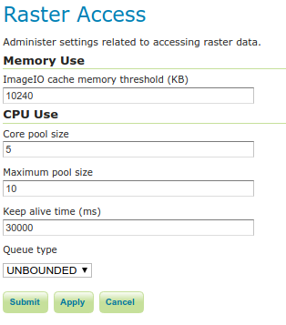

.. _config_converageaccess:

Raster Access
=============

The Coverage Access Settings page in the Server menu in the :ref:`web_admin` provides configuration options to customize thread pool executors and ImageIO caching memory.

   
   Raster Access Settings
   
.. _Thread_pool_executor_settings:

.. _ImageIO_settings:

Memory Use
----------
WMS requests usually produce relatively small images whilst WCS requests may frequently deal with bigger datasets. Caching the image in memory before encoding it may be helpful when the size of the image isn't too big. For a huge image (as one produced by a big WCS request) it would be better instead caching through a temporary file with respect to caching in memory. 
This section allows to specify a threshold image size to let GeoServer decide whether to use a `MemoryCacheImageOutputStream <http://docs.oracle.com/javase/1.5.0/docs/api/javax/imageio/stream/MemoryCacheImageOutputStream.html/>`_ or `FileCacheImageOutputStream <http://docs.oracle.com/javase/1.5.0/docs/api/javax/imageio/stream/FileCacheImageOutputStream.html/>`_ when encoding the images.

**ImageIO Cache Memory Threshold**—Sets the threshold size (expressed in KiloBytes) which will make GeoServer choose between file cache vs memory based cache.
If the estimated size of the image to be encoded is smaller than the threshold value, a `MemoryCacheImageOutputStream` will be used resulting into caching the image in memory. If the estimated size of the image to be encoded is greater than the threshold value, a `FileCacheImageOutputStream` will be used.

CPU Use
-------
The imageMosaic reader may load, in parallel, different files that make up the mosaic by means of a 
`ThreadPoolExecutor <http://docs.oracle.com/javase/1.5.0/docs/api/java/util/concurrent/ThreadPoolExecutor.html/>`_ .
A global ThreadPoolExecutor instance is shared by all the readers supporting and using concurrent reads. This section
of the Coverage Access Settings administration page allows configuration of the Executor parameters.

**Core Pool Size**—Sets the core pool size of the thread pool executor. A positive integer must be specified.

**Maximum Pool Size**—Sets the maximum pool size of the thread pool executor. A positive integer must be specified.

**Keep Alive Time**—Sets the time to be wait by the executor before terminating an idle thread in case there are more threads than `corePoolSize`. 

**Queue Type**—The executor service uses a `BlockingQueue <http://docs.oracle.com/javase/1.5.0/docs/api/java/util/concurrent/BlockingQueue.html/>`_ to manage submitted tasks.
Using an `unbounded` queue is recommended which allows to queue all the pending requests with no limits (Unbounded). With a `direct` type, incoming requests will be rejected when there are already `maximumPoolSize` busy threads.

.. note:: If a new task is submitted to the list of tasks to be executed, and less than `corePoolSize` threads are running, a new thread is created to handle the request. Incoming tasks are queued in case `corePoolSize` or more threads are running.
.. note:: If a request can't be queued or there are less than `corePoolSize` threads running, a new thread is created unless this would exceed `maximumPoolSize`.
.. note:: If the pool currently has more than `corePoolSize` threads, excess threads will be terminated if they have been idle for more than the `keepAliveTime`.
.. note:: If a new task is submitted to the list of tasks to be executed and there are more than `corePoolSize` but less than `maximumPoolSize` threads running, a new thread will be created only if the queue is full. This means that when using an `Unbounded` queue, no more threads than `corePoolSize` will be running and `keepAliveTime` has no influence.
.. note:: If `corePoolSize` and `maximumPoolSize` are the same, a fixed-size thread pool is used.
