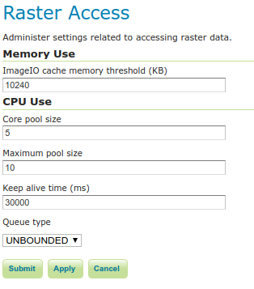

.. _config_converageaccess:

Raster Access
=============

The Coverage Access Settings page in the Server menu in the :ref:`web_admin` provides configuration options to customize thread pool executors and ImageIO caching memory.

   
   Raster Access Settings

.. _ImageIO_settings:

Memory Use
----------
WMS requests usually produce relatively small images whilst WCS requests may frequently deal with bigger datasets. Caching the image in memory before encoding it may be helpful when the size of the image isn't too big. For a huge image (as one produced by a big WCS request) it would be better instead caching through a temporary file with respect to caching in memory. 
This section allows to specify a threshold image size to let GeoServer decide whether to use a `MemoryCacheImageOutputStream <http://docs.oracle.com/javase/1.5.0/docs/api/javax/imageio/stream/MemoryCacheImageOutputStream.html/>`_ or `FileCacheImageOutputStream <http://docs.oracle.com/javase/1.5.0/docs/api/javax/imageio/stream/FileCacheImageOutputStream.html/>`_ when encoding the images.

**ImageIO Cache Memory Threshold**—Sets the threshold size (expressed in KiloBytes) which will make GeoServer choose between file cache vs memory based cache.
If the estimated size of the image to be encoded is smaller than the threshold value, a `MemoryCacheImageOutputStream` will be used resulting into caching the image in memory. If the estimated size of the image to be encoded is greater than the threshold value, a `FileCacheImageOutputStream` will be used.

CPU Use
-------
The imageMosaic reader may load, in parallel, different files that make up the mosaic by means of a 
`ThreadPoolExecutor <http://docs.oracle.com/javase/1.5.0/docs/api/java/util/concurrent/ThreadPoolExecutor.html/>`_ .
A global ThreadPoolExecutor instance is shared by all the readers supporting and using concurrent reads. This section
of the Coverage Access Settings administration page allows configuration of the Executor parameters.

**Core Pool Size**—Sets the core pool size of the thread pool executor. A positive integer must be specified.

**Maximum Pool Size**—Sets the maximum pool size of the thread pool executor. A positive integer must be specified.

**Keep Alive Time**—Sets the time to be wait by the executor before terminating an idle thread in case there are more threads than `corePoolSize`. 

**Queue Type**—The executor service uses a `BlockingQueue <http://docs.oracle.com/javase/1.5.0/docs/api/java/util/concurrent/BlockingQueue.html/>`_ to manage submitted tasks.
Using an `unbounded` queue is recommended which allows to queue all the pending requests with no limits (Unbounded). With a `direct` type, incoming requests will be rejected when there are already `maximumPoolSize` busy threads.

.. note:: If a new task is submitted to the list of tasks to be executed, and less than `corePoolSize` threads are running, a new thread is created to handle the request. Incoming tasks are queued in case `corePoolSize` or more threads are running.
.. note:: If a request can't be queued or there are less than `corePoolSize` threads running, a new thread is created unless this would exceed `maximumPoolSize`.
.. note:: If the pool currently has more than `corePoolSize` threads, excess threads will be terminated if they have been idle for more than the `keepAliveTime`.
.. note:: If a new task is submitted to the list of tasks to be executed and there are more than `corePoolSize` but less than `maximumPoolSize` threads running, a new thread will be created only if the queue is full. This means that when using an `Unbounded` queue, no more threads than `corePoolSize` will be running and `keepAliveTime` has no influence.
.. note:: If `corePoolSize` and `maximumPoolSize` are the same, a fixed-size thread pool is used.

Granule Image Cache
--------------------
Mosaics made of many small granules (small image tiles, or zoomed-out views that compose thousands of tiny overviews when no pyramid was built) re-read and re-decode the same granules from disk on every request. This section configures an optional in-memory cache that keeps the decoded granule images and serves later reads of the same granule from memory, skipping the disk read and decode. All later processing still runs after the cache, so the produced image is identical to an uncached read. A single cache pool is shared by all image mosaic layers.

**Granule Cache Max Size**—Total size of the cache, expressed in MegaBytes and measured on the decoded (uncompressed) image size. Defaults to ``128`` MB; set to ``0`` to disable the cache. When the cache fills up, the least recently used granules are evicted.

**Default Per-Granule Caching Threshold**—The largest decoded granule, expressed in KiloBytes, eligible for caching. A granule whose full decoded size exceeds this value is read normally and never cached, so that a few large granules cannot evict many useful small ones. Defaults to 1024 KB, enough to hold the top of a typical overview pyramid (a tile of maximum 512x512 with 4 bands).

A non-zero size only makes the cache available, but caching is turned on per layer, so the default 128 MB budget stays unused until a mosaic opts in. On the layer's *Coverage Parameters* (edit) section, set **Cache Granules** to ``true``, and optionally set **Cache Threshold (KB)** to override the default threshold for that layer (``-1`` keeps the global default).

The cache is one server-wide pool, not one per layer: its memory is bounded by the size above regardless of how many mosaics use it. Each cached image is tagged with the mosaic it came from, so when a layer is reconfigured, removed, or the configuration is reloaded, that layer's cached images are released right away and the heap they occupied is freed.

.. note:: A granule is assumed to keep the same content for its location between harvesting operations. Re-harvesting a granule, or removing it with the option that deletes its files, drops the corresponding cached image automatically. Only if a granule file is overwritten in place *without* re-harvesting the mosaic may the cache keep serving the previous content, until the pool evicts it or the server is restarted. The cache is also cleared on configuration reload and reset.

System Properties Configuration
===============================
There are some additional global configuration parameters involved in raster access which can be specified through System properties.

Max Oversampling Factor
-----------------------
When dealing with reprojection, the underlying raster read operation might do some oversampling in order to provide the requested output resolution. Depending on the reprojection and the requested area, the oversampling factor might be high.

Consider an untiled whole world request of an EPSG:4326 raster, towards EPSG:3857, filling a 1024x768 image. Due to the big distortion introduced by the Mercator Projection at high latitudes, the underlying read operation may result in actually reading 20000x8000 pixels, in other words, an oversampling factor of almost 20. Image processing operations will work on that big input image before returning back the desired 1024x768 image.

This can be very time consuming (you may notice long rendering time for that). It's possible to put a limit on the maximum oversampling factor by adding the following java option to GeoServer startup script and restart it:

    .. code-block:: xml
	
	-Dorg.geotools.coverage.max.oversample=N
   

With N a number representing the maximum oversampling factor. By this way, the underlying read operation will use a reading resolution within that limit, making the rendering faster. The speed gain has however a penalty, output quality decrease at the poles. So you may want to play a bit with this value to find the optimal trade-off between speed and quality. For example, you could start trying with a value of 3 and check the results, and then slowly increase it until the output matches the desired quality within an acceptable rendering time.
