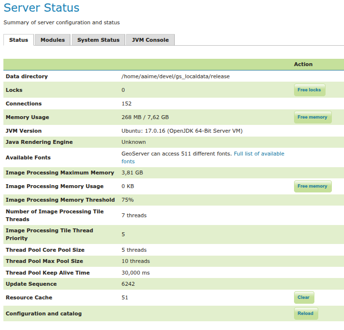
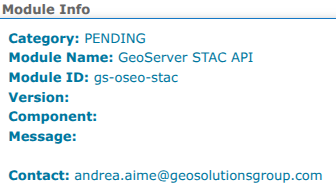

.. _config_serverstatus:

Status
======
The Server Status page has two tabs to summarize the current status of GeoServer. The Status tab provides a summary of server configuration parameters and run-time status. The modules tab provides the status of the various modules installed on the server. This page provides a useful diagnostic tool in a testing environment. 

Server Status
-------------

   
   Status Page (default tab)

Status Field Descriptions
^^^^^^^^^^^^^^^^^^^^^^^^^

The following table describes the current status indicators.

.. list-table::
   :widths: 30 70 
   :header-rows: 1

   * - Option
     - Description
   * - Data directory
     - Shows the path to the GeoServer data directory (GEOSERVER_DATA_DIR property).
   * - Locks
     - A WFS has the ability to lock features to prevent more than one person from updating the feature at one time.  If data is locked, edits can be performed by a single WFS editor. When the edits are posted, the locks are released and features can be edited by other WFS editors. A zero in the locks field means all locks are released. If locks is non-zero, then pressing "free locks," releases all feature locks currently help by the server, and updates the field value to zero. 
   * - Connections
     - Refers to the numbers of vector stores, in the above case 4, that were able to connect. 
   * - Memory Usage
     - The amount of memory current used by GeoServer. In the above example, 118 MB of memory out of a total of 910 MB is being used. Clicking on the "Free Memory" button,  cleans up memory marked for deletion by running the garbage collector.
   * - JVM Version
     - Denotes which version of the JVM (Java Virtual Machine) is been used to power the server. Here the JVM is Oracle Corporation.: 1.8.0_60.
   * - Java Rendering Engine
     - Shows the rendering engine used for vector operations.
   * - Available Fonts
     - Shows the number of fonts available. Selecting the link will show the full list.
   * - Native JAI
     - GeoServer uses `Java Advanced Imaging <https://jai.dev.java.net>`_ (JAI) framework for image rendering and coverage manipulation. When properly installed (true), JAI makes WCS and WMS performance faster and more efficient.
   * - Native JAI ImageIO
     - GeoServer uses `JAI Image IO <https://jai-imageio.dev.java.net>`_ (JAI) framework for raster data loading and image encoding. When properly installed (true), JAI Image I/O makes WCS and WMS performance faster and more efficient. 
   * - JAI Maximum Memory
     - Expresses in bytes the amount of memory available for tile cache, in this case 455 Mbytes.
   * - JAI Memory Usage
     - Run-time amount of memory is used for the tile cache. Clicking on the "Free Memory" button, clears available JAI memory by running the tile cache flushing.
   * - JAI Memory Threshold
     - Refers to the percentage, e.g. 75, of cache memory to retain during tile removal.
   * - Number of JAI Tile Threads
     - The number of parallel threads used by the scheduler to handle tiles.
   * - JAI Tile Thread Priority
     - Schedules the global tile scheduler priority. The priority value defaults to 5, and must fall between 1 and 10.
   * - ThreadPoolExecutor Core Pool Size
     - Number of threads that the ThreadPoolExecutor will create. This is underlying Java runtime functionality - see the Java documentation for ThreadPoolExecutor for more information.
   * - ThreadPoolExecutor Max Pool Size
     - Maximum number of threads that the ThreadPoolExecutor will create. This is underlying Java runtime functionality - see the Java documentation for ThreadPoolExecutor for more information.
   * - ThreadPoolExecutor Keep Alive Time (ms)
     - Timeout for threads to be terminated if they are idle and more than the core pool number exist. This is underlying Java runtime functionality - see the Java documentation for ThreadPoolExecutor for more information.
   * - Update Sequence
     - Refers to the number of times (426) the server configuration has been modified.
   * - Resource cache
     - GeoServer does not cache data, but it does cache connection to stores, feature type definitions, external graphics, font definitions and CRS definitions as well. The "Clear" button forces those caches empty and makes GeoServer reopen the stores and re-read image and font information, as well as the custom CRS definitions stored in `${GEOSERVER_DATA_DIR}/user_projections/epsg.properties`.
   * - Configuration and catalog
     - GeoServer keeps in memory all of its configuration data. If for any reason that configuration information has become stale (e.g., an external utility has modified the configuration on disk) the "Reload" button will force GeoServer to reload all of its configuration from disk.
  

Module Status
-------------

The modules tab provides a summary of the status of all installed modules in the running server. 

.. figure:: img/module_status.png
   
   Module Status
   
Module Status Field Descriptions
^^^^^^^^^^^^^^^^^^^^^^^^^^^^^^^^

.. list-table::
   :widths: 20 80
   :header-rows: 1
   
   * - Module Name
     - The human readable name of the module, this links to a popup containing the full details and messages of the module
   * - Module ID
     - The internal package name of the module
   * - Available?
     - Whether the module is available to GeoServer
   * - Enabled?
     - Whether the module is enabled in the current GeoServer configuration
   * - Component
     - (Optional) Optional component identifier within the module
   * - Version
     - (Optional) The version of the installed module
   * - Message (popup)
     - (Optional) status message such as what Java rendering engine is in use, or the library path if the module/driver is unavailable

   Module Status popup
     

