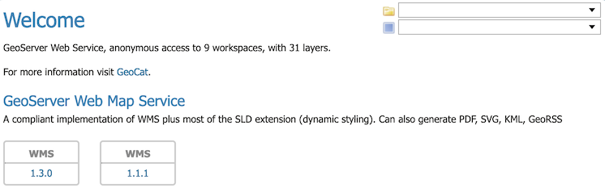
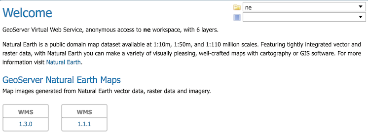
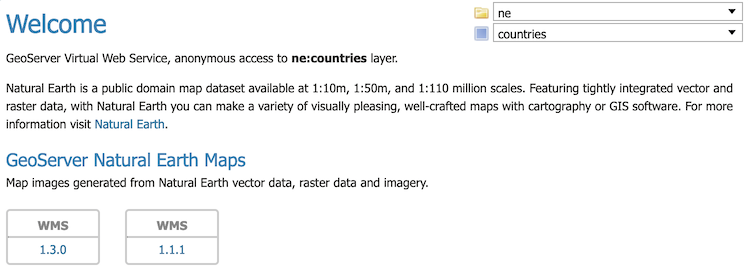
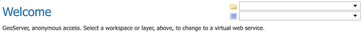

.. _virtual_services:

Virtual Services
================

The different types of web services in GeoServer include:

* Open Web Services (OWS): WFS, WMS, WCS, WMTS, WPS and CSW.
* OGC API Services: "OGC API -- Features"
* Other geospatial web services such as TMS, WMS-C

By default these services are **global** in that each web service *publishes all* GeoServer layers: WFS publishes all vector layer (feature types), WCS publishes all raster layers (coverages), and WMS publishes everything.

   
   Global Services with access to all layers
   
If you would like to have smaller web services, that only publish a few layers, you do not have to install multiple copies of GeoServer -- make use of the idea of **virtual services** that only *publishes a subset* of the GeoServer layers.

================== =========================== ======================
GeoServer          Publishes                   WMS Example
================== =========================== ======================
"global"           all the layers              http://localhost:8080/geoserver/wms?request=GetCapabilities
workspace service  the layers in a workspace   http://localhost:8080/geoserver/ne/wms?request=GetCapabilities
layer service      single layer or layergroup  http://localhost:8080/geoserver/ne/countries/wms?request=GetCapabilities
================== =========================== ======================

When a client accesses a virtual service that client only has access to those layers published by that virtual service. Access to layers in the global service via the virtual service will result in an exception. This makes virtual services ideal for compartmentalizing access to layers. A service provider may wish to create multiple services for different clients handing one web service URL to one client, and a different web service URL to another client. Virtual services allow the service provider to achieve this with a single GeoServer instance.

.. note::

   Virtual services only apply to the geospatial web services. It also does not apply to other subsystems such
   as REST API used for configuration.

.. _virtual_workspace_services:

Workspace services
------------------

**Workspace services** are based on GeoServer workspaces. For each workspace that exists a virtual GeoServer exists along with it with its own Welcome Page and virtual web services. The virtual services publish only those layers that fall under the corresponding workspace.

   
   Workspaces services restricted to a single workspace

Consider the following snippets of the WFS capabilities document from the GeoServer release configuration that list all the feature types::

   http://localhost:8080/geoserver/wfs?request=GetCapabilities

The above url results in the following feature types in the capabilities document::

   <wfs:WFS_Capabilities>
     <ows:ServiceIdentification>
       <ows:Title>GeoServer Web Feature Service</ows:Title>
       <ows:Abstract>This is the reference implementation of WFS 1.0.0 and WFS 1.1.0, supports all WFS operations including Transaction.</ows:Abstract>
       ...
     <FeatureType xmlns:ne="https://www.naturalearthdata.com">
       <Name>ne:boundary_lines</Name>
       ...
     <FeatureType xmlns:ne="https://www.naturalearthdata.com">
       <Name>ne:coastlines</Name>
       ...
     <FeatureType xmlns:ne="https://www.naturalearthdata.com">
       <Name>ne:countries</Name>
       ...
     <FeatureType xmlns:ne="https://www.naturalearthdata.com">
       <Name>ne:disputed_areas</Name>
       ...
     <FeatureType xmlns:ne="https://www.naturalearthdata.com">
       <Name>ne:populated_places</Name>
       ...
     <FeatureType xmlns:tiger="http://www.census.gov">
      <Name>tiger:poly_landmarks</Name>
      ...
     <FeatureType xmlns:tiger="http://www.census.gov">
      <Name>tiger:poi</Name>
      ...
     <FeatureType xmlns:tiger="http://www.census.gov">
      <Name>tiger:tiger_roads</Name>
      ...
     <FeatureType xmlns:sf="http://www.openplans.org/spearfish">
      <Name>sf:archsites</Name>
      ...
     <FeatureType xmlns:sf="http://www.openplans.org/spearfish">
      <Name>sf:bugsites</Name>
      ...
     <FeatureType xmlns:sf="http://www.openplans.org/spearfish">
      <Name>sf:restricted</Name>
      ...
     <FeatureType xmlns:sf="http://www.openplans.org/spearfish">
      <Name>sf:roads</Name>
      ...
     <FeatureType xmlns:sf="http://www.openplans.org/spearfish">
      <Name>sf:streams</Name>
      ...
     <FeatureType xmlns:topp="http://www.openplans.org/topp">
      <Name>topp:tasmania_cities</Name>
      ...
     <FeatureType xmlns:topp="http://www.openplans.org/topp">
      <Name>topp:tasmania_roads</Name>
      ...
     <FeatureType xmlns:topp="http://www.openplans.org/topp">
      <Name>topp:tasmania_state_boundaries</Name>
      ...
     <FeatureType xmlns:topp="http://www.openplans.org/topp">
      <Name>topp:tasmania_water_bodies</Name>
      ...
     <FeatureType xmlns:topp="http://www.openplans.org/topp">
      <Name>topp:states</Name>
      ...
     <FeatureType xmlns:tiger="http://www.census.gov">
      <Name>tiger:giant_polygon</Name>
      ...
   </wfs:WFS_Capabilities>
   
The above document lists every feature type configured on the server. Now consider the following workspace service capabilities request which includes the name of a workspace in the virtual service URL:: 

   http://localhost:8080/geoserver/ne/wfs?request=GetCapabilities

The part of interest in the above request is the "ne" prefix to the wfs service. The above url results in the following feature types in the capabilities document::

   <wfs:WFS_Capabilities>
     <ows:ServiceIdentification>
       <ows:Title>GeoServer Natural Earth Vector data</ows:Title>
       <ows:Abstract>Natural Earth feature data.</ows:Abstract>
       ...
     <FeatureType xmlns:ne="https://www.naturalearthdata.com">
       <Name>ne:boundary_lines</Name>
       ...
     <FeatureType xmlns:ne="https://www.naturalearthdata.com">
       <Name>ne:coastlines</Name>
       ...
     <FeatureType xmlns:ne="https://www.naturalearthdata.com">
       <Name>ne:countries</Name>
       ...
     <FeatureType xmlns:ne="https://www.naturalearthdata.com">
       <Name>ne:disputed_areas</Name>
       ...
     <FeatureType xmlns:ne="https://www.naturalearthdata.com">
       <Name>ne:populated_places</Name>
   </wfs:WFS_Capabilities>

The above feature types correspond to those configured on the server as part of the ``ne`` workspace.

The consequence of a virtual service is not only limited to the capabilities document of the service. When a client accesses a virtual service it is restricted to only those layers for all operations. For instance, consider the following WFS feature request::

  http://localhost:8080/geoserver/ne/wfs?request=GetFeature&typename=tiger:roads

The above request results in an exception. Since the request feature type ``tiger:roads`` is not in the ``ne`` workspace the client will receive an error stating that the requested feature type does not exist.

Configuring workspace services
^^^^^^^^^^^^^^^^^^^^^^^^^^^^^^

Workspace services can be configured to override service configuration for an individual workspace.

.. figure:: /data/webadmin/img/workspace_services.png
   
   Workspace services

Each workspace service can be configured with their own title, abstract and service settings. This can also be used to enable/disable specific services on a workspace by workspace basis to control what virtual services are available.

.. figure:: /data/webadmin/img/workspace_wms_settings.png
   
   Workspace Service Settings
   
For more information see :ref:`workspace_services`.

.. _virtual_layer_services:

Layer services
--------------

**Layer services** are based on a single GeoServer layer or layer group. They use the workspace description of each web service but only contain a single layer or layer group.

   
   Layer services restricted to a single layer
     
A layer service further filters a global service by specifying the name of layer as part of the virtual service URL. For instance consider the following capabilities document:: 

   http://localhost:8080/geoserver/topp/states/wfs?request=GetCapabilities

The part of interest is the ``topp/states`` prefix to the wfs service. The above url results in the following WFS GetCapabilities document that contains a single feature type::

  <wfs:WFS_Capabilities>
    <ows:ServiceIdentification>
      <Title>GeoServer Natural Earth Maps</Title>
      <Abstract>
        Map images generated from Natural Earth vector data, raster data and imagery.
      </Abstract>
      ...
    <FeatureType xmlns:topp="http://www.openplans.org/topp">
      <Name>topp:states</Name>
      ...
  <wfs:WFS_Capabilities>
  
The WMS GetCapabilities document has a root layer to define coordinate reference systems, containing a single child layer::

    <WMS_Capabilities>
      <Service>
        <Name>WMS</Name>
        <Title>GeoServer Natural Earth Maps</Title>
        <Abstract>Map images generated from Natural Earth vector data, raster data and imagery.</Abstract>
        ...
      <Capability>
        <Layer>
          <Title>Natural Earth</Title>
          <Abstract>Natural Earth is a public domain map dataset available featuring tightly integrated vector and raster data.</Abstract>
          <!--All supported Coordinate Reference Systems:-->
          <CRS>AUTO:42001</CRS>
          ...
          <Layer queryable="1" opaque="0">
            <Name>countries</Name>
            <Title>Countries</Title>
            <Abstract>Country boundaries on land and offshore.</Abstract>

Configuring layer services
^^^^^^^^^^^^^^^^^^^^^^^^^^

Layer services use the configuration provided by :ref:`workspace services <workspace_services>`, or default :ref:`global services <services>`.

Additionally you may choose to :ref:`disable specific layer services <data_webadmin_layers_services>` to control which services are available for this layer.

  .. figure:: /data/webadmin/img/service_layer.png

     Disabled Services Settings

WMS Configuration offers configuration of :ref:`data_webadmin_layers_root` only when a single layer is to be listed for a layer service::

    <WMS_Capabilities>
      <Service>
        <Name>WMS</Name>
        <Title>GeoServer Natural Earth Maps</Title>
        <Abstract>Map images generated from Natural Earth vector data, raster data and imagery.</Abstract>
        ...
      <Capability>
        <Layer queryable="1" opaque="0">
          <Name>countries</Name>
          <Title>Countries</Title>
          <Abstract>Country boundaries on land and offshore.</Abstract>
          <KeywordList>
            <Keyword>features</Keyword>
            <Keyword>countries</Keyword>
          </KeywordList>
          <!--All supported Coordinate Reference Systems:-->
          <CRS>AUTO:42001</CRS>
          ...

Global services
---------------

With the use of virtual services being available additional configuration options are available to manage global services.

.. _global_services_off:

Turning off global services
^^^^^^^^^^^^^^^^^^^^^^^^^^^

It is possible to completely restrict access to the global OWS services by adjusing :ref:`config_globalsettings_global`. When global access is disabled OWS services may only occur through a virtual workspace or layer service. 

   
   Global Services disabled

Any client that tries to access a service globally (i.e. not via a '/workspace' or '/workspace/layer' url) will receive an exception.
   
To disable global services, log into the GeoServer web administration interface and navigate to "Global Settings". Uncheck the "Enable Global Services" check box.

   .. figure:: img/global-services.jpg

.. _workspace_isolated:

Isolated Workspaces
^^^^^^^^^^^^^^^^^^^

When publishing XML content each FeatureType is published into an XML Namespace. This allows a layer with the same name to be differentiated as they end up with a unique qualified name (in the form `<namespace>:<layer-name>`).  For this approach to avoid any conflicts each workspace is required to have a unique XML Namesapce.

Isolated workspaces allow GeoServer to configure two workspaces with the same XML Namespace, with the with the guarantee that can only be accessed different WFS or WMS Services. This places some restrictions (outlined in examples below) to ensure there is no opportunity for namespace conflict.

Isolated workspaces content is only visible and queryable in the context of a virtual service bound to the isolated workspace. This means that isolated workspaces content will not show up in global capabilities documents and global services cannot query isolated workspaces contents. Note that these restrictions do not apply to the REST API.

A workspace can be made isolated by checking the :guilabel:`Isolated Workspace` checkbox when creating or editing a workspace.

.. figure:: img/isolated_workspace.png

   Making a workspace isolated

An isolated workspace will be able to reuse an XML namespace already used by another workspace, but its resources (layers, styles, etc ...) can only be retrieved when using that workspace virtual services and will only show up in those virtual services capabilities documents.

It is only possible to create two or more workspaces with the same XML namespace in GeoServer if only one of them is non isolated, i.e. isolated workspaces have no restrictions in namespaces usage but two non isolated workspaces can't use the same namespace.

The following situation will be valid:

  - Prefix: st1 Namespace: http://www.stations.org/1.0 Isolated: false

  - Prefix: st2 Namespace: http://www.stations.org/1.0 Isolated: true

  - Prefix: st3 Namespace: http://www.stations.org/1.0 Isolated: true

But not the following one:

  - Prefix: st1 Namespace: http://www.stations.org/1.0 Isolated: false

  - **Prefix: st2 Namespace: http://www.stations.org/1.0 Isolated: false**

  - Prefix: st3 Namespace: http://www.stations.org/1.0 Isolated: true

At most only one non isolated workspace can use a certain XML namespace.

Consider the following image which shows to workspaces (st1 and st2) that use the same namespace (http://www.stations.org/1.0) and several layers contained by them:

.. figure:: img/workspaces_example.png

   Two workspaces using the same namespace, one of them is isolated.

In the example above st2 is the isolated workspace. Consider the following WFS GetFeature requests:

  1. http://localhost:8080/geoserver/ows?service=WFS&version=2.0.0&request=DescribeFeatureType&typeName=layer2

  2. http://localhost:8080/geoserver/st2/ows?service=WFS&version=2.0.0&request=DescribeFeatureType&typeName=layer2

  3. http://localhost:8080/geoserver/ows?service=WFS&version=2.0.0&request=DescribeFeatureType&typeName=st1:layer2

  4. http://localhost:8080/geoserver/st2/ows?service=WFS&version=2.0.0&request=DescribeFeatureType&typeName=st2:layer2

  5. http://localhost:8080/geoserver/ows?service=WFS&version=2.0.0&request=DescribeFeatureType&typeName=st2:layer2

  6. http://localhost:8080/geoserver/ows?service=WFS&version=2.0.0&request=DescribeFeatureType&typeName=layer5

The first request is targeting WFS global service and requesting layer2, this request will use layer2 contained by workspace st1. The second request is targeting st2 workspace WFS virtual service, layer2 belonging to workspace st2 will be used. Request three and four will use layer2 belonging to workspace, respectively, st1 and st2. The last two requests will fail saying that the feature type was not found, isolated workspaces content is not visible globally.

**The rule of thumb is that resources (layers, styles, etc ...) belonging to an isolated workspace can only be retrieved when using that workspaces virtual services and will only show up in those virtual services capabilities documents.**