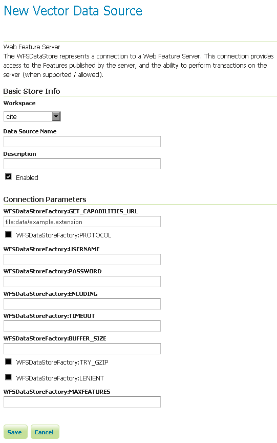

.. _data_external_wfs:

External Web Feature Server
===========================

GeoServer has the ability to load data from a remote Web Feature Server (WFS).  This is useful if the remote WFS lacks certain functionality that GeoServer contains.  For example, if the remote WFS is not also a Web Map Server (WMS), data from the WFS can be cascaded through GeoServer to utilize GeoServer's WMS.  If the remote WFS has a WMS but that WMS cannot output KML, data can be cascaded through GeoServer's WMS to output KML.

Adding an external WFS
----------------------

To connect to an external WFS, it is necessary to load it as a new datastore.  To start, navigate to :menuselection:`Stores --> Add a new store --> Web Feature Server`.

   *Adding an external WFS as a store*

.. list-table::
   :widths: 20 80

   * - **Option**
     - **Description**
   * - :guilabel:`Workspace`
     - Name of the workspace to contain the store.  This will also be the prefix of all of the layer names created from the store.
   * - :guilabel:`Data Source Name`
     - Name of the store as known to GeoServer.
   * - :guilabel:`Description`
     - Description of the store. 
   * - :guilabel:`Enabled`
     - Enables the store.  If disabled, no data from the external WFS will be served.
   * - :guilabel:`GET_CAPABILITIES_URL`
     - URL to access the capabilities document of the remote WFS.
   * - :guilabel:`PROTOCOL`
     - When checked, connects with POST, otherwise uses GET.
   * - :guilabel:`USERNAME`
     - The user name to connect to the external WFS.
   * - :guilabel:`PASSWORD`
     - The password associated with the above user name.
   * - :guilabel:`ENCODING`
     - The character encoding of the XML requests sent to the server.  Defaults to ``UTF-8``.
   * - :guilabel:`TIMEOUT`
     - Time (in milliseconds) before timing out.  Default is ``3000``.
   * - :guilabel:`BUFFER_SIZE`
     - Specifies a buffer size (in number of features).  Default is ``10`` features.
   * - :guilabel:`TRY_GZIP`
     - Specifies that the server should transfer data using compressed HTTP if supported by the server. 
   * - :guilabel:`LENIENT`
     - When checked, will try to render features that don't match the appropriate schema.  Errors will be logged. 
   * - :guilabel:`MAXFEATURES`
     - Maximum amount of features to retrieve for each featuretype.  Default is no limit.
   * - :guilabel:`AXIS_ORDER`
     - Axis order used in result coordinates (It applies only to WFS 1.x.0 servers). Default is Compliant.
   * - :guilabel:`AXIS_ORDER_FILTER`
     - Axis order used in filter (It applies only to WFS 1.x.0 servers). Default is Compliant.
   * - :guilabel:`OUTPUTFORMAT`
     - Output format to request (instead of the default remote service one).
   * - :guilabel:`GML_COMPLIANCE_LEVEL`
     - OCG GML compliance level. i.e. (simple feature) 0, 1 or 2. Default is 0.
   * - :guilabel:`GML_COMPATIBLE_TYPENAMES`
     - Use Gml Compatible TypeNames (replace : by _).  Default is no false.
   * - :guilabel:`USE_HTTP_CONNECTION_POOLING`
     - Use connection pooling to connect to the remote WFS service. Also enables digest authentcation.

When finished, click :guilabel:`Save`.

Configuring external WFS layers
-------------------------------

When properly loaded, all layers served by the external WFS will be available to GeoServer.  Before they can be served, however, they will need to be individually configured as new layers.  See the section on :ref:`data_webadmin_layers` for how to add and edit new layers.

Connecting to an external WFS layer via a proxy server
------------------------------------------------------

In a corporate environment it may be necessary to connect to an external WFS through a proxy server. To achieve this, various java variables need to be set.

For a Windows install running GeoServer as a service, this is done by modifying the wrapper.conf file. For a default Windows install, modify :file:`C:\\Program Files\\GeoServer x.x.x\\wrapper\\wrapper.conf` similarly to the following.

   # Java Additional Parameters

   wrapper.java.additional.1=-Djetty.home=.
   wrapper.java.additional.2=-DGEOSERVER_DATA_DIR="%GEOSERVER_DATA_DIR%"
   wrapper.java.additional.3=-Dhttp.proxySet=true
   wrapper.java.additional.4=-Dhttp.proxyHost=maitproxy
   wrapper.java.additional.5=-Dhttp.proxyPort=8080
   wrapper.java.additional.6=-Dhttps.proxyHost=maitproxy
   wrapper.java.additional.7=-Dhttps.proxyPort=8080
   wrapper.java.additional.8=-Dhttp.nonProxyHosts="mait*|dpi*|localhost"

Note that the :command:`http.proxySet=true` parameter is required. Also, the parameter numbers must be consecutive - ie. no gaps.

For a Windows install not running GeoServer as a service, modify :file:`startup.bat` so that the :command:`java` command runs with similar -D parameters.

For a Linux/UNIX install, modify :file:`startup.sh` so that the :command:`java` command runs with similar -D parameters.
