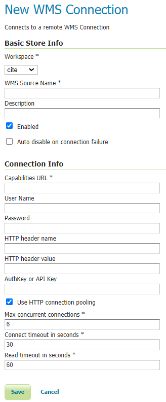
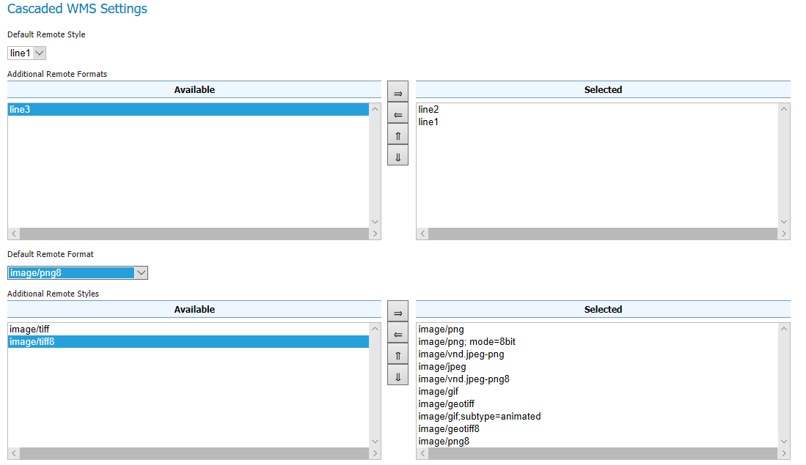

.. _data_external_wms:

External Web Map Server
=======================

GeoServer has the ability to proxy a remote Web Map Service (WMS).  This process is sometimes known as **Cascading WMS**.  Loading a remote WMS is useful for many reasons.  If you don't manage or have access to the remote WMS, you can now manage its output as if it were local.  Even if the remote WMS is not GeoServer, you can use GeoServer features to treat its output (watermarking, decoration, printing, etc).

To access a remote WMS, it is necessary to load it as a store in GeoServer.  GeoServer must be able to access the capabilities document of the remote WMS for the store to be successfully loaded.

Adding an external WMS
----------------------

To connect to an external WMS, it is necessary to load it as a new store.  To start, in the :ref:`web_admin`, navigate to :menuselection:`Stores --> Add a new store --> WMS`.  The option is listed under :guilabel:`Other Data Sources`.

.. figure:: images/wmsaddnew.png
   :align: center

   *Adding an external WMS as a store*

   *Configuring a new external WMS store*

.. list-table::
   :widths: 20 80

   * - **Option**
     - **Description**
   * - :guilabel:`Workspace`
     - Name of the workspace to contain the store.  This will also be the prefix of all of the layer names published from the store.  **The workspace name on the remote WMS is not cascaded.**
   * - :guilabel:`Data Source Name`
     - Name of the store as known to GeoServer.
   * - :guilabel:`Description`
     - Description of the store. 
   * - :guilabel:`Enabled`
     - Enables the store.  If disabled, no data from the remote WMS will be served.
   * - :guilabel:`Capabilities URL`
     - The full URL to access the capabilities document of the remote WMS.
   * - :guilabel:`User Name`
     - If the WMS requires authentication, the user name to connect as.
   * - :guilabel:`Password`
     - If the WMS requires authentication, the password to connect with.
   * - :guilabel:`Max concurrent connections`
     - The maximum number of persistent connections to keep for this WMS.

When finished, click :guilabel:`Save`.

Configuring external WMS layers
-------------------------------

When properly loaded, all layers served by the external WMS will be available to GeoServer.  Before they can be served, however, they will need to be individually configured (published) as new layers.  See the section on :ref:`data_webadmin_layers` for how to add and edit new layers.  Once published, these layers will show up in the :ref:`layerpreview` and as part of the WMS capabilities document.

Features
--------

Connecting a remote WMS allows for the following features:

* **Dynamic reprojection**.  While the default projection for a layer is cascaded, it is possible to pass the SRS parameter through to the remote WMS.  Should that SRS not be valid on the remote server, GeoServer will dynamically reproject the images sent to it from the remote WMS.

* **GetFeatureInfo**.  WMS GetFeatureInfo requests will be passed to the remote WMS.  If the remote WMS supports the ``application/vnd.ogc.gml`` format the request will be successful. 

* Full **REST Configuration**. See the :ref:`rest` section for more information about the GeoServer REST interface.

Cascaded WMS Settings
---------------------

Making use of Remotely advertised styles and supported image formats.

* **Remote Styles Configuration**. Remote Styles advertised in WMS capability document under <Layer> tag, can also be used. A default style and additionally supported styles can be selected. By default no remote style is selected which indicates Geoserver to use whatever style is configured remotely and all available styles are selected. This means that remote styles can be passed in a GetMap request just like local styles. If the styles on remote WMS server have changed, please re-save the layer from UI.

* **Remote Image Format**. Preferred image format(s) can be selected. It is possible to select a preferred image format and additionally supported image formats. This configuration works looks at the requested image format in local GetMap, if the GetMap format is either the preferred remote format or one of the many selected remote formats, the passed image format will be relayed in the remote WMS request. If the image format requested in local GetMap is neither the preferred remote image format nor in the list of Selected formats, the remote WMS format will use the preferred remote image format. This setting only works for image formats and ignore other advertised formats such as JSON, KML and SVG etc

* **Scale Denominators**. Min and Max scale denominators can be applied to WMS layers. The effects of this configurations on the WMS layer are similar to that of scale denominators used in SLD as filters. See :ref:`sld_reference_rules`

* **Respect Advertised Bounds**. It is possible to ignore remote WMS requests with bounding box completely outside the advertised bounds of remote WMS layer. Some external WMS providers might respond with error instead of empty transparent image for WMS requests outside their advertised bounds, in such cases enable the check box to bar Geoserver from making empty WMS requests to WMS provider. 

Limitations
-----------

Layers served through an external WMS have some, but not all of the functionality of a local WMS.

* Layers cannot be styled with SLD.

* Alternate (local) styles cannot be used.

* Extra request parameters (``time``, ``elevation``, ``cql_filter``, etc.) cannot be used.
