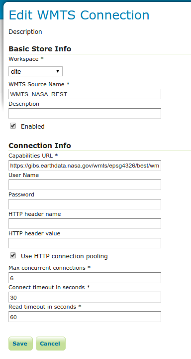

.. _data_external_wmts:

External Web Map Tile Server
============================

GeoServer has the ability to proxy a remote Web Map Tile Service (WMTS).  This process is sometimes known as **Cascading WMTS**,
even if the incoming requests follow the WMS protocol and the backing service follows the WMTS one; the WMTS cascading
functionality is more like a "protocol translator", where the different handled data (capabilities documents, images) are
translated by the "WMTS cascading" logic.

Loading a remote WMTS is useful for many reasons.  If you don't manage or have access to the remote WMTS, you can now manage its output as if it were local.  Even if you don't have any control on the remote WMTS, you can use GeoServer features to treat its output (watermarking, decoration, printing, etc).

To access a remote WMTS, it is necessary to load it as a store in GeoServer.  GeoServer must be able to access the capabilities document of the remote WMTS for the store to be successfully loaded.

Adding an external WMTS
-----------------------

To connect to an external WMTS, it is necessary to load it as a new store.  To start, in the :ref:`web_admin`, navigate to :menuselection:`Stores --> Add a new store --> WMTS`.  The option is listed under :guilabel:`Other Data Sources`.

.. figure:: images/wmtsaddnew.png
   :align: center

   *Adding an external WMTS as a store*

   *Configuring a new external WTMS store*

.. list-table::
   :widths: 20 80

   * - **Option**
     - **Description**
   * - :guilabel:`Workspace`
     - Name of the workspace to contain the store.  This will also be the prefix of all of the layer names published from the store.
   * - :guilabel:`Data Source Name`
     - Name of the store as known to GeoServer.
   * - :guilabel:`Description`
     - Description of the store.
   * - :guilabel:`Enabled`
     - Enables the store.  If disabled, no data from the remote WMTS will be served.
   * - :guilabel:`Capabilities URL`
     - The full URL to access the capabilities document of the remote WMTS.
   * - :guilabel:`User Name`
     - If the WMTS requires authentication, the user name to connect as.
   * - :guilabel:`Password`
     - If the WMTS requires authentication, the password to connect with.
   * - :guilabel:`HTTP header name`
     - If the WMTS requires a custom HTTP header, the header name.
   * - :guilabel:`HTTP header value`
     - If the WMTS requires a custom HTTP header, the header value.
   * - :guilabel:`Max concurrent connections`
     - The maximum number of persistent connections to keep for this WMTS.

When finished, click :guilabel:`Save`.

Configuring external WMTS layers
--------------------------------

When properly loaded, all layers served by the external WMTS will be available to GeoServer.  Before they can be served, however, they will need to be individually configured (published) as new layers.  See the section on :ref:`data_webadmin_layers` for how to add and edit new layers.  Once published, these layers will show up in the :ref:`layerpreview` and as part of the WMS capabilities document. If the WMTS layer has additional dimensions (e.g. time), related info will be reported on the WMS capabilities as well.

Features
--------

Connecting a remote WMTS allows for the following features:

* **Dynamic reprojection**.  While the default projection for a layer is cascaded, it is possible to pass the SRS parameter through to the remote WMS.  Should that SRS not be valid on the remote server, GeoServer will dynamically reproject the tiles sent to it from the remote WMTS.

* Full **REST Configuration**. See the :ref:`rest` section for more information about the GeoServer REST interface.

Limitations
-----------

Layers served through an external WMTS have some, but not all of the functionality of a local layer.

* Layers cannot be styled with SLD.

* Alternate (local) styles cannot be used.

* GetFeatureInfo requests aren't supported.

* GetLegendGraphic requests aren't supported.

* Image format cannot be specified.  GeoServer will attempt to request PNG images, and if that fails will use the remote server's default image format.
