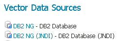
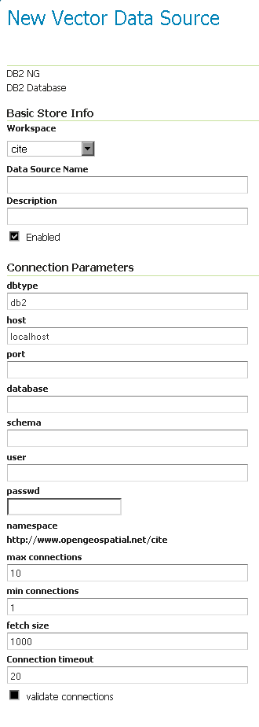

.. _data_db2:

DB2
===

.. note:: GeoServer does not come built-in with support for DB2; it must be installed through an extension. Proceed to :ref:`db2_install` for installation details.

The IBM DB2 UDB database is a commercial relational database implementing ISO SQL standards and is similar in functionality to Oracle, SQL Server, MySQL, and PostgreSQL.  The DB2 Spatial Extender is a no-charge licensed feature of DB2 UDB which implements the OGC specification "Simple Features for SQL using types and functions" and the ISO "SQL/MM Part 3 Spatial" standard.

A trial copy of DB2 UDB and Spatial Extender can be downloaded from: http://www-306.ibm.com/software/data/db2/udb/edition-pde.html .  There is also an "Express-C" version of DB2, that is free, comes with spatial support, and has no limits on size.  It can be found at: http://www-306.ibm.com/software/data/db2/express/download.html

.. _db2_install:

Installing the DB2 extension
----------------------------

.. warning:: Due to licensing requirements, not all files are included with the extension.  To install DB2 support, it is necessary to download additional files.  **Just installing the DB2 extension will have no effect.**

GeoServer files
```````````````

#. Download the DB2 extension from the `GeoServer download page 
   <http://geoserver.org/download>`_.

   .. warning:: Make sure to match the version of the extension to the version of the GeoServer instance!

#. Extract the contents of the archive into the ``WEB-INF/lib`` directory of 
   the GeoServer installation.

Required external files
```````````````````````

There are two files that are required but are not packaged with the GeoServer extension:  :file:`db2jcc.jar` and :file:`db2jcc_license_cu.jar`.  These files should be available in the :file:`java` subdirectory of your DB2 installation directory.  Copy these files to the ``WEB-INF/lib`` directory of the GeoServer installation.

After all GeoServer files and external files have been downloaded and copied, restart GeoServer.

Adding a DB2 data store
-----------------------

When properly installed, :guilabel:`DB2` will be an option in the :guilabel:`Vector Data Sources` list when creating a new data store.



   *DB2 in the list of raster data stores*

Configuring a DB2 data store
----------------------------



   *Configuring a DB2 data store*

Configuring a DB2 data store with JNDI
--------------------------------------

Notes on usage
--------------

DB2 schema, table, and column names are all case-sensitive when working with GeoTools/GeoServer. When working with DB2 scripts and the DB2 command window, the default is to treat these names as upper-case unless enclosed in double-quote characters.


