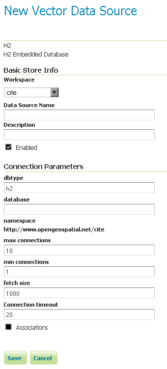

.. _data_h2:

H2
==

.. note:: GeoServer does not come built-in with support for H2; it must be installed through an extension. Proceed to :ref:`h2_install` for installation details.

.. _h2_install:

Installing the H2 extension
----------------------------

#. Download the H2 extension from the `GeoServer download page 
   <http://geoserver.org/download>`_.

   .. warning:: Make sure to match the version of the extension to the version of the GeoServer instance!

#. Extract the contents of the archive into the ``WEB-INF/lib`` directory of the GeoServer installation.

Adding an H2 data store
-----------------------

Once the extension is properly installed :guilabel:`H2` will be an option in the :guilabel:`Vector Data Sources` list when creating a new data store.

.. figure:: images/h2create.png
   :align: center

   *H2 in the list of vector data stores*

Configuring an H2 data store
----------------------------

   *Configuring an H2 data store*

Configuring an H2 data store with JNDI
--------------------------------------