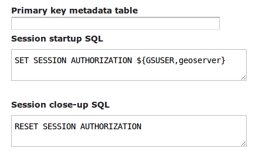

.. _data_sqlsession:

Custom SQL session start/stop scripts 
=====================================

Starting with version 2.1.4 GeoServer support custom SQL scripts that can be run every time GeoServer
grabs a connection from the connection pool, and every time the session is returned to the pool.

These scripts can be parametrized with the expansion of environment variables, which can be in turn
set into the OGC request parameters with the same mechanism as :ref:`sld_variable_substitution`.

In addition to the parameters provided via the request the ``GSUSER`` variable is guaranteed to
contain the current GeoServer user, or be null if no authentication is available. This is useful
if the SQL sessions scripts are used to provide tight control over database access

The SQL script can expand environment variables using the ``${variableName, defaultValue}`` syntax,
for example the following alters the current database user to be the same as the GeoServer current user, 
or ``geoserver`` in case no user was authenticated 

   SET SESSION AUTHORIZATION ${GSUSER,geoserver}
   
Using SQL session scripts to control authorizations at the database level
-------------------------------------------------------------------------

GeoServer connects to a database via a connection pool, using the same rights as the user that
is specified in the connection pool setup.
In a setup that provides a variety of services and tables the connection pool user must have
a rather large set of rights, such as table selection (WMS), table insert/update/delete (WFS-T) and
even table creation (data upload via RESTConfig, WPS Import process and eventual new processes leveraging
direct database connections).

What a user can do can be controlled by means of the GeoServer security subsystem, but in high security
setups this might not be considered enough, and a database level access control be preferred instead.
In these setups normally the connection pool user has limited access, such as simple read only access,
while specific users are allowed to perform more operations.

When setting up such a solution remember the following guidelines:

* The connection pool user must be able to access all table metadata regardless of whether it is able
  to actually perform a select on the tables (dictionary tables/describe functionality must be always accessible)
* The connection pool must see each and every column of tables and views, in other words, the
  structure of the tables must not change as the current user changes
* the database users and the GeoServer user must be kept in synch with some external tools, GeoServer
  provides no out of the box facilities
* during the GeoServer startup the code will access the database to perform some sanity checks, 
  in that moment there is no user authenticated in GeoServer so the code will run under whatever
  user was specified as the "default value" for the ``GSUSER`` variable. 
* The user that administers GeoServer (normally ``admin``, but it can be renamed, and other users
  given the administration roles too) must also be a database user, all administrative access on the
  GeoServer GUI will have that specific user controlling the session  
  
Typical use cases:
  
* Give insert/update/delete rights only to users that must use WFS-T 
* Only allow the administrator to create new tables
* Limit what rows of a table a user can see by using dynamic SQL views taking into account the
  current user to decide what rows to return 
  
To make a point in case, if we want the PostgreSQL session to run with the current GeoServer user
credentials the following scripts will be used:

   *Setting up session authorization for PostgreSQL*

The first command makes the database session use either the current GeoServer user, or the ``geoserver``
user if no authentication was available (anonymous user, or startup situation).
The second command resets the session to the rights of the connection pool user.
 

