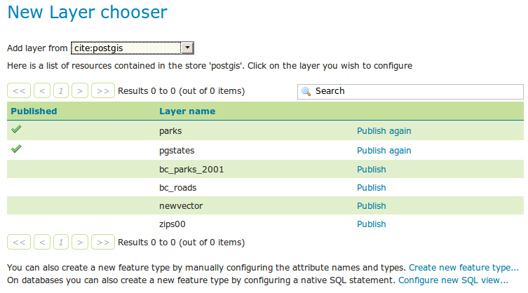
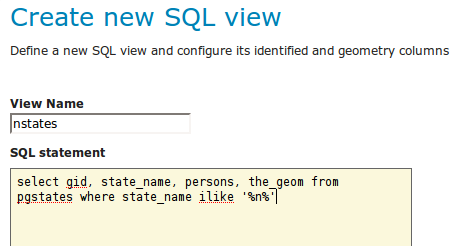
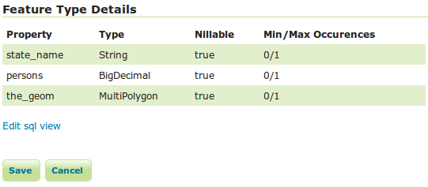
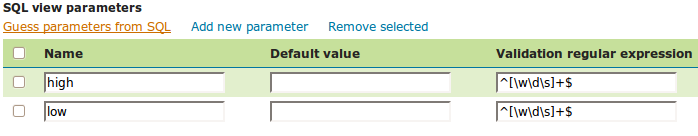

.. _sql_views:

SQL Views
=========

The traditional way to access database data is to configure layers against either tables or database views. 
Starting with GeoServer 2.1.0, layers can also be defined as SQL Views.  
SQL Views allow executing a custom SQL query on each request to the layer.  
This avoids the need to create a database view for complex queries.  

Even more usefully, SQL View queries can be parameterized via string substitution. 
Parameter values can be supplied in both WMS and WFS requests.  
Default values can be supplied for parameters, and input values can be validated by Regular Expressions 
to eliminate the risk of SQL injection attacks.

.. note::

   SQL Views are read-only, and thus cannot be updated by WFS-T transactions.

Creating a SQL View
-------------------------

In order to create a SQL View the administrator invokes the :guilabel:`Create new layer` page. 
When a database store is selected, the usual list of tables and views available for publication appears, 
A link :guilabel:`Configure new SQL view...` also appears:

   
Selecting the :guilabel:`Configure new SQL view...` link opens a new page where the SQL view query can be specified:

   
.. note::

   The query can be any SQL statement that is valid as a subquery in a FROM clause (that is, ``select * from (<the sql view>) [as] vtable``). 
   This is the case for most SQL statements, but in some databases special syntax may be needed to call stored procedures.
   Also, all the columns returned by the SQL statement must have names. 
   In some databases alias names are required for function calls.
   
When a valid SQL query has been entered, press the :guilabel:`Refresh` link in the **Attributes** table to get the list of the attribute columns determined from the query:

.. figure:: images/sqlview-attributes.png
   :align: center

GeoServer attempts to determine the geometry column type and the native SRID, but these should be verified and corrected if necessary.

.. note::

  Having a correct SRID (spatial reference id) is essential for spatial queries to work. 
  In many spatial databases the SRID is equal to the EPSG code for the specific spatial reference system, but this is not always the case (for instance, Oracle has a number of non-EPSG SRID codes).

  
If stable feature ids are desired for the view's features, one or more columns providing a unique id for the features should be checked in the **Identifier** column. 
Always ensure these attributes generate a unique key, or filtering and WFS requests will not work correctly.

Once the query and the attribute details are defined, press :guilabel:`Save`.  
The usual :guilabel:`New Layer` configuration page will appear.
If further changes to the view are required, the page has a link to the SQL View editor at the bottom of the :guilabel:`Data` tab:

Once created, the SQL view layer is used in the same way as a conventional table-backed layer,
with the one limitation of being read-only.

.. warning:: Saving the SQL view definition here is not sufficient, the layer containing it must be saved as well for the change to have any effect.
             This is because the SQL view definition is actually just one component of the layer/featuretype/coverage attributes.

Parameterizing SQL Views
------------------------

A parametric SQL view is based on a SQL query containing named parameters.  
The values for the parameters can be provided dynamically in WMS and WFS requests
using the ``viewparams`` request parameter.  
Parameters can have default values specified,
to handle the situation where they are not supplied in a request.
Validation of supplied parameter values is supported by specifying validation regular expressions.
Parameter values are only accepted if they match the regular expression defined for them.
Appropriate parameter validation should always be used to avoid the risk of `SQL injection attacks <http://en.wikipedia.org/wiki/SQL_injection>`_.

.. warning:: 

  SQL View parameter substitution should be used with caution, since improperly validated parameters open the risk of SQL injection attack.  
  Where possible, consider using safer methods such as :ref:`dynamic filtering <filtering>` in the request, or :ref:`sld_variable_substitution`.

  
Defining parameters
^^^^^^^^^^^^^^^^^^^

Within the SQL View query, parameter names are delimited by leading and trailing ``%`` signs.
The parameters can occur anywhere within the query text, 
including such uses as within SQL string constants,
in place of SQL keywords, or representing entire SQL clauses.

Here is an example of a SQL View query for a layer called ``popstates`` with two parameters, ``low`` and ``high``:

.. figure:: images/sqlview-parametricsql.png
   :align: center

Each parameter needs to be defined with its name, an optional default value, and a validation expression.  
The :guilabel:`Guess parameters from SQL` link can be clicked to infer the query parameters automatically, or they can be entered manually. 
The result is a table filled with the parameter names, default values and validation expressions:

In this case the default values should be specified, since the query cannot be executed without values for the parameters (because the expanded query ``select gid, state_name, the_geom from pgstates where persons between and`` is invalid SQL). 
Since the use of the parameters in the SQL query requires their values to be positive integer numbers, the validation regular expressions are specified to allow only numeric input (i.e. ``^[\d]+$``):

.. figure:: images/sqlview-paramcustom.png
   :align: center
   
Once the parameters have been defined, 
the **Attributes** :guilabel:`Refresh` link is clicked to parse the query and retrieve the attribute columns.
The computed geometry type and column identifier details can be corrected if required. 
From this point on the workflow is the same as for a non-parameterized query.

.. _using_a_parametric_sql_view:

Using a parametric SQL View
^^^^^^^^^^^^^^^^^^^^^^^^^^^

The SQL view parameters are specified by adding the ``viewparams`` parameter to the WMS ``GetMap``
or the WFS ``GetFeature`` request. 
The ``viewparams`` argument is a list of ``key:value`` pairs, separated by semicolons: 

  ``viewparams=p1:v1;p2:v2;...``
  
If the values contain semicolons or commas these must be escaped with a backslash (e.g. ``\,`` and ``\;``).

For example, the ``popstates`` SQL View layer can be displayed by invoking the :ref:`layerpreview`.
Initially no parameter values are supplied, so the defaults are used and all the states are displayed. 

To display all states having more than 20 million inhabitants the following parameter is added to the ``GetMap`` request: ``&viewparams=low:20000000``

.. figure:: images/sqlview-20millions.png
   :align: center

To display all states having between 2 and 5 million inhabitants the view parameters are: ``&viewparams=low:2000000;high:5000000``

.. figure:: images/sqlview-2m-5m.png
   :align: center
   
   
Parameters can be provided for multiple layers by separating each parameter map with a comma: 

  ``&viewparams=l1p1:v1;l1p2:v2,l2p1:v1;l2p2:v2,...``

The number of parameter maps must match the number of layers (featuretypes) included in the request.

Parameters and validation
^^^^^^^^^^^^^^^^^^^^^^^^^

The value of a SQL View parameter can be an arbitrary string of text.  
The only constraint is that the attribute names and types returned by the view query must never change.
This makes it possible to create views containing parameters representing complex SQL fragments.
For example, using the view query ``select * from pgstates %where%`` allows specifying the WHERE clause of the query dynamically.
However, this would likely require an empty validation expression.  
which presents a serious risk of `SQL injection attacks <http://en.wikipedia.org/wiki/SQL_injection>`_.
This technique should only be used if access to the server is restricted to trusted clients.

In general, SQL parameters must be used with care.  
They should always include validation regular expressions that accept only the intended parameter values. 
Note that while validation expressions should be constructed to prevent illegal values, 
they do not necessarily have to ensure the values are syntactically correct, 
since this will be checked by the database SQL parser.
For example:

  * ``^[\d\.\+-eE]+$`` checks that a parameter value contains valid characters for floating-point numbers (including scientific notation), but does not check that the value is actually a valid number
  * ``[^;']+`` checks that a parameter value does not contain quotes or semicolons.  This prevents common SQL injection attacks, but otherwise does not impose much limitation on the actual value

Resources for Validation Regular expressions
^^^^^^^^^^^^^^^^^^^^^^^^^^^^^^^^^^^^^^^^^^^^

Defining effective validation regular expressions is important for security. 
Regular expressions are a complex topic that cannot be fully addressed here. 
The following are some resources for constructing regular expressions:

  * GeoServer uses the standard Java regular expression engine. The `Pattern class Javadocs <http://java.sun.com/javase/6/docs/api/java/util/regex/Pattern.html>`_ contain the full specification of the allowed syntax.
  * `<http://www.regular-expressions.info>`_ has many tutorials and examples of regular expressions.
  * The `myregexp <http://myregexp.com/>`_ applet can be used to test regular expressions online.

Place holder for the SQL WHERE clause
^^^^^^^^^^^^^^^^^^^^^^^^^^^^^^^^^^^^^

The SQL ``WHERE`` clause produced by GeoServer using the context filters, e.g. the bounding box filter of a WMS query, will be added around the SQL view definition. This comes handy (better performance) when we have extra operations that can  be done on top of the rows filtered with the GeoServer produced filter first.

A typical use case for this functionality is the execution of analytic functions on top of the filtered results:

.. code-block:: sql

  SELECT STATION_NAME,
         MEASUREMENT,
         MEASUREMENT_TYPE,
         LOCATION
  FROM
    (SELECT STATION_NAME,
            MEASUREMENT,
            MEASUREMENT_TYPE,
            LOCATION,
            ROW_NUMBER() OVER(PARTITION BY STATION_ID, MEASUREMENT_TYPE
                              ORDER BY TIME DESC) AS RANK
     FROM
       (SELECT st.id AS STATION_ID,
               st.common_name AS STATION_NAME,
               ob.value AS MEASUREMENT,
               pr.param_name AS MEASUREMENT_TYPE,
               ob.time AS TIME,
               st.position AS LOCATION
        FROM meteo.meteo_stations st
        LEFT JOIN meteo.meteo_observations ob ON st.id = ob.station_id
        LEFT JOIN meteo.meteo_parameters pr ON ob.parameter_id = pr.id

        -- SQL WHERE clause place holder for GeoServer
        WHERE 1 = 1 :where_clause:) AS stations_filtered) AS stations

  WHERE RANK = 1;

A few restrictions apply when using the explicit ``:where_clause:`` place holder:

  * it needs to be added in a position where all the attributes known by GeoServer are already present
  * the ``:where_clause:`` can only appear once 

When a ``WHERE`` clause place holder is present, GeoServer will always add an explicit ``AND`` at the beginning of the produced ``WHERE`` clause. This allows the injection of the produced ``WHERE`` in the middle of complex expressions if needed.
