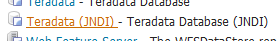
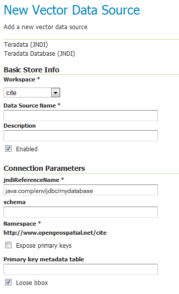

.. _data_teradata:

Teradata
========

.. note:: Teradata database support is not enabled by default and requires the Teradata extension to be installed prior to use.  Please see the section on :ref:`data_teradata_install` for details.

The Teradata Database is a commercial relational database (RDBMS) that specializes in parallel processing and scalability.  From version 12.0, Teradata has added geospatial support, closely following the SQL/MM standard (SQL Multimedia and Applications Packages).  Geospatial support was available through an add-on in version 12.0 and became standard in version 13.0.

GeoServer connects to a Teradata database via JDBC.

For more information on Teradata and the Teradata Database system, please go to `<http://www.teradata.com>`_.

Compatibility
-------------

The GeoServer Teradata extension is compatible with GeoServer 2.1.1 and higher.  GeoServer can connect to Teradata databases version 12.0 or higher.  Version 12.0 of the Teradata Database requires the optional geospatial extension to be installed.

Read/write access
-----------------

The Teradata datastore in GeoServer supports full transactional capabilities, including feature creation, editing, and deleting.

To support editing, a table must have one of the following:

* a primary key
* a unique primary index
* an identity (sequential) column

.. note:: It is not recommended to solely use an identity column, as spatial index triggers are not supported when referencing an identity column. See the section on Spatial Indexes for more details.

Query Banding
-------------

The GeoServer Teradata extension supports Query Banding.  Query Banding is a feature which allows any application to associate context information with each query it issues to the database.  In practice this can be used for purposes of workload management (i.e. request prioritization), debugging, and logging.

GeoServer sends the following information as part of a standard request:

 * Name of application (i.e. GeoServer)
 * Authenticated username (if set up)
 * Hostname (if available) 
 * Type of statement (i.e. "SELECT", "INSERT", "DELETE")

It is not possible to modify this information from within GeoServer.

Spatial indexes
---------------

GeoServer will read from a spatial index if its exists.  The convention for a spatial index table name is::

   [TABLENAME]_[GEOMETRYCOLUMN]_idx

So for a layer called "STATES" with a geometry column called "GEOM", the index table should be called :guilabel:`STATES_GEOM_idx`.

.. warning:: Make sure to match the case of all tables and columns.  If the geometry column is called "GEOM" (upper case) and the index created is called :guilabel:`STATES_geom_idx` (lower case), the index will not be properly linked to the table.

This index table should contain two columns:

 * A column that maps to the primary key of the spatial data table
 * The tessellation cell ID (cellid)

The tessellation cell ID is the ID of the cell where that feature is contained.

Geometry column
---------------

As per the SQL/MM standard, in order to make a Teradata table spatially enabled, an entry needs to be created for that table in the ``geometry_columns`` table.  This table is stored, like all other spatially-related tables, in the SYSSPATIAL database.

Tessellation
------------

Tessellation is the name of Teradata's spatial index.  In order to activate tessellation for a given layer, an entry (row) needs to be placed in the ``SYSSPATIAL.tessellation`` table.  This table should have the following schema:

.. list-table::
   :widths: 30 20 50
   :header-rows: 1

   * - Table name
     - Type
     - Description
   * - F_TABLE_SCHEMA
     - varchar
     - Name of the spatial database/schema containing the table
   * - F_TABLE_NAME
     - varchar
     - Name of the spatial table
   * - F_GEOMETRY_COLUMN
     - varchar
     - Column that contains the spatial data
   * - U_XMIN
     - float
     - Minimum X value for the tessellation universe
   * - U_YMIN
     - float
     - Minimum Y value for the tessellation universe
   * - U_XMAX
     - float
     - Maximum X value for the tessellation universe
   * - U_YMAX
     - float
     - Maximum Y value for the tessellation universe
   * - G_NX
     - integer
     - Number of X grids 
   * - G_NY
     - integer
     - Number of Y grids 
   * - LEVELS
     - integer
     - Number of levels in the grid 
   * - SCALE
     - float
     - Scale value for the grid 
   * - SHIFT
     - float
     - Shift value for the grid 

.. warning:: The tessellation table values are case sensitive and so must match the case of the tables and columns.

.. _data_teradata_install:

Installing the Teradata extension
---------------------------------

Teradata database support is not enabled by default and requires the GeoServer Teradata extension to be installed prior to use.  In addition to this extension, an additional artifact will need to be downloaded from the Teradata website.

GeoServer artifacts
~~~~~~~~~~~~~~~~~~~

#. Download the Teradata extension from the `download page <http://geoserver.org/release/stable/>`_ that matches your version of GeoServer.  The extension is listed at the bottom of the download page under :guilabel:`Extensions`.

   .. warning:: Make sure to match the version of the extension to the version of GeoServer!

#. Extract the contents of the archive into the ``WEB-INF/lib`` directory of the GeoServer installation.

Teradata artifacts
~~~~~~~~~~~~~~~~~~

In addition to the GeoServer artifacts, it is also necessary to download the Teradata JDBC driver.  This file cannot be redistributed and so must be downloaded directly from the Teradata website.  

#. Download the Teradata JDBC driver at `<https://downloads.teradata.com/download/connectivity/jdbc-driver>`_.

   .. note:: You will need to log in to Teradata's site in order to download this artifact.

#. Extract the contents of the archive into the :file:`WEB-INF/lib` directory of the GeoServer installation.

When all files have been downloaded and extracted, restart GeoServer.  To verify that the installation was successful, see the section on :ref:`data_teradata_add`.

.. note:: The full list of files required are:

    * ``gt-jdbc-teradata-<version>.jar``
    * ``tdgssconfig.jar``
    * ``terajdbc4.jar``

.. _data_teradata_add:

Adding a Teradata datastore
---------------------------

Once the extension has been added, it will now be possible to load an existing Teradata database as a store in GeoServer.  In the :ref:`web_admin`, click on :ref:`data_webadmin_stores` then go to :guilabel:`Add a new Store`.  You will see a option, under :guilabel:`Vector Data Stores`, for :guilabel:`Teradata`.  Select this option.

.. figure:: images/teradata_addnewstore.png
   :align: center

   *Teradata in the list of readable stores*

.. note:: If you don't Teradata in this list, the extension has not been installed properly.  Please ensure that the steps in the :ref:`data_teradata_install` have been followed correctly.

On the next screen, enter in the details on how to connect to the Teradata database.  You will need to include the following information:

.. list-table::
   :widths: 20 80
   :header-rows: 1

   * - Option
     - Description
   * - :guilabel:`Workspace`
     - Name of the workspace to contain the database.  This will also be the prefix of any layers server from tables in the database.
   * - :guilabel:`Data Source Name`
     - Name of the database in GeoServer.  This can be different from the name of the Teradata database, if desired.
   * - :guilabel:`Description`
     - Description of the database/store. 
   * - :guilabel:`Enabled`
     - Enables the store.  If disabled, no layers from the database will be served.
   * - :guilabel:`host`
     - Host name where the database exists.  Can be a URL or IP address.
   * - :guilabel:`port`
     - Port number on which to connect to the above host.
   * - :guilabel:`database`
     - Name of the Teradata database.  
   * - :guilabel:`user`
     - User name to connect to use to connect to the database.
   * - :guilabel:`passwd`
     - Password associated with the above user.
   * - :guilabel:`namespace`
     - Namespace to be associated with the database.  This field is altered automatically by the above Workspace field.
   * - :guilabel:`Expose primary keys`
     - Exposes primary key as a standard attribute.
   * - :guilabel:`max connections`
     - Maximum amount of open/pooled connections to the database. 
   * - :guilabel:`min connections`
     - Minimum number of open/pooled connections.
   * - :guilabel:`fetch size`
     - Number of records read with each interaction with the database.
   * - :guilabel:`Connection timeout`
     - Time (in seconds) the connection pool will wait before timing out.
   * - :guilabel:`validate connections`
     - Checks the connection is alive before using it.
   * - :guilabel:`Primary key metadata table`
     - Name of primary key metadata table to use if unable to determine the primary key of a table.
   * - :guilabel:`Loose bbox`
     - If checked, performs only the primary filter on the bounding box.
   * - :guilabel:`tessellationTable`
     - The name of the database table that contains the tessellations
   * - :guilabel:`estimatedBounds`
     - Enables using the geometry_columns/tessellation table bounds as an estimation instead of manual calculation. 
   * - :guilabel:`Max open prepared statements`
     - The maximum number of prepared statements.

When finished, click :guilabel:`Save`.

.. figure:: images/teradata_store1.png
   :align: center

.. figure:: images/teradata_store2.png
   :align: center

   *Adding a Teradata store*

Using JNDI
~~~~~~~~~~

GeoServer can also connect to a Teradata database using `JNDI <http://www.oracle.com/technetwork/java/jndi/index.html>`_ (Java Naming and Directory Interface).

To begin, in the :ref:`web_admin`, click on :ref:`data_webadmin_stores` then go to :guilabel:`Add a new Store`.  You will see a option, under :guilabel:`Vector Data Stores`, for :guilabel:`Teradata (JNDI)`.  Select this option.

   *Teradata (JNDI) in the list of readable stores*

On the next screen, enter in the details on how to connect to the Teradata database.  You will need to include the following information:

.. list-table::
   :widths: 20 80
   :header-rows: 1

   * - Option
     - Description
   * - :guilabel:`Workspace`
     - Name of the workspace to contain the database.  This will also be the prefix of any layers server from tables in the database.
   * - :guilabel:`Data Source Name`
     - Name of the database in GeoServer.  This can be different from the name of the Teradata database, if desired.
   * - :guilabel:`Description`
     - Description of the database/store. 
   * - :guilabel:`Enabled`
     - Enables the store.  If disabled, no layers from the database will be served.
   * - :guilabel:`jndiReferenceName`
     - JNDI path to the database.
   * - :guilabel:`schema`
     - Schema for the above database.
   * - :guilabel:`namespace`
     - Namespace to be associated with the database.  This field is altered by changing the workspace name.
   * - :guilabel:`Expose primary keys`
     - Exposes primary key as a standard attribute.
   * - :guilabel:`Primary key metadata table`
     - Name of primary key metadata table to use if unable to determine the primary key of a table.
   * - :guilabel:`Loose bbox`
     - If checked, performs only the primary filter on the bounding box.

When finished, click :guilabel:`Save`.

   *Adding a Teradata store with JNDI*

Adding layers
-------------

One the store has been loaded into GeoServer, the process for loading data layers from database tables is the same as any other database source.  Please see the :ref:`data_webadmin_layers` section for more information. 

.. note:: Only those database tables that have spatial information and an entry in the ``SYSSPATIAL.geometry_columns`` table can be served through GeoServer.

