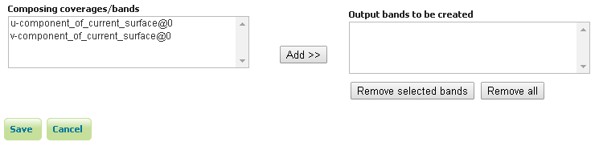
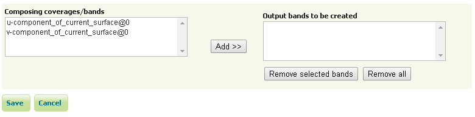
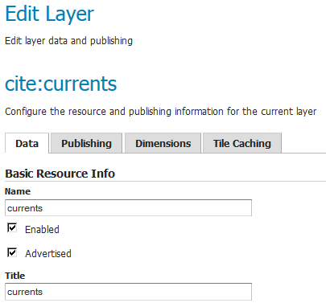
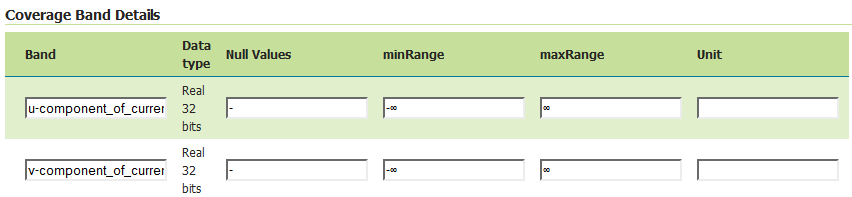
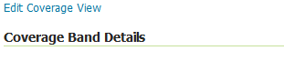

.. _coverage_views:

Coverage Views
==============

Starting with GeoServer 2.6.0, You can define a new raster layer as a Coverage View.  
Coverage Views allow defining a View made of different bands originally available inside coverages (either bands of the same coverage or different coverages) of the same Coverage Store.

Creating a Coverage View
------------------------

In order to create a Coverage View the administrator invokes the :guilabel:`Create new layer` page. 
When a Coverage store is selected, the usual list of coverages available for publication appears. 
A link :guilabel:`Configure new Coverage view...` also appears:

.. figure:: images/coverageviewnewlayer.png
   :align: center
   
Selecting the :guilabel:`Configure new Coverage view...` link opens a new page where you can configure the coverage view:

   
The upper text box allows to specify the name to be assigned to this coverage view. (In the following picture we want to create as example, a **currents** view merging together both u and v components of the currents, which are exposed as separated 1band coverages).

.. figure:: images/coverageviewname.png
   :align: center

Next step is defining the output bands to be put in the coverage view.
It is possible to specify which input coverage bands need to be put on the view by selecting them from the :guilabel:`Composing coverages/bands...`.

Once selected, they needs to be added to the output bands of the coverage view, using the :guilabel:`add` button. 

.. figure:: images/coverageviewaddbands.png
   :align: center

Optionally, is it possible to remove the newly added bands using the :guilabel:`remove` and :guilabel:`remove all` buttons.
Once done, clicking on the :guilabel:`save` button will redirect to the standard Layer configuration page.

Scrolling down to the end of the page, is it possible to see the bands composing the coverage (and verify they are the one previously selected).

At any moment, the Coverage View can be refined and updated by selecting the :guilabel:`Edit Coverage view...` link available before the Coverage Bands details section.

Once all the properties of the layer have been configured, by selecting the :guilabel:`Save` button, the coverage will be saved in the catalog and it will become visible as a new layer.

.. figure:: images/coverageviewavailablelayers.png
   :align: center

Coverage View in action
-----------------------

A Layer preview of the newly created coverage view will show the rendering of the view. Note that clicking on a point on the map will result into a GetFeatureInfo call which will report
the values of the bands composing the coverage view.

.. figure:: images/coverageviewlayerpreview.png
   :align: center

