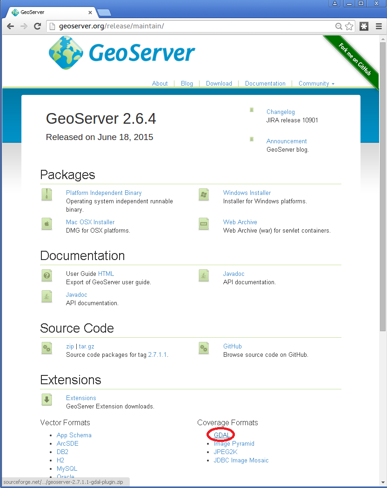
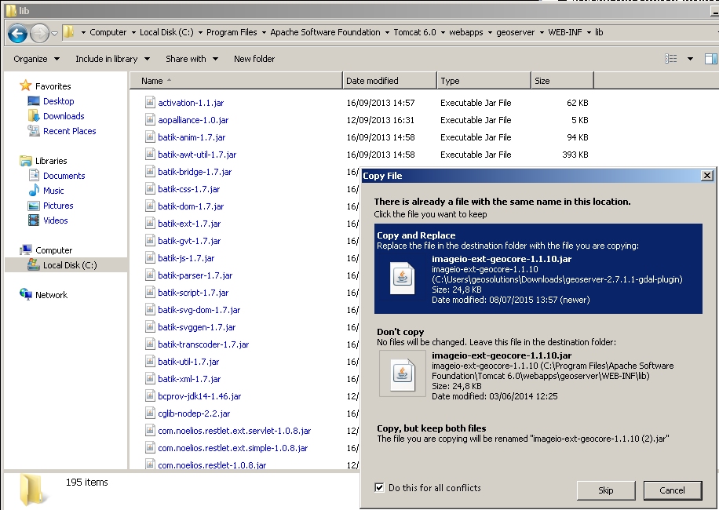
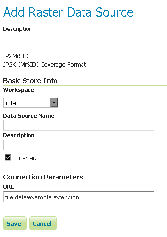
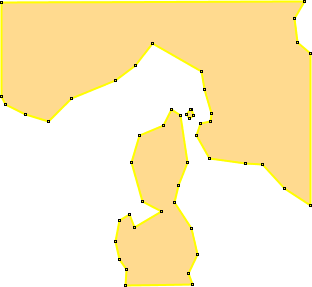
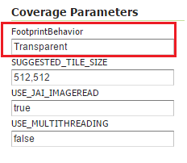
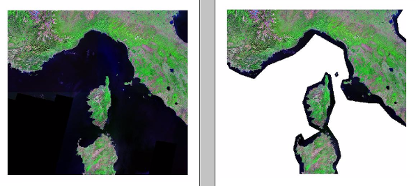

.. _data_gdal:

GDAL Image Formats
==================

GeoServer can leverage the `ImageI/O-Ext <https://github.com/geosolutions-it/imageio-ext/wiki>`_ GDAL libraries to read selected coverage formats. `GDAL <http://www.gdal.org>`_ is able to read many formats, but for the moment GeoServer supports only a few general interest formats and those that can be legally redistributed and operated in an open source server.

The following image formats can be read by GeoServer using GDAL:

* DTED, Military Elevation Data (.dt0, .dt1, .dt2): http://www.gdal.org/frmt_dted.html
* EHdr, ESRI .hdr Labelled: <http://www.gdal.org/frmt_various.html#EHdr>
* ENVI, ENVI .hdr Labelled Raster: <http://www.gdal.org/frmt_various.html#ENVI>
* HFA, Erdas Imagine (.img): <http://www.gdal.org/frmt_hfa.html>
* JP2MrSID, JPEG2000 (.jp2, .j2k): <http://www.gdal.org/frmt_jp2mrsid.html>
* MrSID, Multi-resolution Seamless Image Database: <http://www.gdal.org/frmt_mrsid.html>
* NITF: <http://www.gdal.org/frmt_nitf.html>
* ECW, ERDAS Compressed Wavelets (.ecw): <http://www.gdal.org/frmt_ecw.html>
* JP2ECW, JPEG2000 (.jp2, .j2k): http://www.gdal.org/frmt_jp2ecw.html
* AIG, Arc/Info Binary Grid: <http://www.gdal.org/frmt_various.html#AIG>
* JP2KAK, JPEG2000 (.jp2, .j2k): <http://www.gdal.org/frmt_jp2kak.html>

Installing GDAL extension
-------------------------

From GeoServer version 2.2.x, GDAL must be installed as an extension. To install it:

* Navigate to the `GeoServer download page <http://geoserver.org/download>`_

* Find the page that matches the version of the running GeoServer.

   .. warning::  Be sure to match the version of the extension with that of GeoServer, otherwise errors will occur.

* Download the GDAL extension.  The download link for :guilabel:`GDAL` will be in the :guilabel:`Extensions` section under :guilabel:`Coverage Format`. 

  
* Extract the files in this archive to the :file:`WEB-INF/lib` directory of your GeoServer installation. On Windows You may be prompted for confirmation to overwrite existing files, confirm the replacement of the files

  
Moreover, in order for GeoServer to leverage these libraries, the GDAL (binary) libraries must be installed through your host system's OS.  Once they are installed, GeoServer will be able to recognize GDAL data types. See below for more information.

Installing GDAL native libraries
++++++++++++++++++++++++++++++++

Starting GeoServer 2.16.x the imageio-ext plugin needs a GDAL version 2.x (tested in particular with 2.2.x and 2.4.x).

Windows packages and setup
^^^^^^^^^^^^^^^^^^^^^^^^^^

For Windows, `gisinternals.com <http://www.gisinternals.com/release.php>`_ provides complete packages,
with Java bindings support, in the ``release-<version>-GDAL-<version>-mapserver-<version>.zip`` packages
(the GDAL installers at the time of writing provide no Java support).

Unpack the zip file in a suitable location, and then set the following variables before starting up
GeoServer::

  set PATH=%PATH%;C:\<unzipped_package>\bin;C:\<unzipped_package>\bin\gdal\java
  set GDAL_DRIVER_PATH=C:\<unzipped_package>\bin\gdal\plugins
  set GDAL_DATA=C:\<unzipped_package>\bin\gdal-data
  
There are a few optional drivers that you can find in ``c:\<unzipped_package>\bin\gdal\plugins-extra``
and ``c:\<unzipped_package>\bin\gdal\plugins-optional``. Adding those paths to ``GDAL_DRIVER_PATH``
enables the additional formats. 

.. warning:: Before adding the extra formats please make sure that you are within your rights 
             to use them in a server environment (some packages are specifically forbidden from
             free usage on the server side and require a commercial licence, e.g., ECW).
  
.. note:: Depending on the version of the underlying operating system you'll have to pick up the right one. You can google around for the one you need. Also make sure you download the 32 bit  
          version if you are using a 32 bit version of Windows or the 64 bit version (has a "-x64" suffix in the name of the zip file) if you are running a 64 bit version of Windows.
          Again, pick the one that matches your infrastructure.
   
Note on running GeoServer as a Service on Windows
^^^^^^^^^^^^^^^^^^^^^^^^^^^^^^^^^^^^^^^^^^^^^^^^^

If you downloaded an installed GeoServer as a Windows service you installed the 32 bit version.

Simply deploying the GDAL ImageI/O-Ext native libraries in a location referred by the PATH environment variable (like, as an instance, the JDK/bin folder) won't allow the GeoServer service to use GDAL. As a result, during the service startup, GeoServer log will likely report the following message::

  it.geosolutions.imageio.gdalframework.GDALUtilities loadGDAL
  WARNING: Native library load failed.java.lang.UnsatisfiedLinkError: no gdaljni in java.library.path

Taking a look at the ``wrapper.conf`` configuration file available inside the GeoServer installation (at ``bin/wrapper/wrapper.conf``), there is this useful entry::

    # Java Library Path (location of Wrapper.DLL or libwrapper.so)
    wrapper.java.library.path.1=bin/wrapper/lib

To allow the GDAL native DLLs to be loaded, you have two options:

#. Move the native DLLs to the referenced path (bin/wrapper/lib)
#. Add a ``wrapper.java.library.path.2=path/where/you/deployed/nativelibs`` entry just after the ``wrapper.java.library.path1=bin/wrapper/lib`` line.

Linux packages and setup
^^^^^^^^^^^^^^^^^^^^^^^^

For common LTS Linux distribution there are packages for GDAL and the associated Java bindings,
e.g., on Ubuntu and derivatives you can install them using::

  sudo apt-get install gdal-bin libgdal-java
  
The libraries as installed above are already in the search path, so no extra setup is normally needed.
In case setting up the ``GDAL_DATA`` is required to handle certain projections, it's normally found
in ``/usr/share/gdal/<version>``, so you can execute the following prior to start GeoServer, e.g::

  export GDAL_DATA=/usr/share/gdal/<version>
  
In case you decide to build from sources instead, remember to run ``configure`` with ``--with-java``,
and after the main build and install, get into the ``swig/java`` and run a build and install there.
For more information about building GDAL see:

* `General build information <https://trac.osgeo.org/gdal/wiki/BuildHints>`_
* `Specific info to build GDAL Java bindings <https://trac.osgeo.org/gdal/wiki/GdalOgrInJavaBuildInstructionsUnix>`_

After the build and installation, export the following variables to make GeoServer use the GDAL custom build::

  export LD_LIBRARY_PATH=/<path_to_gdal_install>/lib
  export GDAL_DATA=/<path_to_gdal_install>/share/gdal

In case of version mismatch
^^^^^^^^^^^^^^^^^^^^^^^^^^^

If you are using a version of GDAL that does not match the one expected by GeoServer, you can go and replace the :file:`gdal-2.2.0.jar` file with the equivalent java binding jar (typically named either :file:`gdal-<version>.jar` or :file:`imageio-ext-gdal-bindings-*.jar`) included with your GDAL version. If your GDAL version does not include a bindings jar, it was probably not compiled with the java bindings and will not work with GeoServer.

Testing the installation
------------------------

Once these steps have been completed, restart GeoServer.  If all the steps have been performed  correctly, new data formats will be in the :guilabel:`Raster Data Sources` list when creating a new data store in the :guilabel:`Stores` section as shown here below.

.. figure:: images/newsource.png
   :align: center

   *GDAL image formats in the list of raster data stores*
   

If new formats do not appear in the GUI and you see the following message in the log file:

*it.geosolutions.imageio.gdalframework.GDALUtilities loadGDAL
WARNING: Native library load failed.java.lang.UnsatisfiedLinkError: no gdaljni in java.library.path*
WARNING: Native library load failed.java.lang.UnsatisfiedLinkError: no gdalalljni in java.library.path*

that means that the installations failed for some reason.

Configuring a DTED data store
-----------------------------

.. figure:: images/gdaldtedconfigure.png
   :align: center

   *Configuring a DTED data store*

Configuring a EHdr data store
-----------------------------

.. figure:: images/gdalehdrconfigure.png
   :align: center

   *Configuring a EHdr data store*

Configuring a ERDASImg data store
---------------------------------

.. figure:: images/gdalerdasimgconfigure.png
   :align: center

   *Configuring a ERDASImg data store*

Configuring a JP2MrSID data store
---------------------------------

   *Configuring a JP2MrSID data store*

Configuring a NITF data store
-----------------------------

.. figure:: images/gdalnitfconfigure.png
   :align: center

   *Configuring a NITF data store*

Supporting vector footprints
----------------------------
Starting with version 2.9.0, GeoServer supports vector footprints.
A footprint is a shape used as a mask to hide those pixels that are outside of the mask, hence making that part of the parent image transparent. 
The currently supported footprint formats are WKB, WKT and Shapefile.
By convention, the footprint file should be located in the same directory as the raster data that the footprint applies to.

.. note:: In the examples of this section and related subsections, we will always use .wkt as extension, representing a WKT footprint, although both .wkb and .shp are supported too.

For example, supposing you have a MrSID file located at
:file:`/mnt/storage/data/landsat/N-32-40_2000.sid` 
to be masked, you just need to place a WKT file on the same folder, as 
:file:`/mnt/storage/data/landsat/N-32-40_2000.wkt`
Note that the footprint needs to have same path and name of the original data file, with .wkt extension.

This is how the sample footprint geometry looks:

   *A sample geometry stored as WKT, rendered on OpenJump*

Once footprint file has been added, you need to change the FootprintBehavior parameter from None (the default value) to Transparent, from the layer configuration.

   *Setting the FootprintBehavior parameter*
   
The next image depicts 2 layer previews for the same layer: the left one has no footprint, the right one has a footprint available and FootprintBehavior set to transparent.

   *No Footprint VS FootprintBehavior = Transparent*

External Footprints data directory
++++++++++++++++++++++++++++++++++

As noted above, the footprint file should be placed in the same directory as the raster file. However in some cases this may not be possible. For example, the folder
containing the raster data may be read only.

As an alternative, footprint files can be located in a common directory, the **footprints data directory**. The subdirectories and file names under that directory must match
the original raster path and file names. The footprints data directory is specified as a Java System Property or an Environment Variable, by setting the `FOOTPRINTS_DATA_DIR`
property/variable to the directory to be used as base folder.

Example
^^^^^^^
Suppose you have 3 raster files with the following paths:

* :file:`/data/raster/charts/nitf/italy_2015.ntf`
* :file:`/data/raster/satellite/ecw/orthofoto_2014.ecw`
* :file:`/data/raster/satellite/landsat/mrsid/N-32-40_2000.sid`

They can be represented by this tree:

.. code-block:: xml

   /data
    \---raster
        +---charts
        |   \---nitf
        |           italy_2015.ntf
        |
        \---satellite
            +---ecw
            |       orthofoto_2014.ecw
            |
            \---landsat
                \---mrsid
                        N-32-40_2000.sid

In order to support external footprints you should

#. Create a :file:`/footprints` (as an example) directory on disk
#. Set the :file:`FOOTPRINTS_DATA_DIR=/footprints` variable/property.
#. Replicate the rasters folder hierarchy inside the specified folder, using the full paths.
#. Put the 3 WKT files in the proper locations: 
 
* :file:`/footprints/data/raster/charts/nitf/italy_2015.wkt`
* :file:`/footprints/data/raster/satellite/ecw/orthofoto_2014.wkt`
* :file:`/footprints/data/raster/satellite/landsat/mrsid/N-32-40_2000.wkt`

Which can be represented by this tree:

.. code-block:: xml

   /footprints
    \---data
        \---raster
            +---charts
            |   \---nitf
            |           italy_2015.wkt
            |
            \---satellite
                +---ecw
                |       orthofoto_2014.wkt
                |
                \---landsat
                    \---mrsid
                            N-32-40_2000.wkt

Such that, in the end, you will have the following folders hierarchy tree:

.. code-block:: xml

   +---data
   |   \---raster
   |       +---charts
   |       |   \---nitf
   |       |           italy_2015.ntf
   |       |
   |       \---satellite
   |           +---ecw
   |           |       orthofoto_2014.ecw
   |           |
   |           \---landsat
   |               \---mrsid
   |                       N-32-40_2000.sid
   |
   \---footprints
       \---data
           \---raster
               +---charts
               |   \---nitf
               |           italy_2015.wkt
               |
               \---satellite
                   +---ecw
                   |       orthofoto_2014.wkt
                   |
                   \---landsat
                       \---mrsid
                               N-32-40_2000.wkt

Note the parallel mirrored folder hierarchy, with the only differences being a :file:`/footprints` prefix at the beginning of the path,
and the change in suffix.
