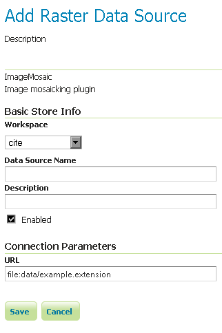

.. _data_imagemosaic:

ImageMosaic
===========

The ImageMosaic data store allows the creation of a mosaic from a number of georeferenced rasters. The plugin can be used with GeoTIFFs, as well as rasters accompanied by a world file (``.pgw`` for PNG files, ``.jgw`` for JPG files, etc.).

The "Mosaic" operation creates a mosaic of two or more source images. This operation could be used for example to assemble a set of overlapping geospatially rectified images into a contiguous image. It could also be used to create a montage of photographs such as a panorama.

The best current source of information on configuring an ImageMosaic is the tutorial: :ref:`tutorial_imagemosaic_extension`.

Adding an ImageMosaic data store
--------------------------------

By default, :guilabel:`ImageMosaic` will be an option in the :guilabel:`Raster Data Sources` list when creating a new data store.

.. figure:: images/imagemosaiccreate.png
   :align: center

   *ImageMosaic in the list of raster data stores*

Configuring an ImageMosaic data store
-------------------------------------

   *Configuring an ImageMosaic data store*

.. list-table::
   :widths: 20 80

   * - **Option**
     - **Description**
   * - ``Workspace``
     - 
   * - ``Data Source Name``
     - 
   * - ``Description``
     - 
   * - ``Enabled``
     -  
   * - ``URL``
     - 
