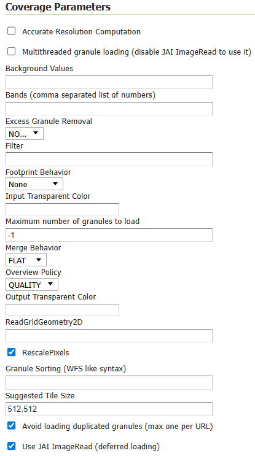

  .. _data_imagemosaic_config:

ImageMosaic configuration
=========================

Granules
--------

Each individual image is commonly referred to as a **granule**. In recent releases of GeoServer the similarities requirements
for the granules have been dropped significantly, including:

* The granules do not need to share the same coordinate reference system (see :ref:`the multi-CRS mosaic tutorial <multi-crs-mosaic>`)

* The granules can be in different color models, with an allowance of mixing gray, RGB, RGBA and indexed color granules
  (it is however not possible to mix colored granules with scientific data types like as float/double).
  In order to benefit of mixed color models JAI-Ext support must be enabled, see :ref:`the JAI-EXT support documentation <JAIEXT>`.

In addition it is worth remarking on the fact that currently the ImageMosaic is able to handle raster data whose grid-to-world transformation is a scale and translate transformation, hence no rotation or skew.

Index and configuration file creation
-------------------------------------

When a new store is created, an index shapefile will be generated to associate each granule file with its bounding box. The index creation respects directory trees as well as single directories. All you need to do is point the store to the root of the hierarchy, and all images will be considered for inclusion in the ImageMosaic.

The index will contain the enclosing polygon for each raster file (in an appropriate coordinate reference system) and the path to each of these files. The location attribute can be relative to the configuration folder or absolute. By default, the name of this attribute is ``location``, but this can be changed in the main configuration file.

If you already have these files generated, GeoServer will respect them and not generate a new index. By default, a shapefile is used for the index, but PostGIS, H2, and Oracle are also supported, with additional configuration steps.

Configuration files
-------------------

Within each store there are multiple configuration files that determine how the mosaic is rendered.

Primary configuration file
~~~~~~~~~~~~~~~~~~~~~~~~~~

The mosaic configuration file is the primary file used to store the configuration parameters that control the ImageMosaic plugin. When created by GeoServer it is by default called ``<directory>.properties``, where ``<directory>`` is the name of the root directory of the store. (It is not related to the store name in GeoServer.) It can have other names, as long as it does not conflict with other files such as :file:`datastore.properties` or :file:`indexer.properties`. This file usually does not require manual editing.

The table below describes the various elements in this configuration file.

.. list-table::
   :widths: 15 5 80
   :header-rows: 1
   :stub-columns: 1

   * - Parameter
     - Mandatory?
     - Description
   * - Levels
     - Y
     - Represents the resolutions for the various levels of the granules of this mosaic.
   * - Heterogeneous
     - N
     - Sets whether the image files are heterogeneous. Default is ``false``.
   * - AbsolutePath
     - N
     - Controls whether or not the path stored inside the ``location`` attribute represents an absolute path or a path relative to the location of the shapefile index. Notice that a relative index ensures much more portability of the mosaic itself. Default value for this parameter is ``false``, which means relative paths.
   * - Name
     - N
     - The name to be assigned to the index. If unspecified, the index name will usually match the name of the folder containing the mosaic.
   * - TypeName
     - Y
     - Featuretype name for this mosaic. Usually the name as ``Name``.
   * - Caching
     - N
     - Boolean value to enable caching. When set to ``true``, the ImageMosaic will try to save in memory the entire contents of the index to reduce loading/query time. Set to ``false`` for a large granule index and/or if new granules are to be ingested (for example, when the index is on a database and we interact directly with it). Default is ``false``.
   * - ExpandToRGB
     - N
     - Boolean flag to force color expansion from index color model (paletted datasets) to component color model (RGB). Default is ``false``.
   * - LocationAttribute
     - Y
     - The name of the attribute path in the shapefile index. Default is ``location``.
   * - SuggestedSPI
     - Y
     - Suggested plugin for reading the image files.
   * - Envelope2D
     - N
     - Envelope for the mosaic formatted as ``LLX,LLY URX,URY`` (notice the space between the lower left and upper right coordinate pairs).
   * - CheckAuxiliaryMetadata
     - N
     - This parameter allows to specify whether the ImageMosaic plugin should check for the presence of a GDAL aux.xml file beside each granule file. For most common use cases, you don't need to set or specify this parameter. Being disabled by Default, ImageMosaic won't look for an ancillary file for each granule being initialized in the GranuleCatalog. This avoid useless checks, especially when dealing with thousand of granules. You should set that parameter to ``true`` when you want to instruct the ImageMosaic to look for a GDAL generated aux.xml file containing PAM (Persistent Auxiliary Metadata) for each granule, to be attached to the Granule info (GranuleDescriptor). This is specially useful when you have setup a :ref:`Dynamic ColorMap rendering transformation <community_colormap>` which dynamically set a color map based on the statistics collected into the granule's GDAL PAM being previously generated with a gdalinfo -stats parameter.
   * - LevelsNum
     - Y
     - Represents the number of reduced resolution layers that we currently have for the granules of this mosaic.

.. SPI is not defined.

A sample configuration file follows::

  Levels=0.4,0.4
  Heterogeneous=false
  AbsolutePath=false
  Name=osm
  TypeName=osm
  Caching=false
  ExpandToRGB=false
  LocationAttribute=location
  SuggestedSPI=it.geosolutions.imageioimpl.plugins.tiff.TIFFImageReaderSpi
  CheckAuxiliaryMetadata=false
  LevelsNum=1
   

:file:`datastore.properties`
~~~~~~~~~~~~~~~~~~~~~~~~~~~~

By default the ImageMosaic index is specified by a shapefile, which is located at the root of the ImageMosaic directory, just like the primary configuration file.

If needed, different storage can be used for the index — like a spatial DBMS, which is the preferred solution when you wish to share the ImageMosaic itself in a cluster of GeoServer instances. In this case the user must supply GeoServer with the proper connection parameters, which can be specified by using a :file:`datastore.properties` file placed at the root of the ImageMosaic directory.

.. note:: A shapefile is created automagically if it does not exist or if there is no :file:`datastore.properties` file.

.. warning:: At the time of writing the following spatial DBMS have been tested successfully: Oracle, PostgreSQL, H2, SQLServer.

.. list-table::
   :widths: 15 5 80
   :header-rows: 1
   :stub-columns: 1

   * - Parameter
     - Mandatory?
     - Description
   * - StoreName
     - N
     - Can be used to refer to a GeoServer registered store, using a "workspace:storeName" syntax. When this is used,
       the no other connection parameters need to be provided. The SPI can still be provided to inform the mosaic of
       the resulting type of store (e.g., Oracle) in case specific behavior need to be enacted for it (e.g., in the
       case of Oracle the attributes are all uppercase and cannot be longer than 30 chars, the mosaic will respect
       the limits but the `SPI` parameter needs to be explicitly set to `org.geotools.data.oracle.OracleNGDataStoreFactory`
       as the actual store type is hidden when it reaches the mosaic code). 
       Also, as a reminder, the code is picking up a Store reference, not a layer one, meaning that security restrictions
       that might have been applied to a layer exposing the feature type do not apply to the mosaic code (e.g., if
       a user has restrictions such as a spatial filter on said layer, it won't transfer to the mosaic, which needs to
       be secured separately) 
   * - SPI
     - Y
     - The DataStoreFactory used to connect to the index store:
       
       * PostGIS: ``org.geotools.data.postgis.PostgisNGDataStoreFactory`` 
       * Oracle: ``org.geotools.data.oracle.OracleNGDataStoreFactory`` 
       * H2: ``org.geotools.data.h2.H2DataStoreFactory``
       * SQLServer: ``org.geotools.data.sqlserver.SQLServerDataStoreFactory``

       :ref:`JNDI <tomcat_jndi>` can also be used with any of these stores. If JNDI is used, the DataStoreFactory name will differ from the above.

   * - Connection parameters
     - Y
     - The connection parameters used by the specified SPI. The list of these connection parameters can be found in the GeoTools documentation on the relevant store:

       * `PostGIS <http://docs.geotools.org/latest/userguide/library/jdbc/postgis.html>`_
       * `Oracle <http://docs.geotools.org/latest/userguide/library/jdbc/oracle.html>`_
       * `H2 <http://docs.geotools.org/latest/userguide/library/jdbc/h2.html>`_
       * `SQLServer <http://docs.geotools.org/latest/userguide/library/jdbc/sqlserver.html>`_

       If JNDI is used, the connection parameters will include ``jndiReferenceName`` instead of ``host``, ``port``, etc.
       Note that for any connection parameters that include a space (such as ``loose bbox``), the space must be escaped by preceding it with a backslash (``loose\ bbox``).

Here is a sample :file:`datastore.properties` file for a PostGIS index::

  SPI=org.geotools.data.postgis.PostgisNGDataStoreFactory
  host=localhost
  port=5432
  database=osm
  schema=public
  user=user
  passwd=password
  Loose\ bbox=true
  Estimated\ extends=false
  validate\ connections=true
  Connection\ timeout=10
  preparedStatements=true
  
Here is a sample :file:`datastore.properties` file for a PostGIS index via JNDI::

  SPI=org.geotools.data.postgis.PostgisNGJNDIDataStoreFactory
  #String
  # JNDI data source
  # Default "java:comp/env/"+"jdbc/mydatabase"
  jndiReferenceName=
  
  #Boolean
  # perform only primary filter on bbox
  # Default Boolean.TRUE
  Loose\ bbox=true
  
  #Boolean
  # use prepared statements
  #Default Boolean.FALSE
  preparedStatements=false
  
  

:file:`indexer.properties`
~~~~~~~~~~~~~~~~~~~~~~~~~~

In addition to the required envelope and location attributes, the schema for the index store may expose other custom attributes which can be used later for filtering the ImageMosaic granules on the fly during a WMS or WCS request or to diver WMS and WCS dimensions like TIME, ELEVATION and so on. This is configured by the :file:`indexer.properties` file:

.. list-table::
   :widths: 15 5 80
   :header-rows: 1
   :stub-columns: 1

   * - Parameter
     - Mandatory?
     - Description
   * - Schema
     - Y
     - A comma-separated sequence describing the mapping between attribute and data type.
   * - PropertyCollectors
     - Y
     - A comma-separated list of PropertyCollectors. Each entry in the list includes the extractor class, the file name (within square brackets ``[ ]`` and not including the ``.properties`` suffix) containing the regular expression needed to extract the attribute value from the granule file name, and the attribute name (within parentheses ``( )``). The instance of the extractor class also indicates the type of object computed by the specific collector, so a ``TimestampFileNameExtractorSPI`` will return ``Timestamps`` while a ``DoubleFileNameExtractorSPI`` will return ``Double`` numbers.
   * - TimeAttribute
     - N
     - Specifies the name of the time-variant attribute.
   * - ElevationAttribute
     - N
     - Specifies the name of the elevation attribute.
   * - AuxiliaryFile
     - N
     - Path to an auxiliary file to be used for internal purposes (For example: when dealing with NetCDF granules, it refers to the NetCDF XML ancillary file.)
   * - AbsolutePath
     - N
     - Controls whether or not the path stored inside the ``location`` attribute represents an absolute path or a path relative to the location of the shapefile index. Notice that a relative index ensures better portability of the mosaic itself. Default value for this parameter is ``false``, which means relative paths.
   * - Caching
     - N
     - Boolean value to enable caching. When set to ``true``, the ImageMosaic will try to save in memory the entire contents of the index to reduce loading/query time. Set to ``false`` for a large granule index and/or if new granules are to be ingested (for example, when the index is on a database and we interact directly with it). Default is ``false``.
   * - CanBeEmpty
     - N
     - Boolean flag used for configuring empty mosaics. When enabled the ImageMosaic will not throw an exception caused by the absence of any coverage. By default it is set to ``false``.
   * - Envelope2D
     - N
     - Envelope for the mosaic formatted as ``LLX,LLY URX,URY`` (notice the space between the lower left and upper right coordinate pairs).
   * - ExpandToRGB
     - N
     - Boolean flag to force color expansion from index color model (paletted datasets) to component color model (RGB). Default is ``false``.
   * - IndexingDirectories
     - N
     - Comma separated values list of paths referring to directories containing granules to be indexed. If unspecified, the IndexingDirectory will be the mosaic configuration directory. This parameter allows configuration of a mosaic in a folder which contains only configuration files, while the granules to be indexed are stored somewhere else.
   * - Name
     - N
     - The name to be assigned to the index. If unspecified, the index name will usually match the name of the folder containing the mosaic.
   * - NoData
     - N
     - Specifies the NoData for the mosaic. (This might be useful, as an instance, when imposing the Envelope2D. At time of ImageMosaic's initialization, a small 5x5 pixels sample read is performed by ImageMosaic on the Envelope's corner in order to retrieve granule's metadata and properties, as nodata. If Envelope2D is forced in configuration, there might be the case that this sample read will not involve any actual granule so a default noData will be set which may be different with respect to what is actually stored on granules. Specifying the desired NoData property in indexer will solve this type of issue).
   * - CoverageNameCollectorSPI
     - N
     - As described in the previous row, the Name parameter allows specification of the coverage name to be exposed by the ImageMosaic. An ImageMosaic of NetCDFs instead exposes a coverage for each supported variable found in the NetCDF, using the variable's name as the coverage name (for instance, air_temperature, wind_speed, etc.) The optional CoverageNameCollectorSPI property allows specification of a CoverageNameCollector plugin to be used to instruct the ImageMosaic on how to setup different coverageNames for granules. It should contains the full name of the implementing class plus an optional set of semicolon-separated keyValue pairs prefixed by ":". See below for an example.
   * - Recursive
     - N
     - Boolean flag used at indexing time. When set to ``true``, the indexer will look for granules by scanning any subdirectory contained in the indexing directory. If ``false``, only the main folder will be analyzed. Default is ``true``.
   * - UseExistingSchema
     - N
     - Boolean flag used for enabling/disabling the use of existing schemas. When enabled, the ImageMosaic will start indexing granules using the existing database schema (from :file:`datastore.properties`) instead of populating it. This is useful when you already have a database with a valid mosaic schema (the_geom, location and other attributes, take a look at gdalindex) or when you do not want to rename the images to add times and dimensions (you should simply add them to the table, to AdditionalDomainAttributes and to PropertyCollectors). Default is ``false``.
   * - Wildcard
     - N
     - Wildcard used to specify which files should be scanned by the indexer. (For instance: ".")
   * - WrapStore
     - N
     - By default, Postgresql identifiers can't be longer than 63 chars. Longer names will be truncated to that fixed length. When dealing with multidimensional datasets (for instance: NetCDFs, GRIBs) each variable (NetCDF) or parameter (GRIB) is indexed into a table with the same name. Therefore an atmosphere-absorption-optical-thickness-due-to-particulate-organic-matter-ambient-aerosol-particles NetCDF CF variable will be associated to a table with the same name. Postgresql will truncate that to atmosphere-absorption-optical-thickness-due-to-particulate-orga breaking the one-to-one mapping and therefore breaking the proper functioning. Setting the WrapStore flag to ``true`` will establish a hidden mapping between full long names and truncated table names to support proper working.
   * - MosaicCRS
     - N
     - The "native" CRS of the mosaic, that is, the one in which footprints are collected. Useful when dealing with granules in multiple CRSs (see tutorial)

Here is a sample :file:`indexer.properties` file::

    Schema=*the_geom:Polygon,location:String,ingestion:java.util.Date,elevation:Double
    PropertyCollectors=TimestampFileNameExtractorSPI[timeregex](ingestion),DoubleFileNameExtractorSPI[elevationregex](elevation)
    TimeAttribute=ingestion
    ElevationAttribute=elevation
    Caching=false
    AbsolutePath=false

An example of optional CoverageNameCollectorSPI could be::

    CoverageNameCollectorSPI=org.geotools.gce.imagemosaic.namecollector.FileNameRegexNameCollectorSPI:regex=^([a-zA-Z0-9]+)
    
This defines a regex-based name collector which extracts the coverage name from the prefix of the file name, so that an ImageMosaic with temperature_2015.tif, temperature_2016.tif, pressure_2015.tif, pressure_2016.tif will put temperature* granules on a ``temperature`` coverage and pressure* granules on a ``pressure`` coverage.
    

Property collectors
~~~~~~~~~~~~~~~~~~~
  
The following table enumerates the available property collectors  
  
.. list-table::
   :widths: 20 80
   :header-rows: 1
   :stub-columns: 1
  
   * - Collector SPI name
     - Description
   * - ByteFileNameExtractorSPI
       DoubleFileNameExtractorSPI
       FloatFileNameExtractorSPI
       IntegerFileNameExtractorSPI
       LongFileNameExtractorSPI
       ShortFileNameExtractorSPI
     - Extracts an number from the file name using a regular expression specified in a sidecar file, casting it to the desired type based on the SPI name (e..g, DoubleFileNameExtractorSPI extracts double precision floating points, IntegerFileNameExtractorSPI extracts 32 bit integers)
   * - TimestampFileNameExtractorSPI
     - Extracts a timestamp from the filename using a regular expression specified in a sidecar file
   * - StringFileNameExtractorSPI
     - Extracts a string from the filename using a regular expression specified in a sidecar file
   * - CurrentDateExtractorSPI
     - Returns the current date and time (useful to track ingestion times in a mosaic)
   * - FSDateExtractorSPI
     - Returns the creation date of the file being harvested
   * - DateExtractorSPI
     - Returns the date found in tiff file header "DateTime" (code 306)
   * - ResolutionExtractorSPI
       ResolutionXExtractorSPI
       ResolutionYExtractorSPI
     - Returns the native resolution of the raster being harvested. ResolutionExtractorSPI and ResolutionXExtractorSPI return the x resolution of the raster, ResolutionYExtractorSPI returns the resolution on the Y axis instead
   * - CRSExtractorSPI
     - Returns the code of the the raster coordinate reference system, as a string, e.g. "EPSG:4326" 

The ``PropertyCollectors`` parameter in the example above indicates two additional ``.properties`` files used to populate the ``ingestion`` and ``elevation`` attributes:

:file:`timeregex.properties`::

    regex=[0-9]{8}T[0-9]{9}Z(\?!.\*[0-9]{8}T[0-9]{9}Z.\*)

The above is a property file containing a regex used to extract Date and Time represented in `ISO-8601 <https://en.wikipedia.org/wiki/ISO_8601>`_ as part of the filename.
(Note the T char between digits for date and digits for time, as per ISO-8601)

In case of custom format datetimes in filename, an additional *format* element should be added after the regex, preceded by a comma, defining the custom representation.

| Example:
| Temperature_2017111319.tif
| an hourly Temperature file with datetime = November, 13 2017 at 7:00 PM (the last 2 digits = 19)
|
| In that case, the timeregex.properties file should be like this:

    regex=.*([0-9]{10}).*,format=yyyyMMddHH

In case of reduced precision of temporal information, where there is the need to get the higher time included in that reduced value, an additional *,useHighTime=true* element should be added.

| Example:
| Temperature_2017111319.tif
| an hourly Temperature file with datetime = November, 13 2017 at 19h 00m 00s 000ms
| You want to get the max time included in that reduced precision, which is November, 13 2017 at 19h 59m 59s 999ms 
|
| In that case, the timeregex.properties file should be like this:

    regex=.*([0-9]{10}).*,format=yyyyMMddHH,useHighTime=true

In case the temporal information is spread along the whole file path, an additional *,fullPath=true* element should be added.

| Example:
| /data/20120202/Temperature.T1800.tif
| an hourly Temperature tif file with Year,Month and Day specified in the parent folder (20120202) and time value embeeded in the name (Temperature.T1800.tif)
|
| In that case, the timeregex.properties file should be like this:

    regex=(?:\/)(\\d{8})(?:\/)(?:Temperature.)(T\\d{4})(?:.tif),fullPath=true

:file:`elevationregex.properties`::

    regex=(?<=_)(\\d{4}\\.\\d{3})(?=_)

Store parameters
----------------

By default, :guilabel:`ImageMosaic` will be an option in the :guilabel:`Raster Data Sources` list when creating a new data store.

.. figure:: images/imagemosaiccreate.png

   ImageMosaic in the list of raster data stores

.. figure:: images/imagemosaicconfigure.png

   Configuring an ImageMosaic data store

.. list-table::
   :widths: 20 80
   :header-rows: 1
   :stub-columns: 1

   * - Option
     - Description
   * - :guilabel:`Workspace`
     - Workspace for the store
   * - :guilabel:`Data Source Name`
     - Name of the store
   * - :guilabel:`Description`
     - Description of the store
   * - :guilabel:`Enabled`
     -  Determines whether the store is enabled. If unchecked, all layers in the store will be disabled. 
   * - :guilabel:`URL`
     - The location of the store. Can be a local directory.

Coverage parameters
-------------------

Creation of the store is the first step to getting an ImageMosaic published in GeoServer. Most of the configuration is done when publishing the resulting coverage (layer).

The Coverage Editor gives users the possibility to set a few control parameters to further control the mosaic creation process.

   Coverage parameters

The parameters are as follows:

.. list-table::
   :widths: 25 75
   :header-rows: 1
   :stub-columns: 1

   * - Parameter
     - Description
   * - Accurate resolution computation
     - Boolean value. If ``true``, computes the resolution of the granules in 9 points: the corners of the requested area and the middle points, taking the better one. This will provide better results for cases where there is a lot more deformation on a subregion (top/bottom/sides) of the requested bounding box with respect to others. If ``false``, computes the resolution using a basic affine scale transform.
   * - AllowMultithreading
     - If ``true``, enables multithreaded tile loading. This allows performing parallelized loading of the granules that compose the mosaic. Setting this to ``true`` makes sense only if you set USE_JAI_IMAGEREAD to ``false`` at the same time to force immediate loading of data into memory.
   * - BackgroundValues
     - Sets the value of the mosaic background. Depending on the nature of the mosaic it is wise to set a value for the "nodata" area (usually -9999). This value is repeated on all the mosaic bands.
   * - Filter
     - Sets the default mosaic filter. It should be a valid :ref:`ECQL query <cql_tutorial>` to be used by default if no ``cql_filter`` is specified (instead of Filter.INCLUDE). This filter will be applied against the mosaic index, and may include any attributes exposed by the index store. If the ``cql_filter`` is specified in the request it will be overridden.

       .. note:: Do not use this filter to change time or elevation dimensions defaults. It will be added as AND condition with CURRENT for "time" and LOWER for "elevation".

   * - FootprintBehavior
     - Sets the behavior of the regions of a granule that are outside of the granule footprint. Can be ``None`` (ignore the footprint), ``Cut`` (remove regions outside the footprint from the image and don't add an alpha channel), or ``Transparent`` (make regions outside the footprint completely transparent, and add an alpha channel if one is not already present). Defaults to ``None``.
   * - InputTransparentColor
     - Sets the transparent color of the granules prior to processing by the ImageMosaic plugin, in order to control how they are superimposed. When GeoServer composes the granules to satisfy a user request, some can overlap others; setting this parameter with an appropriate color avoids the overlap of "nodata" areas between granules. See below for an example:

       .. figure:: images/input_color.png

          InputTransparentColor parameter not configured

       .. figure:: images/input_color2.png

          InputTransparentColor parameter configured

   * - MaxAllowedTiles
     - Sets the maximum number of tiles that can be loaded simultaneously for a request. For large mosaics, this parameter should be set to avoid saturating the server by loading too many granules simultaneously.
   * - MergeBehavior
     - The method used to handle overlapping granules during the mosaic operation. Can be ``FLAT`` (only the topmost granule is visible in the case of an overlap) or ``STACK`` (a band-stacking merge is applied to the overlapping granules). Default is ``FLAT``.
   * - OutputTransparentColor
     - Set the transparent color for the mosaic. This parameter make sense for RGB or paletted mosaics, but not for a DEM or MetOc data. See below for an example:

       .. figure:: images/output_color.png

          OutputTransparentColor parameter configured with "no color"

       .. figure:: images/output_color2.png

          OutputTransparentColor parameter configured with "nodata" color

   * - SORTING
     - Controls the order in which the granules are passed to the mosaic operation. Only useful if MergeBehavior is set to ``FLAT``. Should be the name of an attribute in the index file, followed by a space, followed by `A` for ascending, or `D` for descending. For example: ``sortattr D``.
   * - SUGGESTED_TILE_SIZE
     - Controls the tile size of the input granules as well as the tile size of the output mosaic. It consists of two positive integers separated by a comma. Default is ``512,512``. If your data is properly tiled, you might want to set this parameter to blank to avoid unnecessarily reformatting when reading.
   * - USE_JAI_IMAGEREAD
     - Controls the low-level mechanism used to read the granules. If set to ``true``, GeoServer will use the JAI ImageRead operation and its deferred loading mechanism. If set to ``false``, GeoServer will perform direct ImageIO read calls, which will result in immediate loading.
   
       .. note::

          Deferred loading consumes less memory since it uses a streaming approach to only load into memory the data immediately needed for processing, but may cause problems under heavy load since it keeps the granule files open for a long time.

          Immediate loading consumes more memory since it loads the requested mosaic into memory all at once, but usually performs faster and prevents the "too many files open" error conditions that can occur with deferred loading.

Continue on with the :ref:`ImageMosaic tutorial <data_imagemosaic_tutorial>` to learn more and see examples.
