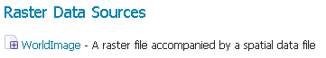
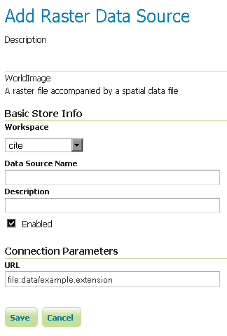

.. _data_worldimage:

WorldImage
==========

.. note:: GeoServer does not come built-in with support for WorldImage; it must be installed through an extension. Proceed to :ref:`image_install` for installation details.

A world file is a plain text file used to georeference raster map images.  This file (often with an extension of ``.jgw`` or ``.tfw``) accompanies an associated image file (``.jpg`` or ``.tif``).  Together, the world file and the corresponding image file is known as a WorldImage in GeoServer.

.. _image_install:

Installing the WorldImage extension
-------------------------------------

#. Visit the :website:`website download <download>` page, locate your release, and download:

   * |release| :download_extension:`image`
   * |version| :nightly_extension:`image`

   .. warning:: Ensure to match plugin (example |release| above) version to the version of the GeoServer instance.

#. Extract the contents of the archive into the :file:`WEB-INF/lib` directory of the GeoServer installation.

Adding a WorldImage data store
------------------------------

Once the extension is properly installed :guilabel:`WorldImage` will be an option in the :guilabel:`Raster Data Sources` list when creating a new data store.

   *WorldImage in the list of raster data stores*

Configuring a WorldImage data store
-----------------------------------

   *Configuring a WorldImage data store*

.. list-table::
   :widths: 20 80

   * - **Option**
     - **Description**
   * - ``Workspace``
     - 
   * - ``Data Source Name``
     - 
   * - ``Description``
     - 
   * - ``Enabled``
     -  
   * - ``URL``
     - 