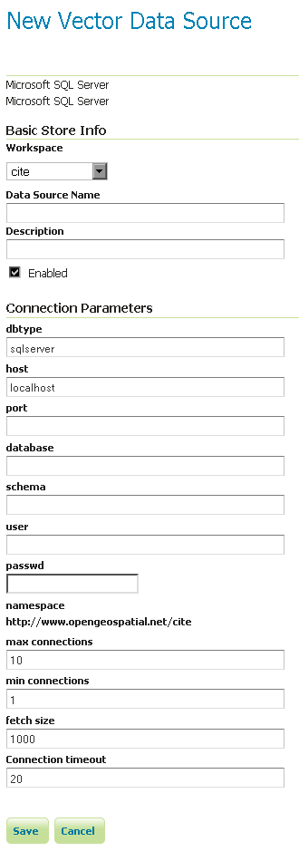

.. _data_sqlserver:

Microsoft SQL Server
====================

.. note:: GeoServer does not come built-in with support for SQL Server; it must be installed through an extension. Proceed to :ref:`sqlserver_install` for installation details.

Microsoft's `SQL Server <http://www.microsoft.com/sqlserver/2008>`_ is a relational database with spatial functionality.

Supported versions
------------------

The extension supports SQL Server 2008.

.. _sqlserver_install:

Installing the SQL Server extension
-----------------------------------

.. warning:: Due to licensing requirements, not all files are included with the extension.  To install SQL Server support, it is necessary to download additional files. 

GeoServer files
```````````````

#. Download the SQL Server extension from the `GeoServer download page <http://geoserver.org/display/GEOS/Download>`_.

   .. warning:: Make sure to match the version of the extension to the version of the GeoServer instance!

#. Extract the contents of the archive into the ``WEB-INF/lib`` directory of the GeoServer installation.

Microsoft files
```````````````

#. Navigate to `Microsoft's JDBC driver download page <http://msdn.microsoft.com/en-us/data/aa937724.aspx>`_.

#. Download using the ``Download SQL Server JDBC Driver 3.0`` link.

#. Accept the license and download the appropriate archive for your operating system.

#. Extract the contents of the archive

#. Copy the file ``sqljdbc4.jar`` to the ``WEB-INF/lib`` directory of the GeoServer installation.

#. For GeoServer installed on Windows, copy ``\x86\sqljdbc_auth.dll`` and ``\x86\sqljdbc_xa.dll`` to ``C:\Windows\System32``

Adding a SQL Server database
----------------------------

Once the extension is properly installed ``SQL Server`` will show up as an option when creating a new data store.

.. figure:: images/sqlservercreate.png
   :align: center

   *SQL Server in the list of vector data sources*

Configuring a SQL Server data store
-----------------------------------



   *Configuring a SQL Server data store*

.. list-table::
   :widths: 20 80

   * - ``host``
     - The sql server instance host name or ip address, only. Note that ``server\instance`` notation is not accepted - specify the port below, instead, if you have a non-default instance.
   * - ``port``
     - The port on which the SQL server instance is accepting connections.  See the :ref:`note <port_notes>` below.
   * - ``database``
     - The name of the database to connect to.
   * - ``schema``
     - The database schema to access tables from (optional).
   * - ``user``
     - The name of the user to connect to the oracle database as.
   * - ``password``     
     - The password to use when connecting to the database. Leave blank for no password.
   * - ``max connections``
 
       ``min connections``

     - Connection pool configuration parameters. See the :ref:`connection_pooling` section for details.

.. _port_notes:

Determining the port used by the SQL Server instance
````````````````````````````````````````````````````

You can determine the port in use by connecting to your SQL server instance using some other software, and then using :command:`netstat` to display details on network connections.  In the following example on a Windows PC, the port is 2646 ..
::
  C:\>netstat -a | find "sql1"
  TCP   DPI908194:1918   maittestsql1.dpi.nsw.gov.au:2646   ESTABLISHED


Adding a SQL Server database with JNDI
--------------------------------------

Configuring a SQL Server database with JNDI
-------------------------------------------
