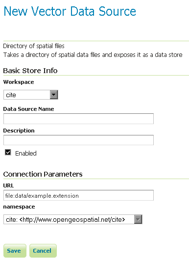

.. _data_shapefiles_directory:

Directory of spatial files
==========================

The directory store automates the process of loading multiple shapefiles into GeoServer.  Loading a directory that contains multiple shapefiles will automatically add each shapefile to GeoServer.

.. note:: While GeoServer has robust support for the shapefile format, it is not the recommended format of choice in a production environment. Databases such as PostGIS are more suitable in production and offer better performance and scalability.  See the section on :ref:`production` for more information.

Adding a directory
------------------

To begin, navigate to :menuselection:`Stores --> Add a new store --> Directory of spatial files`.

   *Adding a directory of spatial files as a store*

.. list-table::
   :widths: 20 80

   * - **Option**
     - **Description**
   * - :guilabel:`Workspace`
     - Name of the workspace to contain the store.  This will also be the prefix of all of the layer names created from shapefiles in the store.
   * - :guilabel:`Data Source Name`
     - Name of the store as known to GeoServer.
   * - :guilabel:`Description`
     - Description of the directory store. 
   * - :guilabel:`Enabled`
     - Enables the store.  If disabled, no data in any of the shapefiles will be served.
   * - :guilabel:`URL`
     - Location of the directory. Can be an absolute path (such as :file:`file:C:\\Data\\shapefile_directory`) or a path relative to the data directory (such as :file:`file:data/shapefile_directory`.
   * - :guilabel:`namespace`
     - Namespace to be associated with the store.  This field is altered by changing the workspace name.

When finished, click :guilabel:`Save`.

Configuring shapefiles
----------------------

All of the shapefiles contained in the directory store will be loaded as part of the directory store, but they will need to be individually configured as new layers they can be served by GeoServer.  See the section on :ref:`data_webadmin_layers` for how to add and edit new layers.