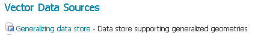
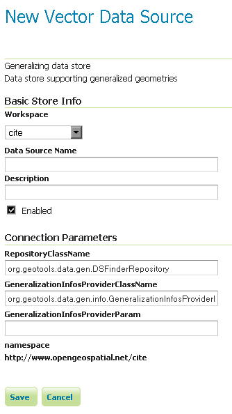

.. _data_featurepregen:

Pregeneralized Features
=======================

.. note:: GeoServer does not come built-in with support for Pregeneralized Features; it must be installed through an extension.

Installing the Pregeneralized Features extension
------------------------------------------------

#. Visit the :website:`website download <download>` page, locate your release, and download: :download_extension:`feature-pregeneralized`
   
   .. warning:: Ensure to match plugin (example |release| above) version to the version of the GeoServer instance.

#. Extract the contents of the archive into the :file:`WEB-INF/lib` directory of the GeoServer installation.

Adding a Pregeneralized Features data store
-------------------------------------------

If the extension is properly installed, :guilabel:`Generalized Data Store` will be listed as an option when creating a new data store.

   *Generalized Data Store in the list of vector data stores*

Configuring a Pregeneralized Features data store
------------------------------------------------

   *Configuring a Pregeneralized Features data store*

For a detailed description, look at the :doc:`Tutorial</tutorials/feature-pregeneralized/feature-pregeneralized_tutorial>`
