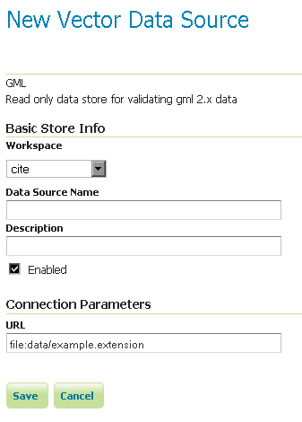

.. _data_gml:

GML
===

.. note:: GeoServer does not come built-in with support for GML; it must be installed through an extension. Proceed to :ref:`gml_install` for installation details.

.. warning:: Currently the GML extension is unmaintained and carries unsupported status.  While still usable, do not expect the same reliability as with other extension.

Geographic Markup Language (GML) is a XML based format for representing vector based spatial data.

Supported versions
------------------

Currently GML version 2 is supported.

.. _gml_install:

Installing the GML extension
----------------------------

#. Download the GML extension from the `GeoServer download page 
   <http://geoserver.org/download>`_.

   .. warning:: Make sure to match the version of the extension to the version of the GeoServer instance!

#. Extract the contents of the archive into the ``WEB-INF/lib`` directory of the GeoServer installation.

Adding a GML data store
-----------------------

Once the extension is properly installed :guilabel:`GML` will be an option in the :guilabel:`Vector Data Sources` list when creating a new data store.

.. figure:: images/gmlcreate.png
   :align: center

   *GML in the list of vector data stores*

Configuring a GML data store
----------------------------

   *Configuring a GML data store*
  