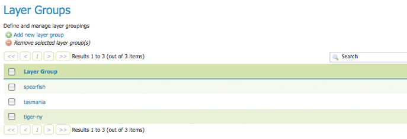
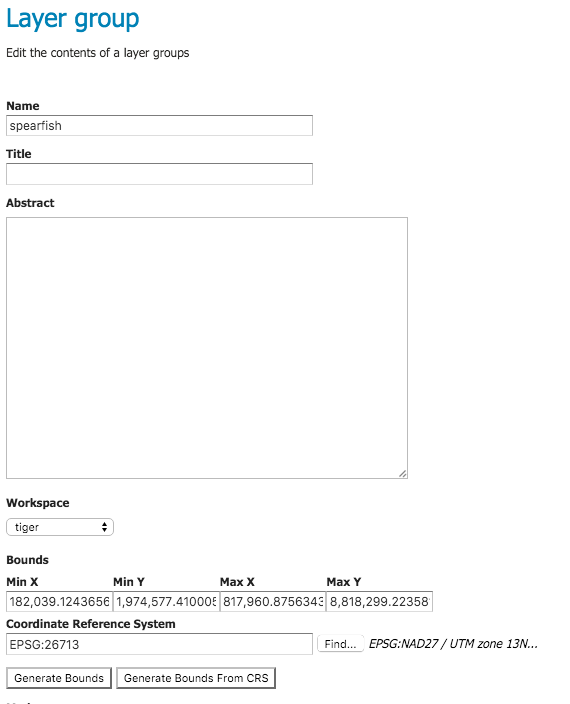
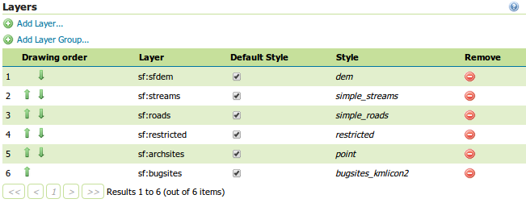
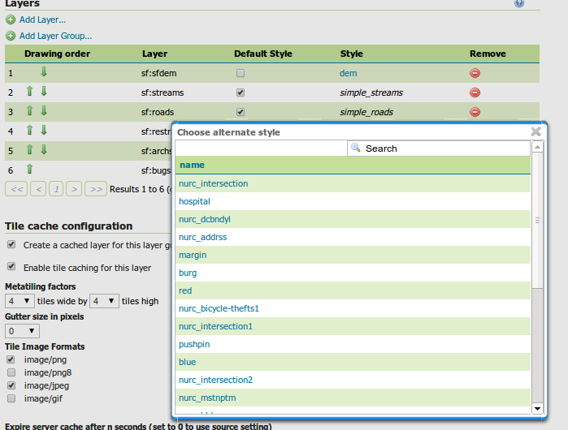
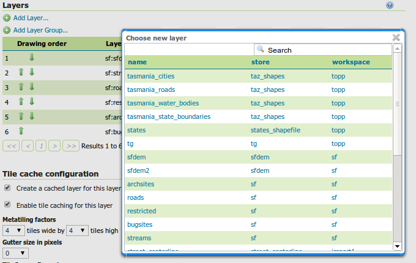
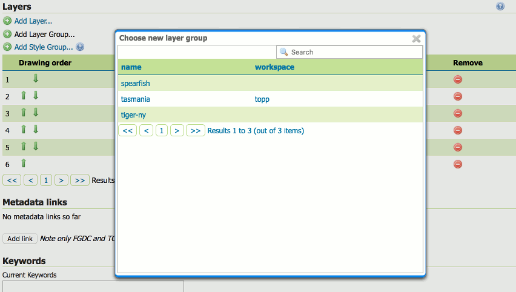
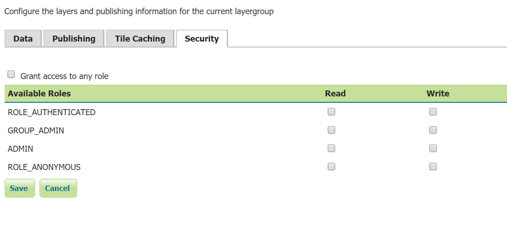
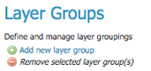
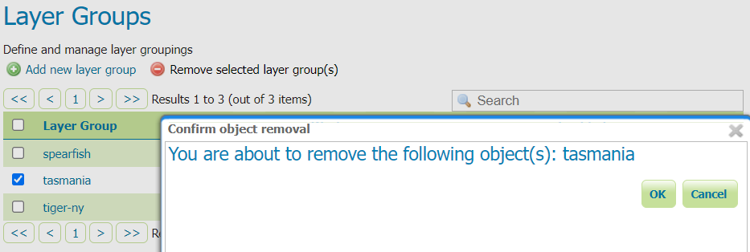

.. _data_webadmin_layergroups:

Layer Groups
============

A layer group is a container in which layers and other layer groups can be organized in a hierarchical structure. A layer group can be referred to by a single name in WMS requests.  This allows simpler requests, as one layer can be specified instead of multiple individual layers.
A layer group also provides a consistent, fixed ordering of the layers it contains, and can specify alternate (non-default) styles for layers.

   Layer Groups page
   
Layer Group modes
-----------------

Layer group behaviour can be configured by setting its :guilabel:`mode`. There are 5 available values:

* **single**: the layer group is exposed as a single layer with a name, acting as an alias for a list of layers. The layers are still showing up as top level entries in the WMS capabilities document (unless explicitly referred by a tree group).
* **opaque container**: the layer group is exposed as a single layer with a name, acting as an alias for a list of layers. However, the layers and sub-groups contained in it won't show up in the capabilities document (unless explicitly referred by a tree group) and won't be available by themselves in WMS calls and in the WMS capabilities document, but only  as part of the group.
* **named tree**: the layer group can be referred to by one name, but also exposes its nested layers and groups in the capabilities document.
* **container tree**: the layer group is exposed in the capabilities document, but does not have a name, making it impossible to render it on its own. This is called "containing category" in the WMS specification.
* **Earth Observation tree**: a special type of group created to manage the WMS Earth Observation requirements. This group does not render its nested layers and groups, but only a "preview layer" called Root Layer. When this mode is chosen, a new field "Root Layer" will be exposed in the configuration UI.

If a layer is included in any non *single* mode group, it will no longer be listed in the flat layer list.  It will still be possible to include the layer in other layer groups. 

+------------------------+-------+-------------------+----------------+------------------+
| Layer Group Mode       | Named | Contains Children | Lists Children | Details          |
+========================+=======+===================+================+==================+
| Single                 | named |                   | no             |                  |
+------------------------+-------+-------------------+----------------+------------------+
| Opaque Container       | named | yes               | no             | hides children   |
+------------------------+-------+-------------------+----------------+------------------+
| Named Tree             | named | yes               | lists children |                  |
+------------------------+-------+-------------------+----------------+------------------+
| Container Tree         |       | yes               | lists children |                  |
+------------------------+-------+-------------------+----------------+------------------+
| Earth Observation Tree | named | yes               | lists children | has root layer   |
+------------------------+-------+-------------------+----------------+------------------+

Edit a Layer Group
------------------

To view or edit a layer group, click the layer group name.  A layer group configuration page will be displayed.  The initial fields allow you to configure the name, title, abstract, workspace, bounds, projection and mode of the layer group. To automatically set the bounding box, select the :guilabel:`Generate Bounds` button or the :guilabel:`Generate Bounds From CRS` button to use the bounds defined in the CRS (if available). You may also provide your own custom bounding box extents. To select an appropriate projection click the :guilabel:`Find` button.

.. note:: A layer group can contain layers with dissimilar bounds and projections. GeoServer automatically reprojects all layers to the projection of the layer group.

The new :guilabel:`Enabled` checkbox, if disabled, will cause the layer group to just show up at configuration time (and in REST config), while the new :guilabel:`Advertised` checkbox, if unchecked, will make it to not be available in GetCapabilities request and in the layer preview. The behaviuor of layer group regarding both checkboxes will not affect the behaviour of any of the layers being grouped, which will follow respectively that specified  in the corresponding edit page.

   Layer Groups Edit page

The table at the bottom of the page lists layers and groups contained within the current layer group. We refer to layers and layer groups as :guilabel:`publishable elements`. When a layer group is processed, the layers are rendered in the order provided, so the :guilabel:`publishable elements` at the bottom of list will be rendered last and will show on top of the other :guilabel:`publishable elements`.

A :guilabel:`publishable element` can be positioned higher or lower on this list by clicking the green up or down arrows, respectively, or can be simply dragged in the target position. The layer at the top of the list is the first one to be painted, the layer below it will be painted second, and so on, the last layer will be painted on top of all others (this is the so called "painter's model").

The :guilabel:`Style` column shows the style associated with each layer. To change the style associated with a layer, click the appropriate style link. A list of enabled styles will be displayed. Clicking on a style name reassigns the layer's style.

   Style editing for a layer within a layer group

To remove a :guilabel:`publishable element` from the layer group, select its button in the :guilabel:`Remove` column. You will now be prompted to confirm or cancel this deletion.

A layer can be added to the list by clicking the :guilabel:`Add Layer...` button at the top of the table. From the list of layers, select the layer to be added by clicking the layer name. The selected layer will be appended to the bottom of the :guilabel:`publishable` list. 

   Dialog for adding a layer to a layer group

A layer group can be added by clicking the :guilabel:`Add Layer Group...` button at the top of the table. From the list of layer groups, select the layer group to be added by clicking its name. The selected group will be appended to the bottom of the :guilabel:`publishable` list. 

   Dialog for adding a layer group to a layer group

A style group can be added by clicking the :guilabel:`Add Style Group...` button at the top of the table. From the list of styles, select the :ref:`style group <sld_working>` to be added by clicking its name. The selected style will be appended to the bottom of the :guilabel:`publishable` list.

.. figure:: img/data_layergroups_add_stylegroup.png

   Dialog for adding a style group to a layer group

You can view layer groups in the :ref:`layerpreview` section of the web admin.

.. figure:: img/data_layergroups_tasmania.png
 
   Openlayers preview of the layer group "tasmania"

.. note:: By default, a layer group is queryable when at least a child layer is queryable. Uncheck "Queryable" box if you want to explicitly indicate that it is not queryable independently of how the child layers are configured.

Security tab allows to set data access rules at layer group level.

.. note:: For more information on data access rules, please see the section on :ref:`security_webadmin_data`.

To create/edit layergroup's data access rules simply check/uncheck checkboxes according to desidered access mode and role. 
The Grant access to any role checkbox grant each role for each access mode.

Add a Layer Group
-----------------

The buttons for adding and removing a layer group can be found at the top of the :guilabel:`Layer Groups` page. 

   Buttons to add or remove a layer group
   
To add a new layer group, select the "Add a new layer group" button. You will be prompted to name the layer group.
   
.. figure:: img/data_layergroups_name.png

   New layer group dialog

When finished, click :guilabel:`Submit`. You will be redirected to an empty layer group configuration page. Begin by adding layers by clicking the :guilabel:`Add layer...` button (described in the previous section). Once the layers are positioned accordingly, press :guilabel:`Generate Bounds` to automatically generate the bounding box and projection. You may also press the :guilabel:`Generate Bounds From CRS` button to use the CRS bounds (if available). Press :guilabel:`Save` to save the new layer group.

   New layer group configuration page

Remove a Layer Group
--------------------

To remove a layer group, select it by clicking the checkbox next to the layer group. Multiple layer groups can be selected, or all can be selected by clicking the checkbox in the header.  Click the :guilabel:`Remove selected layer group(s)` link. You will be asked to confirm or cancel the deletion. Selecting :guilabel:`OK` removes the selected layer group(s). 
 

  
   Removing a layer group

Layer Group Keywords
--------------------

Is possible to associate a layer group with some keywords that will be used to assist catalog searching. 
 
.. figure:: img/data_layergroups_keywords.png
  
   Layer groups keywords editor

Layer groups keywords will no be merged with contained layers keywords but keywords of a layer group should be logically inherited by contained layers.

Root Layer in Capabilities
--------------------------
Capabilities documents in GeoServer always have a top level (root) Layer element that works as a container of all the available layers and groups.

When a layer group is the only top level element in the Capabilities document, it is possible to remove this root Layer and return
a hierarchy where the layer group is the root instead.

To enable this functionality, choose the **No** option from the Root Layer in Capabilities section.

By default this behaviour is inherited from the global WMS service settings (**WMS Global Settings** option).
Finally, it is possible to override the service settings and force a **Yes** to always include the GeoServer root element.
 
.. figure:: img/data_layers_root_in_capabilities.png
  
   Layer groups root layer in capabilities options
