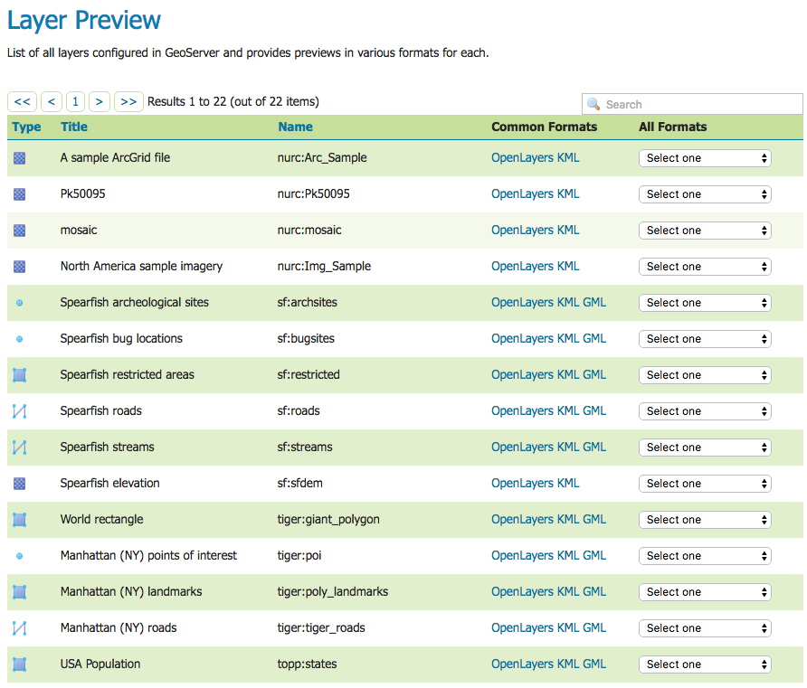
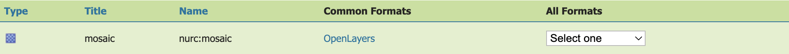

.. _layerpreview:

Layer Preview
=============

This page provides layer views in various output formats. A layer must be enabled to be previewed. 


   
   Layer Preview Page

Each layer row consists of a type, name, title, and available formats for viewing.

.. list-table::
   :widths: 5 70
   :header-rows: 1

   * - Field
     - Description
   * - .. image:: img/raster_icon.png
     - Raster (grid)
   * - .. image:: img/polygon_icon.png
     - Polygon
   * - .. image:: img/line_string_icon.png
     - Line
   * - .. image:: img/point_icon.png
     - Point
   * - .. image:: img/vector.png
     - Other Geometry
   * - .. image:: img/layers.png
     - Layer Group
   * - .. image:: img/map.png
     - Cascading WMS
   * - .. image:: img/error.png
     - Unknown/Other

Name refers to the Workspace and Layer Name of a layer, while Title refers to the brief description configured in the :ref:`data_webadmin_layers_edit_data` panel. In the following example, nurc refers to the Workspace, Arc_Sample refers to the Layer Name and "A sample ArcGrid field" is specified on the Edit Later Data panel.



   Single Layer preview row

Output Formats
--------------

The Layer Preview page supports a variety of output formats for further use or  data sharing. You can preview all three layer types in the common OpenLayers and KML formats. Similarly, using the "All formats" menu you can preview all layer types in seven additional output formats—AtomPub, GIF, GeoRss, JPEG, KML (compressed), PDF, PNG, SVG, and TIFF. Only Vector layers provide the WFS output previews, including the common GML as well as the CSV, GML3, GeoJSON and shapefile formats. The table below provides a brief description of all supported output formats, organized by output type (image, text, or data). 

Image Outputs
`````````````

All image outputs can be initiated from a WMS getMap request on either a raster,
vector or coverage data. WMS are methods that allows visual display of spatial data  without necessarily providing access to the features that comprise those data. 

.. list-table::
   :widths: 10 90 
   :header-rows: 1

   * - Format
     - Description
   * - KML
     - KML (Keyhole Markup Language) is an XML-based language schema for expressing geographic data in an Earth browser, such as Google Earth or Google Maps. KML uses a tag-based structure with nested elements and attributes. For GeoServer, KML files are distributed as a KMZ, which is a zipped KML file.
   * - JPEG
     - WMS output in raster format. The JPEG is a compressed graphic file format, with some loss of quality due to compression. It is best used for photos and not recommended for exact reproduction of data.  
   * - GIF
     - WMS output in raster format. The GIF (Graphics Interchange Format) is a bitmap image format best suited for sharp-edged line art with a limited number of colors. This takes advantage of the format's lossless compression, which favors flat areas of uniform color with well defined edges (in contrast to JPEG, which favors smooth gradients and softer images). GIF is limited to an 8-bit palette, or 256 colors.
   * - SVG
     - WMS output in vector format. SVG (Scalable Vector Graphics) is a language for modeling two-dimensional graphics in XML. It differs from the GIF and JPEG in that it uses graphic objects rather than individual points.     
   * - TIFF
     - WMS output in raster format. TIFF (Tagged Image File Format) is a flexible, adaptable format for handling multiple data in a single file. GeoTIFF contains geographic data embedded as tags within the TIFF file.
   * - PNG
     - WMS output in raster format. The PNG (Portable Network Graphics) file format was created as the free, open-source successor to the GIF. The PNG file format supports truecolor (16 million colors) while the GIF supports only 256 colors. The PNG file excels when the image has large, uniformly coloured areas.       
   * - OpenLayers
     - WMS GetMap request outputs a simple OpenLayers preview window. `OpenLayers <http://openlayers.org/>`_ is an open source JavaScript library for displaying map data in web browsers. The OpenLayers output has some advanced filters that are not available when using a standalone version of OpenLayers. Further, the generated preview contains a header with easy  configuration options for display. Version 3 of the OpenLayers library is used by default. Version 3 can be disabled with the `ENABLE_OL3` (true/false) format option or system property. For older browsers not supported by OpenLayers 3, version 2 is used regardless of the setting.
   * - PDF
     - A PDF (Portable Document Format) encapsulates a complete description of a fixed-layout 2D document,including any text, fonts, raster images, and 2D vector graphics.  
 
.. figure:: img/preview_openlayers.png
   
   Sample Image Output-an OpenLayers preview of nurc:Pk50095

Text Outputs
````````````

.. list-table::
   :widths: 10 90 
   :header-rows: 1

   * - Format
     - Description
   * - AtomPub
     - WMS output of spatial data in XML format. The AtomPub (Atom Publishing Protocol) is an application-level protocol for publishing and editing Web Resources using HTTP and XML. Developed as a replacement for the RSS family of standards for content syndication, Atom allows subscription of geo data.
   * - GeoRss
     - WMS GetMap request output of vector data in XML format. RSS (Rich Site Summary) is an XML format for delivering regularly changing web content. `GeoRss <http://www.georss.org>`_ is a  standard for encoding location as part of a RSS feed.supports  Layers Preview produces a RSS 2.0 documents, with GeoRSS Simple geometries using Atom. 
   * - GeoJSON
     - `JavaScript Object Notation <http://json.org/>`_ (JSON) is a lightweight data-interchange format based on the JavaScript programming language. This makes it an ideal interchange format for browser based applications since it can be parsed directly and easily in to javascript. GeoJSON is a plain text output format that add geographic types to JSON. 
   * - CSV
     - WFS GetFeature output in comma-delimited text. CSV (Comma Separated Values) files are text files containing rows of data. Data values in each row are separated by commas. CSV files also contain a comma-separated header row explaining each row's value ordering. GeoServer's CSVs are fully streaming, with no limitation on the amount of data that can be outputted. 
     
A fragment of a simple GeoRSS for nurc:Pk50095 using Atom::

   <?xml version="1.0" encoding="UTF-8"?>
	<rss xmlns:atom="http://www.w3.org/2005/Atom"
	     xmlns:georss="http://www.georss.org/georss" version="2.0">
	   <channel>
		 <title>Pk50095</title>
		 <description>Feed auto-generated by GeoServer</description>
		 <link>></link>		
		 <item>
		   <title>fid--f04ca6b_1226f8d829e_-7ff4</title>
		   <georss:polygon>46.722110379286 13.00635746384126 
			46.72697223230676 13.308182612644663 46.91359611878293
			13.302316867622581 46.90870264238999 12.999446822650462 
			46.722110379286 13.00635746384126
		   </georss:polygon>
		   </item>
	   </channel>
   </rss>

Data Outputs
````````````

All data outputs are initiated from a WFS GetFeature request on vector data.

.. list-table::
   :widths: 10 90 
   :header-rows: 1

   * - Format
     - Description
   * - GML2/3
     - GML (Geography Markup Language) is the XML grammar defined by the `Open Geospatial Consortium <http://en.wikipedia.org/wiki/Open_Geospatial_Consortium>`_ (OGC) to express geographical features. GML serves as a modeling language for geographic systems as well as an open interchange format for geographic data sharing. GML2 is the default (Common) output format, while GML3 is available from the "All Formats" menu.
   * - Shapefile
     - The ESRI Shapefile, or simply a shapefile, is the most commonly used format for exchanging GIS data. GeoServer outputs shapefiles in zip format, with a directory of .cst, .dbf, .prg, .shp, and .shx files. 
