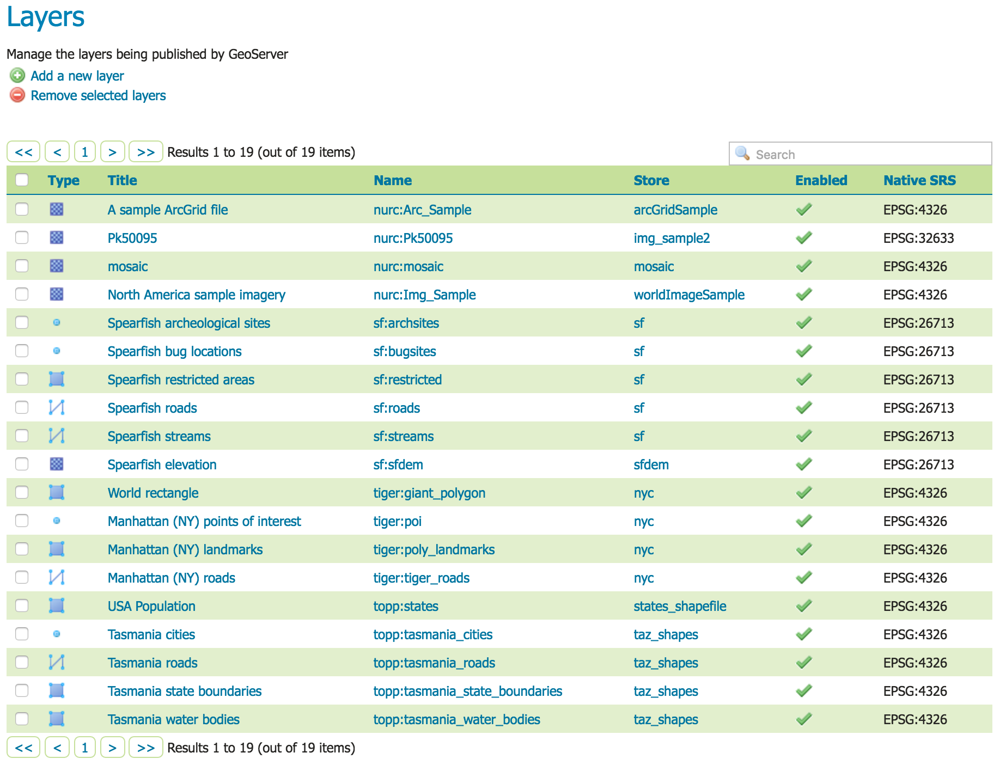
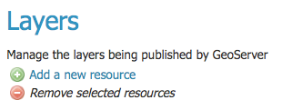
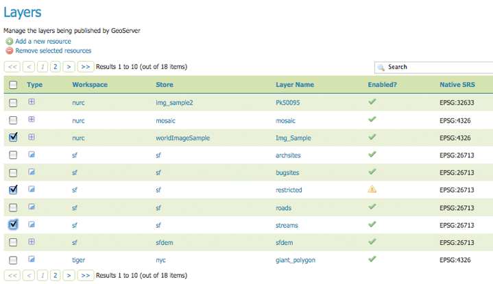
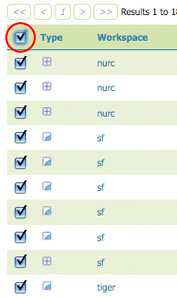
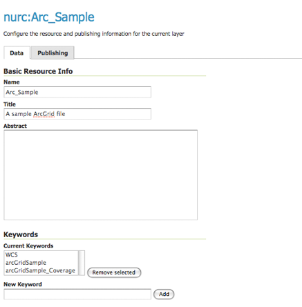
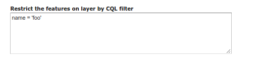
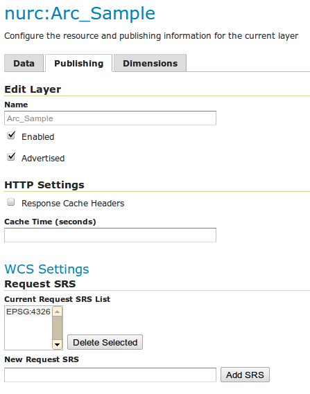
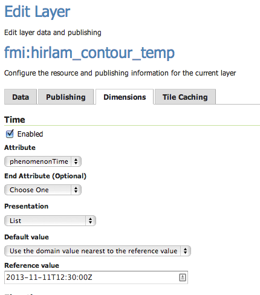
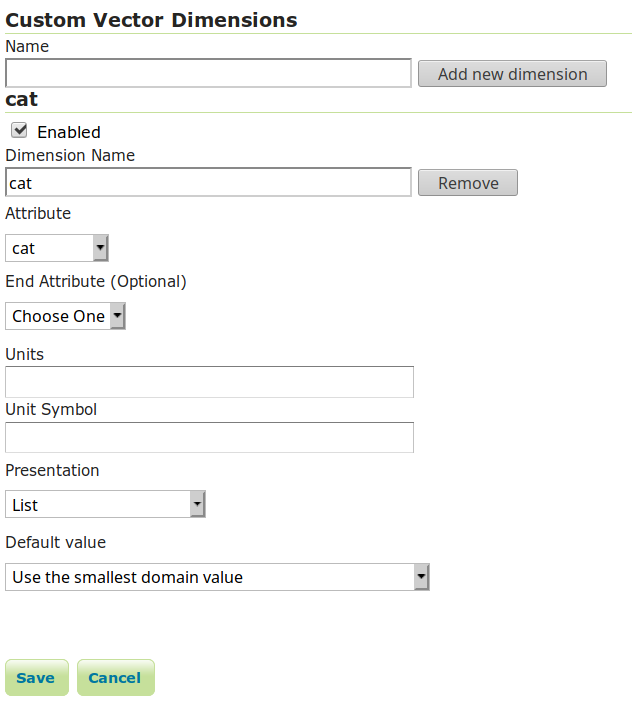
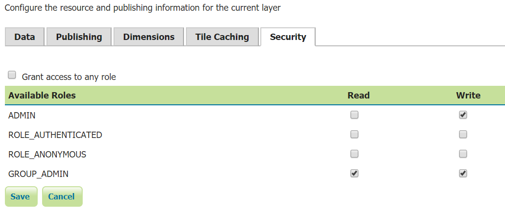

.. _data_webadmin_layers:

Layers
======

In GeoServer, the term "layer" refers to a raster or vector dataset that represents a collection of geographic features. Vector layers are analogous to "featureTypes" and raster layers are analogous to "coverages". All layers have a source of data, known as a Store. The layer is associated with the Workspace in which the Store is defined.

In the Layers section of the web interface, you can view and edit existing layers, add (register) a new layer, or remove (unregister) a layer. The Layers View page displays the list of layers, and the Store and Workspace in which each layer is contained. The View page also displays the layer's status and native SRS.

   Layers View

Layer types
-----------

Layers can be divided into two types of data: raster and vector. These two formats differ in how they store spatial information. Vector types store information about feature types as mathematical paths—a point as a single x,y coordinate, lines as a series of x,y coordinates, and polygons as a series of x,y coordinates that start and end on the same place. Raster format data is a cell-based representation of features on the earth surface. Each cell has a distinct value, and all cells with the same value represent a specific feature.

.. list-table::
   :widths: 5 70
   :header-rows: 1

   * - Field
     - Description
   * - .. image:: img/raster_icon.png
     - Raster (grid)
   * - .. image:: img/polygon_icon.png
     - Polygon
   * - .. image:: img/line_string_icon.png
     - Line
   * - .. image:: img/point_icon.png
     - Point

.. _data_webadmin_layers_add_a_layer:

Add a Layer
-----------

At the upper left-hand corner of the layers view page there are two buttons for the adding and removal of layers.
The green plus button allows you to add a new layer. The red minus button allows you to remove selected layers.

   Buttons to Add and Remove a Layer

Clicking the :guilabel:`Add a new layer` button brings up a :guilabel:`New Layer Chooser` panel. The menu displays all currently enabled stores. From this menu, select the Store where the layer should be added.

.. figure:: img/data_layers_add_chooser.png

   List of all currently enabled stores

Upon selection of a Store, a list is displayed of resources within the store.
Resources which have already been published as layers are listed first, followed by other resources which
are available to be published.
In this example, ``giant_polygon``, ``poi``, ``poly_landmarks`` and ``tiger_roads`` are all existing layers within the NYC store.

.. figure:: img/data_layers_add_view.png

   List of published and available resources in a store

To add a layer for an available resource click :guilabel:`Publish`.
To add a new layer for a published resource click :guilabel:`Publish Again`.
(Note that when re-publishing the name of the new layer may have to be modified to avoid conflict with an existing layer.)
The actions display an :ref:`Edit Layer <data_webadmin_layers_edit_data>` page to enter the definition of the new layer.

Remove a Layer
--------------

To remove a layer, select it by clicking the checkbox next to the layer. As shown below, multiple layers can be selected for batch removal. Note that selections for removal will not persist from one results pages to the next.

   Some layers selected for removal

All layers can be selected for removal by clicking the checkbox in the header.

   All layers selected for removal

Once layer(s) are selected, the :guilabel:`Remove selected resources` link is activated. Once you've clicked the link, you will be asked to confirm or cancel the removal. Selecting :guilabel:`OK` removes the selected layer(s).

.. _data_webadmin_layers_edit_data:

Edit Layer: Data
----------------

To view or edit a layer, click the layer name.  A layer configuration page will be displayed. The :guilabel:`Data` tab, activated by default, allows you to define and change data parameters for a layer.

   Edit Layer: Data tab

Basic Info
^^^^^^^^^^

The beginning sections—Basic Resource Info, Keywords and Metadata link—are analogous to the :ref:`service_metadata` section for WCS, WFS, and WMS.
These sections provide "data about the data," specifically textual information that make the layer data easier to understand and work with.
The metadata information will appear in the capabilities documents which refer to the layer.

* **Name**—Identifier used to reference the layer in WMS requests.  (Note that for a new layer for an already-published resource, the name must be changed to avoid conflict.)
* **Title**—Human-readable description to briefly identify the layer to clients (required)
* **Abstract**—Describes the layer in detail
* **Keywords**—List of short words associated with the layer to assist catalog searching
* **Metadata Links**—Allows linking to external documents that describe the data layer. Currently only two standard format types are valid: TC211 and FGDC. TC211 refers to the metadata structure established by the `ISO Technical Committee for Geographic Information/Geomatics <http://www.isotc211.org/>`_ (ISO/TC 211) while FGDC refers to those set out by the `Federal Geographic Data Committee <http://www.fgdc.gov/>`_ (FGDC) of the United States.

  .. figure:: img/data_layers_meta.png

     Adding a metadata link in FGDC format

Coordinate Reference Systems
^^^^^^^^^^^^^^^^^^^^^^^^^^^^

A coordinate reference system (CRS) defines how georeferenced spatial data relates to real locations on the Earth’s surface. CRSes are part of a more general model called Spatial Reference Systems (SRS), which includes referencing by coordinates and geographic identifiers. GeoServer needs to know the Coordinate Reference System of your data. This information is used for computing the latitude/longitude bounding box and reprojecting the data during both WMS and WFS requests.

.. figure:: img/data_layers_CRS.png

   Coordinate reference system of a layer

* **Native SRS**—Specifies the coordinate system the layer is stored in. Clicking the projection link displays a description of the SRS.
* **Declared SRS**—Specifies the coordinate system GeoServer publishes to clients
* **SRS Handling**—Determines how GeoServer should handle projection when the two SRSes differ. Possible values are:

  * **Force declared** (default): the declared SRS is forced upon the data, overwriting the native one. This is the default option and normally the best course of action,
    the declared code comes from the EPSG database and has a wealth of extra information in it, starting from a valid EPSG code, an area of validity, a link back in the
    database to find the best transformation steps to other coordinate reference systems should reprojection be required. Use this option when the source has no
    native CRS, has a wrong one, or has one matching the EPSG code (in order to get full metadata in the CRS used by GeoServer).
  * **Reproject from native**: This setting should be used when the native data set has a CRS that is not matching any official EPSG. OGC protocols need to advertise
    a EPSG code for the layers, with this setting the declared one will be advertised, and reprojection from native will happen on the fly as needed (in case a third
    CRS is requested, the reprojection will go directly from native to declared)
  * **Keep native**: this is a setting that should be used in very rare cases. Keeping native means using the declared one in the capabilities documents, but then
    using the native CRS in all othe requests (with no reprojection in between, unless explicitly requested from client). This is particularly problematic if the source
    is a shapefile, as the PRJ files lack all the extra information provided by the EPSG database (it will for example break WFS 1.1 and 2.0 SRS declarations in GML output).
    The setting meant to be used in cases where WMS is the primary target, and the native and declared CRSs have very small differences, avoiding on the fly reprojection
    and datum change.

In summary, use **Force Declared** as your primary option, **Reproject from native** only if your source data does not match any EPSG code, and **Keep Native**
only if you really know what you're doing.

For WMS Server and WFS-NG layers with multiple supported CRS in capability document, the Native CRS can be selected from clicking Find button next to Native SRS field

.. figure:: img/cascade_srs.png

Bounding Boxes
^^^^^^^^^^^^^^

The bounding box determines the extent of the data within a layer.

* **Native Bounding Box**—The bounds of the data specified in the Native SRS. These bounds can be generated by clicking the :guilabel:`Compute from data` button or they can be generated from the SRS definition by clicking the :guilabel:`Compute from SRS bounds` button. The SRS used depends on the :guilabel:`SRS Handling` chosen: the declared SRS when *Force declared* or *Reproject native to declared* are chosen, otherwise the native SRS is used. If the SRS does not have a bounding defined then none is generated.
* **Lat/Lon Bounding Box**—The bounds specified in geographic coordinates. These bounds can be calculated by clicking the :guilabel:`Compute from native bounds` button.

.. figure:: img/data_layers_BB.png

   Bounding Boxes of a layer

Coverage Parameters (Raster)
^^^^^^^^^^^^^^^^^^^^^^^^^^^^

Optional coverage parameters are possible for certain types of raster data. For example, WorldImage formats request a valid range of grid coordinates in two dimensions known as a :guilabel:`ReadGridGeometry2D.` For ImageMosaic, you can use :guilabel:`InputImageThresholdValue`, :guilabel:`InputTransparentColor`, and :guilabel:`OutputTransparentColor` to control the rendering of the mosaic in terms of thresholding and transparency.

Curves support (Vector)
^^^^^^^^^^^^^^^^^^^^^^^

GeoServer can handle geometries containing circular arcs (initially only from Oracle Spatial and the "properties data store", though more data sources are planned).

These geometries are kept in memory in their circular representation for as long as possible, are properly visually depicted in WMS, and encoded in GML 3.x as curved.

There are two options pertaining the circular arcs:

* **Linear geometries can contain circular arcs** should be checked to inform the GML encoder that the layer can contain circular arcs among other linear segments in the geometries, and thus use "gml:Curve" in place of "gml:LineString" in GML 3.1 output format. This is required because there is no quick way to know from the data sources if the linear geometries do contain circular arcs, and the choice of top level GML elements influences whether it is possible, or not, to represent circular arcs in their natural form.
* **Linearization tolerance** controls how accurately the linearized version of geometries matches the original circular version of them. The tolerance can be expressed as an absolute number in the native unit of measure of the data, or it can be expressed in meters or feet using the "m" and "ft" suffixes (such as "10m" or "15ft").

.. figure:: img/curved.png

   Curved geometry control

.. _data_webadmin_layers_edit_publishing:

Feature Type Details (Vector)
^^^^^^^^^^^^^^^^^^^^^^^^^^^^^

Vector layers have a list of the :guilabel:`Feature Type Details`. These include the :guilabel:`Property` and :guilabel:`Type` of a data source. For example, the ``sf:archsites`` layer shown below includes a geometry (``the_geom``) of type "point".

.. figure:: img/data_layers_feature.png

   Feature Type Details

The :guilabel:`Nillable` option refers to whether the property requires a value or may be flagged as being null. Meanwhile :guilabel:`Min/Max Occurrences` refers to how many values a field is allowed to have. Currently both :guilabel:`Nillable` and :guilabel:`Min/Max Occurrences` are set to ``true`` and ``0/1`` but may be extended with future work on complex features.

Restricting features showing up in the layer
^^^^^^^^^^^^^^^^^^^^^^^^^^^^^^^^^^^^^^^^^^^^

By default GeoServer will publish all the features available in the layer. It is possible
to restrict the features to a subset by specifying a CQL filter in the configuration:

   Restrict the features on layer by CQL filter

.. note::

     It is recommended to use this setting for layers that are not meant to be edited. The filter
     is only applied to reads, if a WFS-T insert adds a feature not matching the filter, it will
     be added to the store anyways, but won't show up in any of the outputs.

Edit Layer: Publishing
----------------------

The Publishing tab configures HTTP and WMS/WFS/WCS settings.

   Edit Layer: Publishing tab

* **Enabled**—A layer that is not enabled won't be available to any kind of request, it will just show up in the configuration (and in REST config)
* **Advertised**—A layer is advertised by default. A non-advertised layer will be available in all data access requests (for example, WMS GetMap, WMS GetFeature) but won't appear in any capabilities document or in the layer preview.

HTTP Settings
^^^^^^^^^^^^^

Cache parameters that apply to the HTTP response from client requests.

* **Response Cache Headers**— If selected, GeoServer will not request the same tile twice within the time specified in :guilabel:`Cache Time`. One hour measured in seconds (3600), is the default value for :guilabel:`Cache Time`.

Root Layer in Capabilities
^^^^^^^^^^^^^^^^^^^^^^^^^^
Capabilities documents in GeoServer always have a top level (root) Layer element that works as a container of all the available layers and groups.

When a layer is the only top level element in the Capabilities document, it is possible to remove this root Layer and return
a hierarchy where the layer is the root instead.

To enable this functionality, choose the **No** option from the Root Layer in Capabilities section.

By default this behaviour is inherited from the global WMS service settings (**WMS Global Settings** option).
Finally, it is possible to override the service settings and force a **Yes** to always include the GeoServer root element.
 
.. figure:: img/data_layers_root_in_capabilities.png
  
   Layer root layer in capabilities options

Services Settings
^^^^^^^^^^^^^^^^^

Sets services configuration on layer level.

  .. figure:: img/service_enable_layer.png

     Services Settings

* **Selectively enable services for layer**—Activate/deactivate service enable/disable configuration for the layer.
* **Enabled Services**—Selects enabled services list for this layer.
* **Disabled Services**—Selects disabled services list for this layer.

  .. note::

     It is also possible to set by-default disabled services to all layers using the ``org.geoserver.service.disabled`` system/env/servlet context variable.  This variable accepts a comma separated list of services that should be disabled by default, in case the resource in question has no explicit configuration.

WMS Settings
^^^^^^^^^^^^

Sets the WMS specific publishing parameters.

  .. figure:: img/wms_settings.png

     WMS Settings

* **Queryable**—Controls whether the layer is queryable via WMS ``GetFeatureInfo`` requests.
* **Default style**—Style that will be used when the client does not specify a named style in GetMap requests.
* **Additional styles**—Other styles that can be associated with this layer. Some clients (and the GeoServer Layer Preview) will present those as styling alternatives for that layer to the user.
* **Default rendering buffer**—Default value of the ``buffer`` GetMap/GetFeatureInfo vendor parameter. See the :ref:`wms_vendor_parameters` for more details.
* **Default WMS path**—Location of the layer in the WMS capabilities layer tree. Useful for building non-opaque layer groups
* **Default Interpolation Method**—Allows to specify a default resampling (interpolation) method for this layer. The available options are *Nearest neighbor*, *Bilinear*, *Bicubic*, or *Use service default*, which means that no layer specific configuration will be created (the default interpolation method selected in the WMS service configuration page will be used, see :ref:`Raster Rendering Options <services_webadmin_wms_raster_options>` for details). Can be overridden by the :ref:`interpolations vendor parameter <wms_vendor_parameter_interpolations>`.

WMS Attribution
^^^^^^^^^^^^^^^

Sets publishing information about data providers.

  .. figure:: img/data_layers_WMS.png

     WMS Attribution

* **Attribution Text**—Human-readable text describing the data provider. This might be used as the text for a hyperlink to the data provider's web site.
* **Attribution Link**—URL to the data provider's website.
* **Logo URL**—URL to an image that serves as a logo for the data provider.
* **Logo Content Type, Width, and Height**—These fields provide information about the logo image that clients may use to assist with layout. GeoServer will auto-detect these values if you click the :guilabel:`Auto-detect image size and type` link at the bottom of the section. The text, link, and URL are each advertised in the WMS Capabilities document if they are provided. Some WMS clients will display this information to advise users which providers provide a particular dataset. If you omit some of the fields, those that are provided will be published and those that are not will be omitted from the Capabilities document.

WFS Settings
^^^^^^^^^^^^

Sets the WFS specific publishing parameters.

  .. figure:: img/wfs_settings.png

     WFS Settings

* **Per-Request Feature Limit**—Sets the maximum number of features for a layer a WFS GetFeature operation should generate (regardless of the actual number of query hits)
* **Maximum number of decimals**—Sets the maximum number of decimals in GML output.

  .. note::

     It is also possible to override the ``OtherSRS/OtherCRS`` list configured in the WFS service, including overriding it with an empty list if need be. The input area will accept a comma separated list of EPSG codes:

     .. figure:: img/data_layers_WFS.png

        WFS otherSRS/otherCRS override

     The list will be used only for the capabilities document generation, but will not be used to limit the actual target SRS usage in GetFeature requests.

* **Encode coordinates measures**—Checking this setting will cause coordinates measures ("M") to be encoded in WFS output formats that support measures. The default (not checked) is to not encode coordinates measures.

WCS Settings
^^^^^^^^^^^^

* **Request SRS**—Provides a list of SRSs the layer can be converted to. :guilabel:`New Request SRS` allows you to add an SRS to that list.
* **Interpolation Methods**—Sets the raster rendering process, if applicable.
* **Formats**—Lists which output formats a layers supports.
* **GeoSearch**—When enabled, allows the Google Geosearch crawler to index from this particular layer. See `What is a Geo Sitemap? <http://www.google.com/support/webmasters/bin/answer.py?hl=en&answer=94554>`_ for more information.

KML Format Settings
^^^^^^^^^^^^^^^^^^^

Limits features based on certain criteria, otherwise known as **regionation**.

* **Default Regionating Attribute**—Choose which feature should show up more prominently than others.
* **Regionating Methods**—There are four types of regionating methods:

  * *external-sorting*—Creates a temporary auxiliary database within GeoServer. The first request to build an index takes longer than subsequent requests.
  * *geometry*—Externally sorts by length (if lines) or area (if polygons)
  * *native-sorting*—Uses the default sorting algorithm of the backend where the data is hosted. It is faster than external-sorting, but will only work with PostGIS datastores.
  * *random*—Uses the existing order of the data and does not sort

.. _data_webadmin_layers_edit_dimensions:

Edit Layer: Dimensions
----------------------

GeoServer supports adding specific dimensions to WMS layers, as specified in WMS 1.1.1 and WMS 1.3.0 standards. There are two pre-defined dimensions in the WMS standards mentioned above, **TIME** and **ELEVATION**. Enabling dimensions for a layer allows users to specify those as extra parameters in GetMap requests, useful for creating maps or animations from underlying multi-dimensional data.

These dimensions can be enabled and configured on the Dimensions tab.

   TIME dimension enabled for a WMS layer

For each enabled dimension the following configuration options are available:

* **Attribute**—Attribute name for picking the value for this dimension (vector only). This is treated at start of the range if **End attribute** is also given.
* **End attribute**—Attribute name for picking the end of the value range for this dimension (optional, vector only).
* **Presentation**—The presentation type for the available values in the capabilities document. Either *each value separately (list)*, *interval and resolution*, or *continuous interval*.
* **Default value**—Default value to use for this dimension if none is provided with the request. Select one of from four strategies:

  * **smallest domain value**—Uses the smallest available value from the data
  * **biggest domain value**—Uses the biggest available value from the data
  * **nearest to the reference value**—Selects the data value closest to the given reference value
  * **reference value**—Tries to use the given reference value as-is, regardless of whether its actually available in the data or not.

* **Reference value**—The default value specifier. Only shown for the default value strategies where its used.
* **Nearest match**—Whether to enable, or not, WMS nearest match support on this dimension. Currently supported only on the time dimension.
* **Acceptable interval**—A maximum search distance from the specified value (available only when nearest match is enabled).
  Can be empty (no limit), a single value (symmetric search) or using a ``before/after`` syntax to
  specify an asymmetric search range. Time distances should specified using the ISO period syntax. For example, ``PT1H/PT0H`` allows to search up to one hour before the user specified value,
  but not after.

For time dimension the value must be in ISO 8601 DateTime format ``yyyy-MM-ddThh:mm:ss.SSSZ`` For elevation dimension, the value must be and integer of floating point number.

Only for the "Reference value" strategy, it is also possible to use ranges or times and ranges of elevation, in the form ``fromValue/toValue``.
Only for the "Reference value" strategy, and limited to times, it's also possible to use relative times like ``P1M/PRESENT``, but caution is given that the reference value
is copied verbatim into the capabilities document, and as a result, not all client might be recognizing that syntax.

.. note:: For more information on specifying times, please see the section on :ref:`wms_time`.

Vector Custom Dimensions
^^^^^^^^^^^^^^^^^^^^^^^^
GeoServer also supports adding custom dimensions to vector layers, defining their names and configurations. 

   Custom dimension enabled for a vector layer

For each enabled dimension the following configuration options are available:

* **Name**—Custom dimension name.
* **Attribute**—Attribute name for picking the value for this dimension (vector only). This is treated at start of the range if **End attribute** is also given.
* **End attribute**—Attribute name for picking the end of the value range for this dimension (optional, vector only).
* **Presentation**—The presentation type for the available values in the capabilities document. Either *each value separately (list)*, *interval and resolution*, or *continuous interval*.
* **Default value**—Default value to use for this dimension if none is provided with the request. Select one of from four strategies:

  * **smallest domain value**—Uses the smallest available value from the data
  * **biggest domain value**—Uses the biggest available value from the data
  * **nearest to the reference value**—Selects the data value closest to the given reference value
  * **reference value**—Tries to use the given reference value as-is, regardless of whether its actually available in the data or not.

* **Reference value**—The default value specifier. Only shown for the default value strategies where its used.
* **Nearest match**—Whether to enable, or not, WMS nearest match support on this dimension.
* **Acceptable interval**—A maximum search distance from the specified value (available only when nearest match is enabled).
  Can be empty (no limit), a single value (symmetric search) or using a ``before/after`` syntax to
  specify an asymmetric search range.

Edit Layer: Security
^^^^^^^^^^^^^^^^^^^^^^^^

.. note:: For more information on data access rules, please see the section on :ref:`security_webadmin_data`.

Sets data access rules at layer level.

To create/edit layer's data access rules simply check/uncheck checkboxes according to desidered access mode and role. 
The Grant access to any role checkbox grant each role for each access mode.
