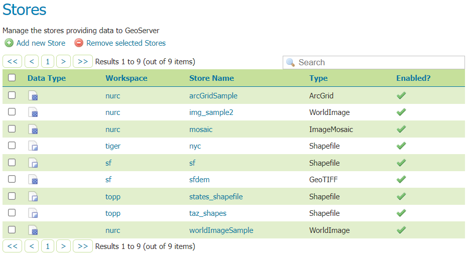
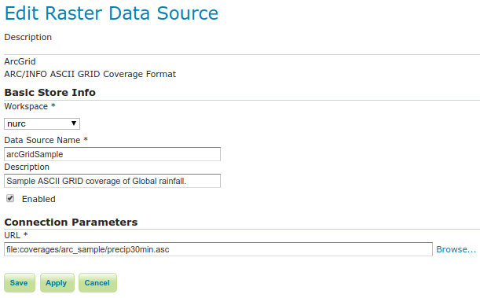
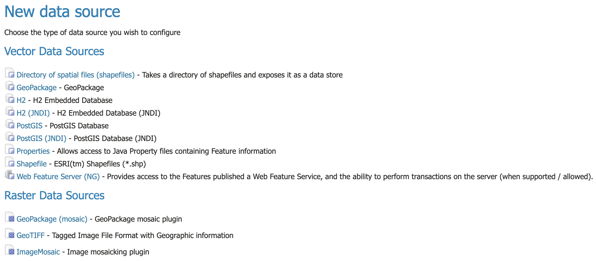
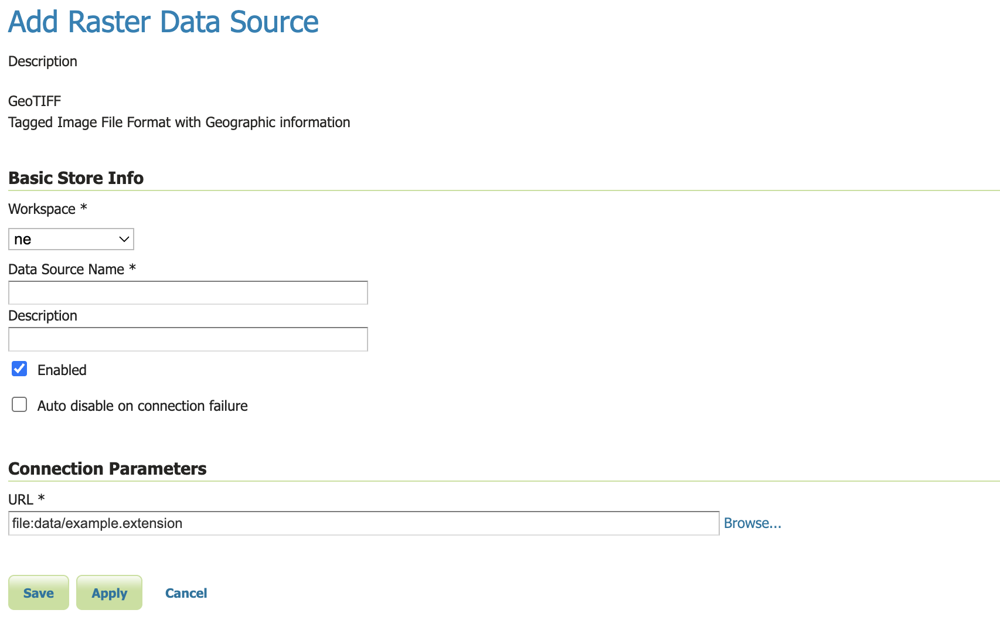
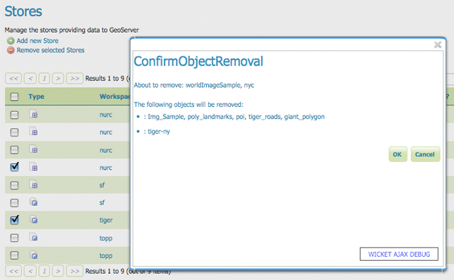

.. _data_webadmin_stores:

Stores
======

A store connects to a data source that contains raster or vector data. A data source can be a file or group of files, a table in a database, a single raster file, or a directory (for example, a Vector Product Format library). The store construct allows connection parameters to be defined once, rather than for each dataset in a source. As such, it is necessary to register a store before configuring datasets within it.

   Stores View

Store types
-----------

While there are many potential formats for data sources, there are only four kinds of stores. For raster data, a store can be a file. For vector data, a store can be a file, database, or server.

.. list-table::
   :widths: 15 85
   :header-rows: 1

   * - Type Icon
     - Description
   * - .. image:: img/data_stores_type1.png
     - raster data in a file
   * - .. image:: img/data_stores_type3.png
     - vector data in a file
   * - .. image:: img/data_stores_type2.png
     - vector data in a database
   * - .. image:: img/data_stores_type5.png
     - vector server (web feature server)

Edit a Store
------------

To view or edit a store, click the store name. A store configuration page will be displayed.  The exact contents of this page depend on the specific format of the store. See the sections :ref:`data_vector`, :ref:`data_raster`, and :ref:`data_database` for information about specific data formats. The example shows the configuration for the ``nurc:ArcGridSample`` store.

   Editing a raster data store

Basic Store Info
^^^^^^^^^^^^^^^^

The basic information is common for all formats.

* **Workspace** - the store is assigned to the selected workspace
* **Data Source Name** - the store name as listed on the view page
* **Description** - (optional) a description that displays in the administration interface
* **Enabled** - enables or disables access to the store, along with all datasets defined for it

Connection Parameters
^^^^^^^^^^^^^^^^^^^^^

The connection parameters vary depending on data format.

.. _data_webadmin_stores_add_a_store:

Add a Store
-----------

The buttons for adding and removing a store can be found at the top of the Stores page.

.. figure:: img/data_stores_add_remove.png

   Buttons to add and remove a Store

To add a store, select the :guilabel:`Add new Store` button. You will be prompted to choose a data source. GeoServer natively supports many formats (with more available via extensions). Click the appropriate data source to continue.

   Choosing the data source for a new store

The next page configures the store. Since connection parameters differ across data sources, the exact contents of this page depend on the store's specific format. See the sections :ref:`data_vector`, :ref:`data_raster`, and :ref:`data_database` for information on specific data formats.
The example below shows the ArcGrid raster configuration page.

   Configuration page for an ArcGrid raster data source

Remove a Store
--------------

To remove a store, click the checkbox next to the store. Multiple stores can be selected, or all can be selected by clicking the checkbox in the header.

.. figure:: img/data_stores_delete.png

   Stores selected for removal

Click the :guilabel:`Remove selected Stores` button. You will be asked to confirm the removal of the configuration for the store(s) and all resources defined under them. Clicking :guilabel:`OK` removes the selected store(s), and returns to the Stores page.

   Confirm removal of stores
