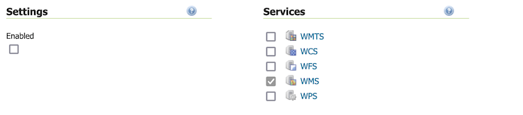
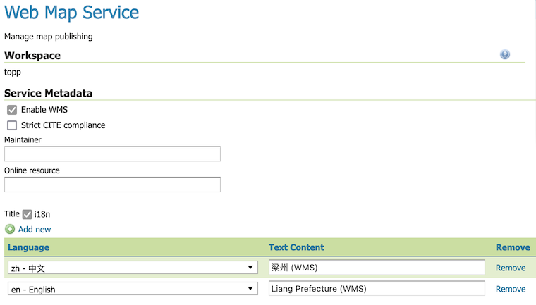
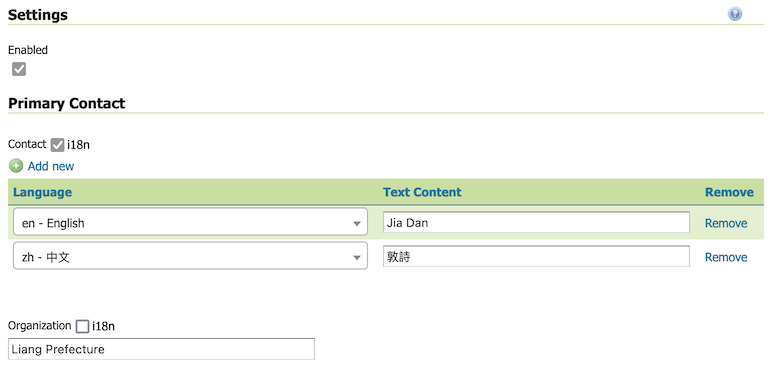
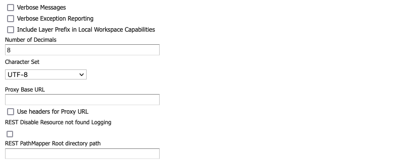

.. _data_webadmin_workspaces:

Workspaces
==========

This section describes how to view and configure workspaces. Analogous to a namespace, a workspace is a container which organizes other items. In GeoServer, a workspace is often used to group similar layers together. Layers may be referred to by their workspace name, colon, layer name (for example ``topp:states``). Two different layers can have the same name as long as they belong to different workspaces (for example ``sf:states`` and ``topp:states``).

.. figure:: img/data_workspaces.png
   
   Workspaces page

.. _data_webadmin_workspaces_add_workspace:

Add a Workspace
---------------

The buttons for adding and removing a workspace can be found at the top of the Workspaces view page. 

.. figure:: img/data_workspaces_add_remove.png

   Buttons to add and remove
   
To add a workspace, select the :guilabel:`Add new workspace` button. You will be prompted to enter the workspace name and URI (as described in :ref:`data_webadmin_workspaces_edit` below).
   
.. figure:: img/data_workspaces_sde.png

   New Workspace page with example

Remove a Workspace
------------------

To remove a workspace, select it by clicking the checkbox next to the workspace. Multiple workspaces can be selected, or all can be selected by clicking the checkbox in the header.  Click the :guilabel:`Remove selected workspaces(s)` button. You will be asked to confirm or cancel the removal. Clicking :guilabel:`OK` removes the selected workspace(s). 

.. figure:: img/data_workspaces_rename_confirm.png

   Workspace removal confirmation

.. _data_webadmin_workspaces_edit:

Edit a Workspace
----------------

To view or edit a workspace, click the workspace name. A workspace configuration page will be displayed.

.. figure:: img/data_workspaces_basic_edit.png
   
   Workspace named "topp"
   
A workspace is defined by a name and a Namespace URI (Uniform Resource Identifier).

* :guilabel:`Name`: The workspace name is limited to ten characters and may not contain space.
  
  The workspace name is used as an XML prefix for the Namespace URI when generating xml documents.
  
  The workspace name is used as a prefix when naming individual layers (unless :guilabel:`Default workspace` is used as described below).

* :guilabel:`Namespace URI`: A URI is similar to a URL, except URIs do not need to point to a actual location on the web, and only need to be a unique identifier.

  For a Workspace URI, we recommend using a URL associated with your project, with perhaps a different trailing identifier. For example, ``http://www.openplans.org/topp`` is the URI for the "topp" workspace. 
  
* :guilabel:`Default Workspace`: One workspace can me nominated as the default.
  
  Layers belonging to the default workspace can be accessed directly, and do not require the workspace name as a prefix.
  
  A GeoServer configured with one workspace can use this setting to avoid using the workspace name when referencing layers. Keep in mind the workspace name will still be used in the generation of xml documents (where the name is used as an XML prefix to reference the workspace Namespace URI).

* :guilabel:`Isolated workspace`: Isolated workspaces content so they are not included as part of global web services.

  The worksapce contents will only visible and queryable in the context of a :ref:`virtual_services` as described below :ref:`workspace_isolated`.

.. _workspace_services:

Workspace Services
^^^^^^^^^^^^^^^^^^

Use the checkbox located next to each service to override the global service definition for the associated service.

   
   Enable workspace services to provide default service description

Once enabled clicking on the service link will open the settings page for the service, allowing default values for service title, abstract and other details to be supplied.

   
   Workspace WMS Settings

Clients accessing this workspace as a :ref:`virtual_services` will use the service description provided here.

.. _workspace_settings:

Workspace Settings
^^^^^^^^^^^^^^^^^^

Use :guilabel:`Enabled` checkbox to override the global configuration and contact information for this workspace.

   
   Enable workspace settings to provide default contact information

Organization
''''''''''''

Clients accessing this workspace as a :ref:`virtual_services` will use the organization description provided here:

* The :guilabel:`Welcome` message is used as an introduction in the welcome page header for this workspace.

* The :guilabel:`Organization` name and :guilabel:`Online Resource` are combined to form a organization link in the welcome page header for this workspace.

.. figure:: img/workspace_orgaization.png
   
   Workspace Organization

If this information is not provided the global :ref:`config_contact` page contact organization details are used.

Primary Contact
'''''''''''''''

Clients accessing this workspace as a virtual service, or via the welcome page, will use the contact information provided here:

* The :guilabel:`email` address if provided, will be used as the administrator contact in the welcome page footer for this workspace.

.. figure:: img/workspace_contaxt.png
   
   Workspace Primary Contact

If this information is not provided the global :ref:`config_contact` page contact information is used.

Address
'''''''

Clients accessing this workspace as a virtual service will be provided the address details provided here.

.. figure:: img/workspace_address.png
   
   Workspace address

If this information is not provided the address information from the global :ref:`config_contact` page is used.

Other
'''''

Other additional :ref:`config_globalsettings` can be overriden on a workspace-by-workspace basis.

* :guilabel:`Include Layer Prefix in Local Workspace Capabilities`: Enable this setting to force the inclusion of the workspace name as a prefix when accessing workspace contents as a virtual web service. The layer ``ne:countries`` is always referenced as ``ne:countries`` with this setting enabled.
  
  With this setting disabled layers may be referenced directly (with no prefix) when accessed by a virtual web service. The layer ``ne:countries`` can be referenced as ``countries`` when this setting is disabled (and the layer is being accessed via a ``ne`` virtual web service).

* :guilabel:`Root Directory for REST PathMapper`: setting used by the RESTful API as the `Root Directory` for uploaded files, following the structure::

    ${rootDirectory}/workspace/store[/<file>]

  .. note:: This parameter is only used when the **Enabled** parameter of the *Settings* section is checked. 

For details on other settings see :ref:`config_globalsettings`.

.. _workspace_security:

Security
^^^^^^^^

The Security tab allows to set data access rules at workspace level.

.. note:: For more information on data access rules, please see the section on :ref:`security_webadmin_data`.

.. figure:: img/data_workspaces_security_edit.png

To create/edit the workspace's data access rules, check/uncheck checkboxes according to the desired role. 
The Grant access to any role checkbox grant each role for any access mode.

