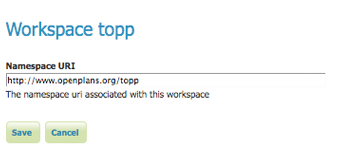

.. _data_webadmin_workspaces:

Workspaces
==========

This section describes how to view and configure workspaces. Analogous to a namespace, a workspace is a container which organizes other items. In GeoServer, a workspace is often used to group similar layers together. Layers may be referred to by their workspace name, colon, layer name (for example ``topp:states``). Two different layers can have the same name as long as they belong to different workspaces (for example ``sf:states`` and ``topp:states``).

.. figure:: img/data_workspaces.png
   
   Workspaces page

Edit a Workspace
----------------

To view or edit a workspace, click the workspace name. A workspace configuration page will be displayed.

   
   Workspace named "topp"
   
A workspace is defined by a name and a Namespace URI (Uniform Resource Identifier). The workspace name is limited to ten characters and may not contain space. A URI is similar to a URL, except URIs do not need to point to a actual location on the web, and only need to be a unique identifier. For a Workspace URI, we recommend using a URL associated with your project, with perhaps a different trailing identifier. For example, ``http://www.openplans.org/topp`` is the URI for the "topp" workspace. 

Root Directory for REST PathMapper 
^^^^^^^^^^^^^^^^^^^^^^^^^^^^^^^^^^

.. figure:: img/data_workspaces_ROOT.png
   
   Workspace Root Directory parameter
   
This parameter is used by the RESTful API as the `Root Directory` for uploaded files, following the structure::

	${rootDirectory}/workspace/store[/<file>]

.. note:: This parameter is visible only when the **Enabled** parameter of the *Settings* section is checked. 
   
Add a Workspace
---------------

The buttons for adding and removing a workspace can be found at the top of the Workspaces view page. 

.. figure:: img/data_workspaces_add_remove.png

   Buttons to add and remove
   
To add a workspace, select the :guilabel:`Add new workspace` button. You will be prompted to enter the the workspace name and URI.  
   
.. figure:: img/data_workspaces_medford.png

   New Workspace page with example

Remove a Workspace
------------------

To remove a workspace, select it by clicking the checkbox next to the workspace. Multiple workspaces can be selected, or all can be selected by clicking the checkbox in the header.  Click the :guilabel:`Remove selected workspaces(s)` button. You will be asked to confirm or cancel the removal. Clicking :guilabel:`OK` removes the selected workspace(s). 

.. figure:: img/data_workspaces_rename_confirm.png

   Workspace removal confirmation
      