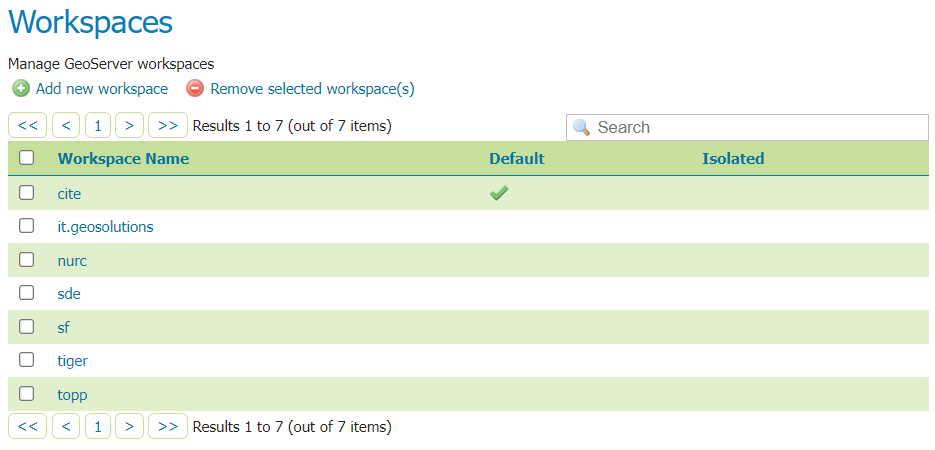
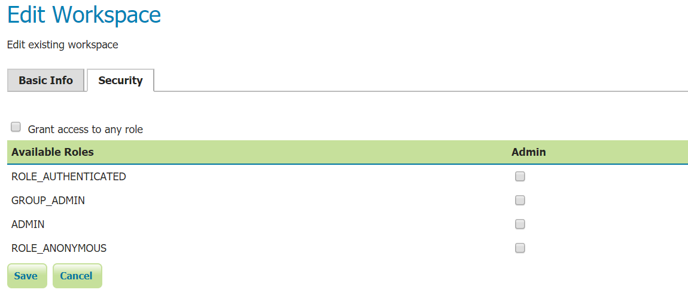
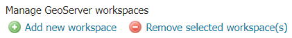

.. _data_webadmin_workspaces:

Workspaces
==========

This section describes how to view and configure workspaces. Analogous to a namespace, a workspace is a container which organizes other items. In GeoServer, a workspace is often used to group similar layers together. Layers may be referred to by their workspace name, colon, layer name (for example ``topp:states``). Two different layers can have the same name as long as they belong to different workspaces (for example ``sf:states`` and ``topp:states``).

   
   Workspaces page

Edit a Workspace
----------------

To view or edit a workspace, click the workspace name. A workspace configuration page will be displayed.

.. figure:: img/data_workspaces_basic_edit.png
   
   Workspace named "topp"
   
A workspace is defined by a name and a Namespace URI (Uniform Resource Identifier). The workspace name is limited to ten characters and may not contain space. A URI is similar to a URL, except URIs do not need to point to a actual location on the web, and only need to be a unique identifier. For a Workspace URI, we recommend using a URL associated with your project, with perhaps a different trailing identifier. For example, ``http://www.openplans.org/topp`` is the URI for the "topp" workspace. 

The Security tab allows to set data access rules at workspace level.

.. note:: For more information on data access rules, please see the section on :ref:`security_webadmin_data`.

To create/edit workspace's data access rules simply check/uncheck checkboxes according to the desidered role. 
The Grant access to any role checkbox grant each role for any access mode.

Root Directory for REST PathMapper 
^^^^^^^^^^^^^^^^^^^^^^^^^^^^^^^^^^

.. figure:: img/data_workspaces_ROOT.png
   
   Workspace Root Directory parameter
   
This parameter is used by the RESTful API as the `Root Directory` for uploaded files, following the structure::

	${rootDirectory}/workspace/store[/<file>]

.. note:: This parameter is visible only when the **Enabled** parameter of the *Settings* section is checked. 
   
Add a Workspace
---------------

The buttons for adding and removing a workspace can be found at the top of the Workspaces view page. 

   Buttons to add and remove
   
To add a workspace, select the :guilabel:`Add new workspace` button. You will be prompted to enter the the workspace name and URI.  
   
.. figure:: img/data_workspaces_medford.png

   New Workspace page with example

Remove a Workspace
------------------

To remove a workspace, select it by clicking the checkbox next to the workspace. Multiple workspaces can be selected, or all can be selected by clicking the checkbox in the header.  Click the :guilabel:`Remove selected workspaces(s)` button. You will be asked to confirm or cancel the removal. Clicking :guilabel:`OK` removes the selected workspace(s). 

.. figure:: img/data_workspaces_rename_confirm.png

   Workspace removal confirmation

Isolated Workspaces
-------------------

Isolated workspaces content is only visible and queryable in the context of a virtual service bound to the isolated workspace. This means that isolated workspaces content will not show up in global capabilities documents and global services cannot query isolated workspaces contents. Is worth mentioning that those restrictions don't apply to the REST API.

A workspace can be made isolated by checking the :guilabel:`Isolated Workspace` checkbox when creating or editing a workspace.

.. figure:: img/isolated_workspace.png

   Making a workspace isolated

An isolated workspace will be able to reuse a namespace already used by another workspace, but its resources (layers, styles, etc ...) can only be retrieved when using that workspace virtual services and will only show up in those virtual services capabilities documents.

It is only possible to create two or more workspaces with the same namespace in GeoServer if only one of them is non isolated, i.e. isolated workspaces have no restrictions in namespaces usage but two non isolated workspaces can't use the same namespace.

The following situation will be valid:

  - Prefix: st1 Namespace: http://www.stations.org/1.0 Isolated: false

  - Prefix: st2 Namespace: http://www.stations.org/1.0 Isolated: true

  - Prefix: st3 Namespace: http://www.stations.org/1.0 Isolated: true

But not the following one:

  - Prefix: st1 Namespace: http://www.stations.org/1.0 Isolated: false

  - **Prefix: st2 Namespace: http://www.stations.org/1.0 Isolated: false**

  - Prefix: st3 Namespace: http://www.stations.org/1.0 Isolated: true

At most only one non isolated workspace can use a certain namespace.

Consider the following image which shows to workspaces (st1 and st2) that use the same namespace (http://www.stations.org/1.0) and several layers contained by them:

.. figure:: img/workspaces_example.png

   Two workspaces using the same namespace, one of them is isolated.

In the example above st2 is the isolated workspace. Consider the following WFS GetFeature requests:

  1. http://localhost:8080/geoserver/ows?service=WFS&version=2.0.0&request=DescribeFeatureType&typeName=layer2

  2. http://localhost:8080/geoserver/st2/ows?service=WFS&version=2.0.0&request=DescribeFeatureType&typeName=layer2

  3. http://localhost:8080/geoserver/ows?service=WFS&version=2.0.0&request=DescribeFeatureType&typeName=st1:layer2

  4. http://localhost:8080/geoserver/st2/ows?service=WFS&version=2.0.0&request=DescribeFeatureType&typeName=st2:layer2

  5. http://localhost:8080/geoserver/ows?service=WFS&version=2.0.0&request=DescribeFeatureType&typeName=st2:layer2

  6. http://localhost:8080/geoserver/ows?service=WFS&version=2.0.0&request=DescribeFeatureType&typeName=layer5

The first request is targeting WFS global service and requesting layer2, this request will use layer2 contained by workspace st1. The second request is targeting st2 workspace WFS virtual service, layer2 belonging to workspace st2 will be used. Request three and four will use layer2 belonging to workspace, respectively, st1 and st2. The last two requests will fail saying that the feature type was not found, isolated workspaces content is not visible globally.

**The rule of thumb is that resources (layers, styles, etc ...) belonging to an isolated workspace can only be retrieved when using that workspaces virtual services and will only show up in those virtual services capabilities documents.**