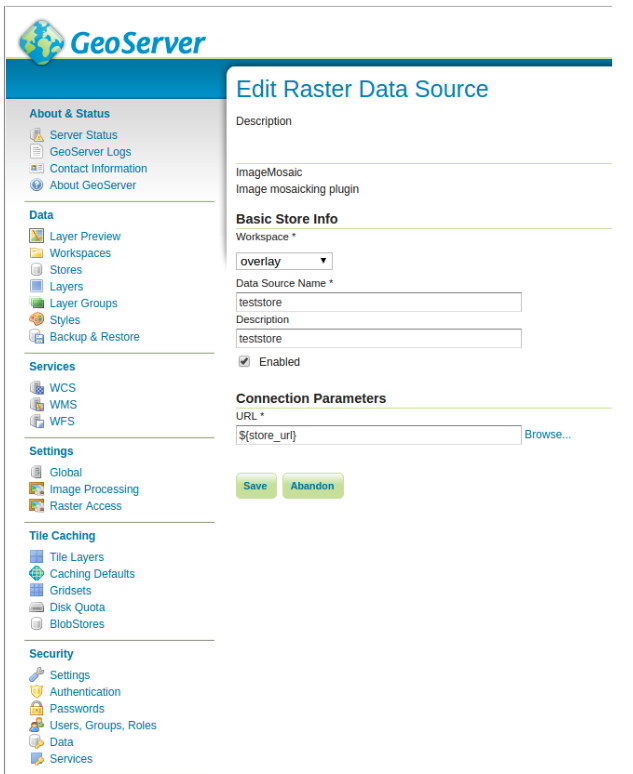

.. _datadir_configtemplate:

Parameterize catalog settings
=============================

This feature allows to parameterize some of the settings in GeoServer's catalog.

What we mean with that is that you are able to use a templating mechanism to tailor GeoServer's settings to the environment in which is run.

For example, you'd want to move the latest changes you've made from a GeoServer instance running on machine **A** to another instance running on machine **B** but there are some differences in the way the two environments are set up, let's say the password used to connect to the database is different.

If you simply create a backup of the catalog from instance **A** and restore it on instance **B**, the stores configured on the database will not be accessible and the corresponding layers will not work properly.

Another example would be the max number of connections available in the connection pool to the database. You might want to have a different poll configuration in the two environments (maybe GeoServer on machine **A** is a test instance an GeoServer on machine **B** is used in production).

To overcome such limitation (to have the environment set up in the exact same way on the source machine and on the destination machine) the ENV parametrization allows you to customize the catalog configuration via the use of a templating system.

First of all to be able to use this feature, set the following flag via system variable to GeoServer's environment:

    ::
    
        -DALLOW_ENV_PARAMETRIZATION=true

Then create a file called ``geoserver-environment.properties`` in the root of GeoServer's datadir. 
This file will contain the definitions for the variables parameterized in the catalog configuration.

Now edit GeoServer's configuration files of the source machine that you want to be parametric, for example let's parameterize the URL of a store 
(this can also be done via GeoServer admin UI):

    ``vim coveragestore.xml`` ::
    
        ...
         <enabled>true</enabled>
          <workspace>
            <id>WorkspaceInfoImpl--134aa31e:1564c12ef68:-7ffe</id>
          </workspace>
          <__default>false</__default>
          <url>${store_url}</url>
        </coverageStore>

Add a definition for the variable **store_url** in your 

    ``geoserver-environment.properties`` ::

        store_url = file:///var/geoserver/store/teststore

Now restart GeoServer and navigate to the store config

   
As you can see the URL in "Connection Parameters" settings now refers the variable **store_url** whose value is defined in the ``geoserver-environment.properties`` file.
