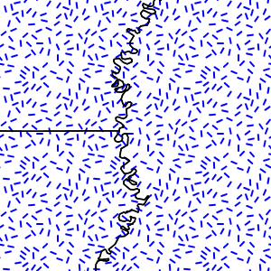

.. _randomized_css:

Fills with randomized symbols
=============================

Starting with GeoServer 2.4.2 it is possible to generate fills by randomly repeating a symbol in the polygons to be filled.
Please refer to the :ref:`equivalent SLD chapter <randomized>` for details on the meaning of the various options.

Simple random distribution
--------------------------

Here is an example distributing up to 50 small "slash" symbols in a 100x100 pixel tile (in case of conflicts the symbol will be skipped), enabling random symbol rotation), and setting the seed to "5" to get a distribution different than the default one:

.. code-block:: css

    * { 
      fill: symbol("shape://slash");
      stroke: black;
      -gt-fill-random: grid;
      -gt-fill-random-seed: 5;
      -gt-fill-random-rotation: free;
      -gt-fill-random-symbol-count: 50;
      -gt-fill-random-tile-size: 100;
    }

    :fill {
      size: 8;
      stroke: blue;
      stroke-width: 4;
      stroke-linecap: round;
    }

   
   *Random distribution of a diagonal line*

Thematic map using point density
--------------------------------

Randomized distributions can also be used for thematic mapping, for example, here is the SLD for a version of topp:states that displays the number of inhabitantìs varying the density of a random point distribution:

.. code-block:: css

    * { 
      fill: symbol("circle");
      stroke: black;
      -gt-fill-random: grid; 
      -gt-fill-random-tile-size: 100;
    }

    :fill {
      size: 2;
      fill: darkgray;
    }

    [PERSONS < 2000000] {
       -gt-fill-random-symbol-count: 50;
    }

    [PERSONS >= 2000000] [PERSONS < 4000000] {
       -gt-fill-random-symbol-count: 150;
    }

    [PERSONS >= 4000000] {
       -gt-fill-random-symbol-count: 500;
    }

.. figure:: ../../styling/sld-extensions/images/states-random.png
   :align: center
   
   *Thematic map via point density approach*
