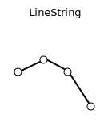
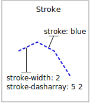
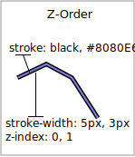

.. _extensions_css_workshop_linestring:

Lines
=====

We will start our tour of CSS styling by looking at the representation of lines.

   
   LineString Geometry

Review of line symbology:

* Lines are used to represent physical details that are too small to be represented at the current scale. Line work can also be used to model non-physical ideas such as network connectivity, or the boundary between land-use classifications. **The visual width of lines do not change depending on scale.**

* Lines are recording as LineStrings or Curves depending on the geometry model used.

* SLD uses a **LineSymbolizer** record how the shape of a line is drawn. The primary characteristic documented is the **Stroke** used to draw each segment between vertices.

* Labeling of line work is anchored to the mid-point of the line. GeoServer provides a vendor option to allow label rotation aligned with line segments.

For our exercises we are going to be using simple CSS documents, often consisting of a single rule, in order to focus on the properties used for line symbology.

Each exercise makes use of the ``ne:roads`` layer.

Reference:

* `Line Symbology <../properties.html#line-symbology>`_ (User Manual | CSS Property Listing)
* `Lines <../cookbook/line.html>`_ (User Manual | CSS Cookbook)
* `LineString <../../../styling/sld-reference/linesymbolizer.html>`_ (User Manual | SLD Reference )

Stroke
------

The only mandatory property for representation of linework is **stroke**. This is a **key property**; its presence triggers the generation of an appropriate LineSymbolizer.

   
   Basic Stroke Properties

The use of **stroke** as a key property prevents CSS from having the idea of a default line color (as the **stroke** information must be supplied each time).

#. Navigate to the **CSS Styles** page.

#. Click :guilabel:`Choose a different layer` and select :kbd:`ne:roads` from the list.

#. Click :guilabel:`Create a new style` and choose the following:

   .. list-table:: 
      :widths: 30 70
      :stub-columns: 1

      * - Workspace for new layer:
        - :kbd:`No workspace`
      * - New style name:
        - :kbd:`line_example`

#. Replace the generated CSS definition with the following **stroke** example:

   .. code-block:: css
   
      /* @title Line
       * @abstract Example line symbolization
       */
       * {
         stroke: blue;
       }

#. Click :guilabel:`Submit` and then the :guilabel:`Map` tab for an initial preview.
   
   You can use this tab to follow along as the style is edited, it will refresh each time :guilabel:`Submit` is pressed.

   .. image:: img/line.png

#. You can look at the :guilabel:`SLD` tab at any time to see the generated SLD. Currently it is showing a straight forward LineSymbolizer generated from the CSS **stroke** property:

   .. code-block:: xml

      <sld:UserStyle>
         <sld:Name>Default Styler</sld:Name>
         <sld:FeatureTypeStyle>
            <sld:Name>name</sld:Name>
            <sld:Rule>
               <sld:Title>Line</sld:Title>
               <sld:Abstract>Example line symbolization</sld:Abstract>
               <sld:LineSymbolizer>
                  <sld:Stroke>
                     <sld:CssParameter name="stroke">#0000ff</sld:CssParameter>
                  </sld:Stroke> 
               </sld:LineSymbolizer>
            </sld:Rule>
         </sld:FeatureTypeStyle>
      </sld:UserStyle>

#. Additional properties can be used to fine-tune appearance. Use **stroke-width** to specify the width of the line.

   .. code-block:: css
      :emphasize-lines: 6
   
      /* @title Line
       * @abstract Example line symbolization
       */
       * {
         stroke: blue;
         stroke-width: 2px;
       }

#. The **stroke-dasharray** is used to define breaks rendering the line as a dot dash pattern.

   .. code-block:: css
      :emphasize-lines: 7 
      
      /* @title Line
       * @abstract Example line symbolization
       */
       * {
         stroke: blue;
         stroke-width: 2px;
         stroke-dasharray: 5 2;
       }

#. Check the :guilabel:`Map` tab to preview the result.

   .. image:: img/line_stroke.png

.. note:: The GeoServer rendering engine is quite sophisticated and allows the use of units of measure (such as :kbd:`m` or :kbd:`ft`). While we are using pixels in this example, real world units will be converted using the current scale.

Z-Index
-------

The next exercise shows how to work around a limitation when using multiple strokes to render a line.

   Use of Z-Index

#. Providing two strokes is often used to provide a contrasting edge (called casing) to thick line work.

   Update ``line_example`` with the following:

   .. code-block:: css

      * {
        stroke: black, #8080E6;
        stroke-width: 5px, 3px;
      }

#. If you look carefully you can see a problem with our initial attempt. The junctions of each line show that the casing outlines each line individually, making the lines appear randomly overlapped. Ideally we would like to control this process, only making use of this effect for overpasses.

   .. image:: img/line_zorder_1.png

#. The **z-index** parameter allows a draw order to be supplied. This time all the thick black lines are dawn first (at z-index 0) followed by the thinner blue lines (at z-index 1).

   .. code-block:: css

      * {
        stroke: black, #8080E6;
        stroke-width: 5px, 3px;
        z-index: 0, 1;
      }

#. If you look carefully you can see the difference. 

   .. image:: img/line_zorder_2.png

#. By using **z-index** we have been able to simulate line casing. 

   .. image:: img/line_zorder_3.png

Label
-----

Our next example is significant as it introduces the how text labels are generated.

.. figure:: img/LineStringLabel.svg
   
   Use of Label Property

This is also our first example making use of a dynamic style (where the value of a property is defined by an attribute from your data).

#. To enable LineString labeling we will need to use the key properties for both **stroke** and **label**.

   Update ``line_example`` with the following:
   
   .. code-block:: css
      :emphasize-lines: 2,3

      * {
        stroke: blue;
        label: [name];
      }

#. The SLD standard documents the default label position for each kind of Geometry. For LineStrings the initial label is positioned on the midway point of the line.

   .. image:: img/line_label_1.png

#. We have used an expression to calculate a property value for label. The **label** property is generated dynamically from the :kbd:`name` attribute. Expressions are supplied within square brackets, making use of Constraint Query Language (CQL) syntax. 

   .. code-block:: css
      :emphasize-lines: 3

      * {
        stroke: blue;
        label: [name];
      }

#. Additional properties can be supplied to fine-tune label presentation:
   
   .. code-block:: css
      
      * {
        stroke: blue;
        label: [name];
        font-fill: black;
        label-offset: 7px;
      }

#. The **font-fill** property set to :kbd:`black` provides the label color.

   .. code-block:: css
      :emphasize-lines: 4
      
      * {
        stroke: blue;
        label: [name];
        font-fill: black;
        label-offset: 7px;
      }
      
#. The **label-offset** property is used to adjust the starting position used for labeling.
   
   Normally the displacement offset is supplied using two numbers (allowing an x and y offset from the the midway point used for LineString labeling).

   When labeling a LineString there is a special twist: by specifying a single number for **label-offset** we can ask the rendering engine to position our label a set distance away from the LineString. 
  
   .. code-block:: css
      :emphasize-lines: 5
      
      * {
        stroke: blue;
        label: [name];
        font-fill: black;
        label-offset: 7px;
      }

#. When used in this manner the rotation of the label will be adjusted automatically to match the LineString.

   .. image:: img/line_label_2.png

How Labeling Works
------------------

The rendering engine collects all the generated labels during the rendering of each layer. Then, during labeling, the engine sorts through the labels performing collision avoidance (to prevent labels overlapping). Finally the rendering engine draws the labels on top of the map. Even with collision avoidance you can spot areas where labels are so closely spaced that the result is hard to read.

The parameters provided by the SLD specification, from which our CSS implementation is derived, are general purpose and should be compatible with any rendering engine.

To take greater control over the GeoServer rendering engine we can use "vendor specific" parameters. These hints are used specifically for the GeoServer rendering engine and will be ignored by other systems. The GeoServer rendering engine marks each vendor specific parameter with the prefix **-gt-**.

#. The ability to take control of the labeling process is exactly the kind of hint a vendor specific parameter is intended for.
    
   Update ``line_example`` with the following:

   .. code-block:: css

      * {
        stroke: blue;
        label: [name];
        font-fill: black;
        label-offset: 7px;
        -gt-label-padding: 10;
      }

#. The parameter **-gt-label-padding** provides additional space around our label for use in collision avoidance.

   .. code-block:: css
      :emphasize-lines: 6
   
      * {
        stroke: blue;
        label: [name];
        font-fill: black;
        label-offset: 7px;
        -gt-label-padding: 10;
      }

#. Each label is now separated from its neighbor, improving legibility.

   .. image:: img/line_label_3.png

Scale
-----

This section explores the use of attribute selectors and the :kbd:`@scale` selector together to simplify the road dataset for display.

#. Replace the `line_example` CSS definition with:

   .. code-block:: css

      [scalerank < 4] {
        stroke: black;
      }

#. And use the :guilabel:`Map` tab to preview the result.

   .. image:: img/line_04_scalerank.png

#. The **scalerank** attribute is provided by the Natural Earth dataset to allow control of the level of detail based on scale. Our selector short-listed all content with scalerank 4 or lower, providing a nice quick preview when we are zoomed out.

#. In addition to testing feature attributes, selectors can also be used to check the state of the rendering engine.

   Replace your CSS with the following:

   .. code-block:: css

      [@scale > 35000000] {
         stroke: black;
      }
      [@scale < 35000000] {
         stroke: blue;
      }

#. As you adjust the scale in the :guilabel:`Map` preview (using the mouse scroll wheel) the color will change between black and blue. You can read the current scale in the bottom right corner, and the legend will change to reflect the current style.

   .. image:: img/line_05_scale.png

#. Putting these two ideas together allows control of level detail based on scale:

   .. code-block:: css

      [@scale < 9000000] {
        stroke: #888888;
        stroke-width: 2;
      }
      [@scale >= 9000000] [@scale < 17000000] [scalerank < 7] {
        stroke: #777777;
      }
      [@scale >= 1700000] [@scale < 35000000] [scalerank < 6] {
        stroke: #444444;
      }
      [@scale >= 3500000] [@scale < 70000000] [scalerank < 5] {
        stroke: #000055;
      }
      [@scale >= 70000000] [scalerank < 4] {
        stroke: black;
      }

#. As shown above selectors can be combined in the same rule:

   * Selectors separated by whitespace are combined CQL Filter AND
   * Selectors separated by a comma are combined using CQL Filter OR

   Our first rule ``[@scale < 9000000]`` checks that the scale is less than 9M. The next rule ``[@scale >= 9000000] [@scale < 17000000] [scalerank < 7]`` checks that the scale is greater than or equal to 9M AND less than 17M AND that the scalerank is less than 7.

   .. image:: img/line_06_adjust.png
   

Additional Considerations
-------------------------

.. note::

    This section will contain some extra information related to linestrings. If you're already feeling comfortable, feel free to move on to the next section.

Vendor Options
~~~~~~~~~~~~~~

Vendor options can be used to enable some quite spectacular effects, while still providing a style that can be used by other applications.

#. Update `line_example` with the following:

   .. code-block:: css

       * {
         stroke: #ededff;
         stroke-width: 10;
         label: [level] " " [name];
         font-fill: black;
         -gt-label-follow-line: true;
       }

#. The property **stroke-width** has been used to make our line thicker in order to provide a backdrop for our label. 

   .. code-block:: css
       :emphasize-lines: 3
    
       * {
         stroke: #ededff;
         stroke-width: 10;
         label: [level] " " [name];
         font-fill: black;
         -gt-label-follow-line: true;
       }

#. The **label** property combines combine several CQL expressions together for a longer label.

   .. code-block:: css
       :emphasize-lines: 4

       * {
         stroke: #ededff;
         stroke-width: 10;
         label: [level] " " [name];
         font-fill: black;
         -gt-label-follow-line: true;
       }

   The combined **label** property::
       
       [level] " " [name]
       
   Is internally represented with the **Concatenate** function::

       [Concatenate(level,' #', name)] 

#. The property **-gt-label-follow-line** provides the ability for a label to exactly follow a LineString character by character.

   .. code-block:: css
       :emphasize-lines: 6
    
       * {
         stroke: #ededff;
         stroke-width: 10;
         label: [level] " " [name];
         font-fill: black;
         -gt-label-follow-line: true;
       }

#. The result is a new appearance for our roads.

   .. image:: img/line_label_4.png

#. The traditional presentation of roads in the US is the use of a shield symbol, with the road number marked on top. We can reproduce this technique using a shield label. The use of a shield label is a vendor specific capability of the GeoServer rendering engine.

   .. code-block:: css
 
      * {
          stroke: black,lightgray;
          stroke-width: 3,2;
          label: [name];
          font-family: 'Ariel';
          font-size: 10;
          font-fill: black;
          shield: symbol(square);
      }
      :shield {
          fill: white;
          stroke: black;
          size: 18;
      }

Using Feature Attributes
~~~~~~~~~~~~~~~~~~~~~~~~

Features can have various attributes which we can select in our CSS. This allows for many styling possibilities with our data.

#. The roads **type** attribute provides classification information. You can **Layer Preview** to inspect features to determine available values for type. In this case, the available values are 'Major Highway','Secondary Highway','Road' and 'Unknown'. We can use these to create a new style which adjusts road appearance based on **type**.

   .. code-block:: css

      [type = 'Major Highway' ] {
          stroke: #000088;
          stroke-width: 1.25;
      }
      [type = 'Secondary Highway' ]{
          stroke: #8888AA;
          stroke-width: 0.75;
      }
      [type = 'Road']{
          stroke: #888888;
          stroke-width: 0.75;
      }
      [type = 'Unknown' ]{
          stroke: #888888;
          stroke-width: 0.5;
      }
      * {
         stroke: #AAAAAA;
         stroke-opacity: 0.25;
         stroke-width: 10;
      }

   The resulting style:

   .. image:: img/line_type.png

Z-Order Stroke
~~~~~~~~~~~~~~

#. Using the z-index can create interesting results. We can create a sort of "halo" effect with a linestring using the **z-index**.

#. Review the SLD generated by the **z-index** example.

   .. code-block:: css

       * {
         stroke: black, #8080E6;
         stroke-width: 5px, 3px;
         z-index: 0, 1;
       }

   There is an interesting trick in the generated SLD here. The Z-Order example produces multiple FeatureTypeSytle definitions, each acting like an "inner layer". Each FeatureTypeStyle is rendered into its own raster, and the results merged in order. The legend shown in the map preview also provides a hint, as the rule from each FeatureType style is shown.