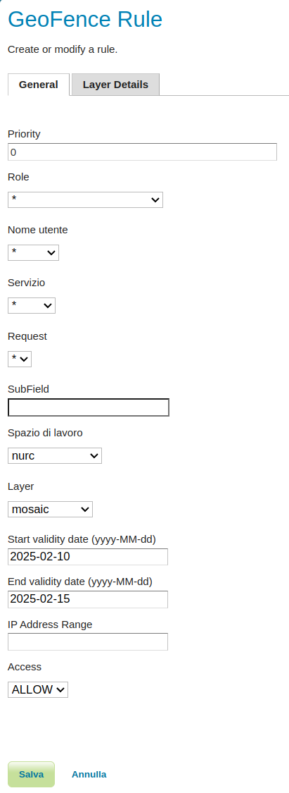

.. geofence_server_gui:

GeoFence Server GUI
===================

The GeoFence user interface is a component of the GeoServer web interface. You can access it from the GeoServer web interface by clicking the :guilabel:`GeoFence Server` link, found on the left side of the screen after logging in.

Rules page
----------
An overview of all rules is provided with priority, the rule's scope specifications (role, user, service, request, workspace and layer) and its access behaviour. The '*' symbol means that the rule applies to all possible values of that specification. Rules are always ordered by priority, but the order can be reversed by pressing the 'P' priority column header. 

A new rule can be added with the "Add new rule" link. Any number of rules can be deleted by selecting them and then clicking on the "Remove selected rules" link.

Rule priority order can be easily on this page through the up and down arrows on the right side. Rules can be modified using the pencil symbol, which opens the rule page.

Rule page
---------
This page is displayed both when creating a new rule and modifying an existing rule.

Priority can be changed manually by specifying a priority number. If this priority number is already occupied by another rule, this will cause that rule and all rules after it to shift one place to a lower priority.

If using the IP Address range to limit access then on Linux (and other systems with IPv6 enabled) to add the ``-Djava.net.preferIPv4Stack=true`` flag to the GeoServer startup options to make sure that the IP range matching works with IPv4 style 
addresses. Currently, IPv6 style address ranges are not supported by GeoFence.

When Access type LIMIT is selected, additional options are displayed that allows the user to select the Catalog Mode and the Allowed Area (WKT) associated with this rule. The Spatial Filter Type parameter allows to define whether apply the Allowed Area filter to vector data as an Intersects or a Clip filter. 

.. figure:: images/limit.png
   :align: center
  
When Access type ACCESS is selected as well as a specific layer, it becomes possible to specify the "layer details" in a separate tab. These make it possible to add additional filters to the layer for the rule in question. For example, the rule can alter the default style of the layer, specify which styles are available at all, which attributes are accessible for reading and/or writing, specify CQL filters for both reading and writing, specify a catalog mode, and an allowed area (WKT) filter.

.. figure:: images/layerdetails.png
   :align: center

Allowed area can be defined in whatever SRID. Geoserver will automatically reproject it to the resource CRS when needed.

Layer groups
^^^^^^^^^^^^
Layer groups are also supported. If no workspace has been specified, the layer dropdown will show global layer groups, while if a workspace is selected the workspace's layergroup will be showed together with the layers.

The read and write filters text areas as well as the style palette in the layer details tab are disabled when the layer group is being configured.

If an allowed area WKT is specified it will be applied to all contained layers.

When a layer contained in a layer group is directly accessed in the context of a WMS request, the following rules apply:

* If the layer group has mode **SINGLE**, the access rule of the layer being requested will be applied.

* If the layer group has mode **OPAQUE**, the layer will not be visible.

* If the layer group has another mode, different from **SINGLE** and **OPAQUE**, the layer group access rule will be applied.

When a layer belongs to more then one layer group, the less restrictive rule is applied. If the containing layer groups have all a **LIMIT** grant type:

* If at least one layer group has no allowed area defined, then no geometry filter is applied to the contained layer.

* If all the containing layer group have an allowed area defined, then the spatial filter will apply a geometry that is the result of the union of all the allowed areas.
