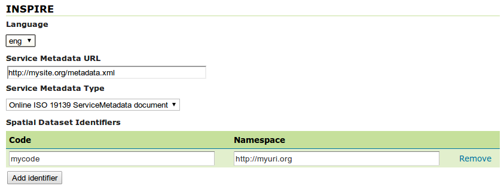

.. _inspire_using:

Using the INSPIRE extension
===========================

When the INSPIRE extension has been properly installed, there will be two changes to GeoServer.

#. The GeoServer WMS 1.3.0 capabilities document, as well as the WFS 1.1 and 2.0 will contain extra content relevant to INSPIRE.
#. The :ref:`services_webadmin_wms` and :ref:`services_webadmin_wfs` sections of the :ref:`web_admin` will show extra configuration options.

Extended WMS Capabilities
-------------------------

.. note:: The INSPIRE directive is relevant to WMS 1.3.0 only, so please make sure that you are viewing the correct capabilities document.

The WMS 1.3.0 capabilities document will be extended once the INSPIRE extension is installed.  Those changes are:

#. Two additional entries in the ``xsi:schemaLocation`` of the root ``<WMS_Capabilities>`` tag:

     * ``http://inspire.ec.europa.eu/schemas/inspire_vs/1.0``
     * ``http://<GEOSERVER_ROOT>/www/inspire/inspire_vs.xsd``

#. An additional ExtendedCapabilities block.  This tag block shows up in between the tags for ``<Exception>`` and ``<Layer>``.  It contains the following information:

     * Metadata URL and MIME type
     * Default Language
     * Supported Language(s)
     * Response Language(s)

  By default, this block will contain the following content::

      <inspire_vs:ExtendedCapabilities>
        <inspire_common:MetadataUrl xsi:type="inspire_common:resourceLocatorType">
          <inspire_common:URL/>
          <inspire_common:MediaType>application/vnd.iso.19139+xml</inspire_common:MediaType>
        </inspire_common:MetadataUrl>
        <inspire_common:SupportedLanguages xsi:type="inspire_common:supportedLanguagesType">
          <inspire_common:DefaultLanguage>
            <inspire_common:Language>eng</inspire_common:Language>
          </inspire_common:DefaultLanguage>
          <inspire_common:SupportedLanguage>
            <inspire_common:Language>eng</inspire_common:Language>
          </inspire_common:SupportedLanguage>
        </inspire_common:SupportedLanguages>
        <inspire_common:ResponseLanguage>
          <inspire_common:Language>eng</inspire_common:Language>
        </inspire_common:ResponseLanguage>
      </inspire_vs:ExtendedCapabilities>

This information can be changed via the :ref:`services_webadmin_wms` section of the :ref:`web_admin`.

.. note:: If you do not see this content in the WMS 1.3.0 capabilities document, the INSPIRE extension may not be installed properly.  Reread the section on :ref:`inspire_installing` and verify that the correct file was saved to the correct directory.

Extended WMS configuration
--------------------------

As with the WMS 1.3.0 capabilities document, the WMS configuration in the :ref:`web_admin` is also extended to allow for changing the above published information.  INSPIRE-specific configuration is accessed on the main :ref:`services_webadmin_wms` page in the :ref:`web_admin`.  This is accessed by clicking on the :guilabel:`WMS` link on the sidebar.

.. note:: You must be logged in as an administrator to edit WMS configuration.

Once on the WMS configuration page, there will be a block titled :guilabel:`INSPIRE`.  This section will have three settings:

* :guilabel:`Language` combo box, for setting the Supported, Default, and Response languages
* :guilabel:`ISO 19139 Service Metadata URL` field, a URL containing the location of the metadata associated with the WMS
* :guilabel:`Service Metadata Type` combo box, for detailing whether the metadata came from a CSW (Catalog Service) or a standalone metadata file

.. figure:: images/inspire.png
   :align: center

   *INSPIRE-related options*

.. note:: If you do not see this content in the WMS configuration page, the INSPIRE extension may not be installed properly.  Reread the section on :ref:`inspire_installing` and verify that the correct file was saved to the correct directory.

After clicking :guilabel:`Submit` on this page, any changes will be immediately reflected in the WMS 1.3.0 capabilities document.

.. note:: Currently GeoServer does not offer the ability to configure alternate languages, as there is no way for an administrator to configure multiple responses.  There is an :geos:`open issue <4502>` on the GeoServer issue tracker that we are hoping to secure funding for.  If you are interested in implementing or funding this improvement, please raise the issue on the :ref:`GeoServer mailing list <getting_involved>`.

Extended WFS Capabilities
-------------------------

.. note:: The INSPIRE directive is relevant to WFS 1.1 and 2.0 only, so please make sure that you are viewing the correct capabilities document.

The WFS 1.1.0 capabilities document will be extended once the INSPIRE extension is installed.  Those changes are:

#. Two additional entries in the ``xsi:schemaLocation`` of the root element tag:

     ``http://inspire.ec.europa.eu/schemas/common/1.0/common.xsd``
     ``http://inspire.ec.europa.eu/schemas/inspire_dls/1.0/inspire_dls.xsd``

#. An additional ExtendedCapabilities block with the following information:

     * Metadata URL and MIME type
     * Default Language
     * Supported Language(s)
     * Response Language(s)
     * Spatial data identifiers

  By default, this block will contain the following content::

      <inspire_vs:ExtendedCapabilities>
        <inspire_common:MetadataUrl xsi:type="inspire_common:resourceLocatorType">
          <inspire_common:URL/>
          <inspire_common:MediaType>application/vnd.iso.19139+xml</inspire_common:MediaType>
        </inspire_common:MetadataUrl>
        <inspire_common:SupportedLanguages xsi:type="inspire_common:supportedLanguagesType">
          <inspire_common:DefaultLanguage>
            <inspire_common:Language>eng</inspire_common:Language>
          </inspire_common:DefaultLanguage>
          <inspire_common:SupportedLanguage>
            <inspire_common:Language>eng</inspire_common:Language>
          </inspire_common:SupportedLanguage>
        </inspire_common:SupportedLanguages>
        <inspire_common:ResponseLanguage>
          <inspire_common:Language>eng</inspire_common:Language>
        </inspire_common:ResponseLanguage>
      </inspire_vs:ExtendedCapabilities>

The spatial data identifiers section is mandatory, but cannot be filled by default, it is your duty to provide at least one spatial dataset identifier (see the INSPIRE download service technical guidelines for more information).

This information can be changed via the :ref:`services_webadmin_wfs` section of the :ref:`web_admin`.

.. note:: If you do not see this content in the WFS 1.1/2.0 capabilities document, the INSPIRE extension may not be installed properly.  Reread the section on :ref:`inspire_installing` and verify that the correct file was saved to the correct directory.

Extended WFS configuration
--------------------------

As with the WFS capabilities document, the WFS configuration in the :ref:`web_admin` is also extended to allow for changing the above published information.  INSPIRE-specific configuration is accessed on the main :ref:`services_webadmin_wfs` page in the :ref:`web_admin`.  This is accessed by clicking on the :guilabel:`WFS` link on the sidebar.

.. note:: You must be logged in as an administrator to edit WFS configuration.

Once on the WFS configuration page, there will be a block titled :guilabel:`INSPIRE`.  This section will have three settings:

* :guilabel:`Language` combo box, for setting the Supported, Default, and Response languages
* :guilabel:`ISO 19139 Service Metadata URL` field, a URL containing the location of the metadata associated with the WFS
* :guilabel:`Service Metadata Type` combo box, for detailing whether the metadata came from a CSW (Catalog Service) or a standalone metadata file
* :guilabel:`Spatial dataset identifers` table, where you can specify a code (mandatory) and a namespace (optional) for each spatial data set the WFS server is offering

   *INSPIRE-related options*

.. note:: If you do not see this content in the WFS configuration page, the INSPIRE extension may not be installed properly.  Reread the section on :ref:`inspire_installing` and verify that the correct file was saved to the correct directory.

After clicking :guilabel:`Submit` on this page, any changes will be immediately reflected in the WFS 1.1 and WFS 2.0 capabilities documents.

.. note:: Currently GeoServer does not offer the ability to configure alternate languages, as there is no way for an administrator to configure multiple responses.  There is an :geos:`open issue <4502>` on the GeoServer issue tracker that we are hoping to secure funding for.  If you are interested in implementing or funding this improvement, please raise the issue on the :ref:`GeoServer mailing list <getting_involved>`.

More information
----------------

A tutorial on setting up GeoServer with the INSPIRE extension is available at:  `<http://location.defra.gov.uk/2011/07/data-publisher-how-to-guides/>`_.  See the section on :guilabel:`Setting up GeoServer on a Windows Machine`.
