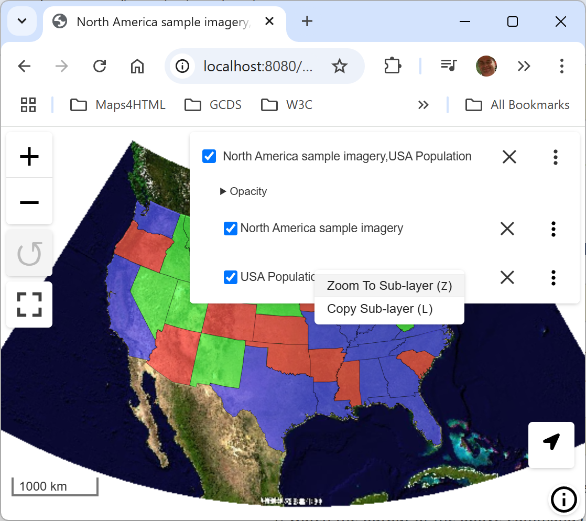

.. _mapml:

MapML 
=========

Map Markup Language (MapML) is a text-based format which allows map authors to encode map information as hypertext documents exchanged over the Uniform Interface of the Web. The format definition is a work-in-progress by the Maps for HTML W3C Community Group. Various tools to work with the format exist, including a Leaflet-based map viewer included in the GeoServer MapML extension. For more information on MapML refer to the `Maps for HTML Community Group <https://maps4html.org/>`.

The MapML module for GeoServer adds new MapML resources to access WMS, WMTS and WFS services configured in Geoserver. The MapML modules includes support for styles, tiling, querying, and dimensions options for WMS layers, and also provides a MapML outputFormat for WMS GetFeatureInfo and WFS GetFeatures requests. See below for information on installing and configuring the MapML module.
    .. warning:: The MapML extension performance is negatively affected by a recent upgrade to Spring in the GeoServer project.  This affects all versions since 2.22.0. To avoid serious performance penalty, please remove "text/.*" from the gzip filter <param-value> in your web.xml servlet configuration.

    .. warning:: MapML is an experimental proposed extension of HTML for the Web. The objective of the project is to standardize map, layer and feature semantics in HTML.  As the format progresses towards a Web standard, it may change slightly.  Always use the latest version of this extension, and follow or join in the project's progress at https://maps4html.org.

Installation
--------------------

#. Visit the :website:`website download <download>` page, locate your release, and download:  :download_extension:`mapml`
   
   .. warning:: Make sure to match the version of the extension (for example |release| above) to the version of the GeoServer instance!

#. Extract the contents of the archive into the :file:`WEB-INF/lib` directory of the GeoServer installation.

#. Restart GeoServer.

Configuration
-------------

Configuration can be done using the Geoserver administrator GUI. The MapML configuration is accessible in the *MapML Settings* section under the *Publishing* tab of the Layer or Layer Group Configuration page for the layer or layer group being configured. Here is the MapML Settings section, with some example values filled in:

.. figure:: images/mapml_config_ui.png

There is also a MapML-specific global WMS setting in the *MapML Extension* section of the ``WMS`` Services Settings Page.  This setting is used to control the handling of multi-layer requests.  

.. figure:: images/mapml_config_wms.png

If the ``Represent multi-layer requests as multiple elements`` is checked (and the configuration is saved), an individually accessible <map-extent> element will be generated for each requested layer.  The default is to represent the layers as a single (hidden) <map-extent>.

Styles
------

Like any WMS layer or layer group available from GeoServer, a comma-separated list of styles may be supplied in the WMS GetMap `styles` parameter.  If no style name is requested, the default style will be used for that layer.  For single-layer (or layer group) requests, the set of alternate styles is presented as an option list in the layer preview map's layer control, with the currently requested style indicated.

.. figure:: images/mapml_preview_multiple_styles_menu.png

Note that in order to ensure that the default layer style is properly available to the preview map's option list, make sure that the style is moved to the ``Available Styles`` list in the ``Publishing`` tab of the Layer Configuration page.  If the style is set to ``Default`` but not explicitly made ``Available``, the style will not be available to MapML.  Similarly but a with a slight variation in requirement, for Layer Groups, the 'default' layer group style must be copied and given a name matching `default-style-` plus the layer group name.

License Info
^^^^^^^^^^^^

Together these two attributes allow the administrator to define the contents of the ``<link rel=license>`` element in the MapML header. Here is an example of the resulting XML:

  <link href="https://creativecommons.org/licenses/by/4.0/" rel="license" title="Attribution 4.0 International (CC BY 4.0)"/>

**License Title**
  The License Title will be included as the value of ``title`` attribute of the ``<link rel=license>`` element in the MapML header.

**License Link**
  The License Link will be included as the value of ``href`` attribute of the ``<link rel=license>`` element in the MapML header, and should be a valid URL referencing the license document.

Tile Settings
^^^^^^^^^^^^^

Using tiles to access the layer can increase the performance of your web map. This is especially true if there is a tile cache mechanism in use between GeoServer and the browser client.

**Use Tiles**
  If the "Use Tiles" checkbox is checked, by default the output MapML will define a tile-based reference to the WMS server. Otherwise, an image-based reference will be used.  If one or more of the MapML-defined GridSets is referenced by the layer or layer group in its "Tile Caching" profile, GeoServer will generate tile references instead of generating WMS GetMap URLs in the MapML document body.

Tile Caching
^^^^^^^^^^^^

In the Tile Caching tab panel of the Edit Layer or Edit Layer Group page, at the bottom of the page you will see the table of GridSets that are assigned to the layer or layer group.  The values "WGS84" and "OSMTILE" are equivalent to the EPSG:4326 and EPSG:900913 built in GeoWebCache GridSets. However, for the MapML module to recognize these GridSets, you must select and use the MapML names.   For new layers or layer groups, or newly created grid subsets for a layer or layer group, the MapML values are selected by default.  For existing layers that you wish to enable the use of cached tile references by the MapML service, you will have to select and add those values you wish to support from the dropdown of available GridSets.  The set of recognized values for MapML is "WGS84" (equivalent to EPSG:4326), "OSMTILE" (equivalent to EPSG:900913), "CBMTILE" (Canada Base Map) and "APSTILE" (Alaska Polar Stereographic).

.. figure:: images/mapml_tile_caching_panel_ui.png

Sharding Config
^^^^^^^^^^^^^^^^

The Sharding Config options are intended to allow for parallel access to tiles via different server names. The actual server names must be configured in the DNS to refer to either the same server or different servers with the same GeSserver layer configuration. In the example above, the mapML client would alternate between the servers a.geoserver.org, b.geoserver.org, and c.geoserver.org to access the map images. The values in the example above would result in the following MapML:  

.. code-block:: html

    <input name="s" type="hidden" shard="true" list="servers" min="0.0" max="0.0"/>
    <datalist id="servers">
        <option value="a"/>
        <option value="b"/>
        <option value="c"/>
    </datalist>
    <link tref="http://{s}.geoserver.org:8080/geoserver/test/wms?version=1.3.0&amp;service=WMS&amp;request=GetMap&amp;crs=EPSG:3857&amp;layers=cntry00&amp;styles=&amp;bbox={xmin},{ymin},{xmax},{ymax}&amp;format=image/png&amp;transparent=false&amp;width={w}&amp;height={h}" rel="image"/>

**Enable Sharding**
  If Enable Sharding is checked, and values are provided for the Shard List and Shard Server Pattern fields, then a hidden shard list input will be included in the MapML. 
  
**Shard List**
  If Enable Sharding is checked, the Shard List should be populated with a comma-separated list of shard names which will be used to populate the shard data list element.
  
**Shard Server Pattern**
  The Shard Server Pattern should be a valid DNS name including the special placeholder string {s} which will be replace with the Shard Names from the Shard List in requests to the server. This pattern should not include any slashes, the protocol string (http://) or the port number (:80), as these are all determined automatically from the URL used to access the MapML resource.  

Dimension Config
^^^^^^^^^^^^^^^^

**Dimension**
  The selected dimension (if any) is advertised in the mapml as an input with the appropriate value options or ranges, as configured in the *Dimension* tab of the Layer Configuration page. Only dimensions enabled in the *Dimension* tab are available as options.

Attribute to <featurecaption> mapping
^^^^^^^^^^^^^^^^^^^^^^^^^^^^^^^^^^^^^

**List of attributes**
The list allows you to read the names of the layer attributes, it doesn't really do more than that. 

**Feature Caption Template String**

To cause an attribute to be serialized in MapML vector content as the <featurecaption> element value,
you must enter its name as a ${placeholder} in the text box immediately below the attributes list. You can also add (a small amount of) plain text that will be 
copied verbatim into the <featurecaption> content.  <featurecaption> is used as the accessible name of features by screen reader software, which will often 
read out this value without the user having to expand a popup; in other words, it will be used as a visual and audible tooltip when the 
feature is focused.

MapML Resources
---------------

MapML resources will be available for any published WMS layers by making a GetMap request with the WMS output format to ``format=text/mapml``.  See :ref:`WMS` for further WMS details, :ref:`wms_getmap` for GetMap details, and :ref:`wms_output_formats` for output format reference information.
  
**SRS/CRS**

Note that the WMS SRS or CRS must be one of the projections supported by MapML:

- MapML:WGS84 (or EPSG:4326)
- MapML:OSMTILE (or EPSG:3857)
- MapML:CBMTILE (or EPSG:3978)
- MapML:APSTILE (or EPSG:5936)

The equivalent EPSG codes are provided for reference, but the MapML names are recommended, as they
imply not only a coordinate refefence system, but also a tile grid and a set of zoom levels (Tiled CRS), 
that the MapML client will use when operating in tiled mode. When using tiles, it's also recommended
to set up tile caching for the same-named gridsets.

If the native SRS of a layer is not a match for the MapML ones, remember to configure the projection
policy to "reproject native to declare". You might have to save and reload the layer configuration
in order to re-compute the native bounds correctly.

If the SRS or CRS is not one of the above, the GetMap request will fail with an ``InvalidParameterValue`` exception.
The main "MapML" link in the preview page generates a HTML client able to consume MapML resources.
The link is generated so that it always work, if the CRS configured for the layer is not supported, it will automatically fall back on MapML:WGS84.

**MapML Output Format**

The output image format for the MapML resource should be specified using the format_options parameter with a key called ``mapml-wms-format``.  If provided, the provided mime type must be a valid WMS format specifier. If not provided, it defaults to ``image/png``.   

Example::

    http://localhost:8080/geoserver/tiger/wms?service=WMS&version=1.1.0&request=GetMap&layers=tiger:giant_polygon&bbox=-180.0,-90.0,180.0,90.0&width=768&height=384&srs=EPSG:4326&styles=&format=text/mapml&format_options=mapml-wms-format:image/jpeg

MapML Visualization
-------------------

With the MapML Extension module installed, the GeoServer Layer Preview page is modified to add a WMS GetMap link to the MapML resources for each layer or layer group.  The MapML link in the Layer Preview table is generated by the MapML extension to an HTML Web map page that is created on the fly which refers to the GeoServer resource:

.. figure:: images/mapml_preview_ui.png

You can add layers to the map as you like, by dragging the URL bar value generated by the the Layer Preview WMS formats dropdown menu selection of "MapML" as shown below, and dropping it onto another layer's MapML preview:

.. figure:: images/mapml_wms_format_dropdown.png

If all goes well, you should see the layers stacked on the map and in the layer control.

MapML visualization is supported by the Web-Map-Custom-Element project. The MapML viewer is built into the GeoServer layer and layer group preview facility.  You can find out more about the Web-Map-Custom-Element at the project `website <https://maps4html.org/web-map-doc/>`. Here is a simple, self-contained example of an HTML page that uses the <mapml-viewer> and <layer-> elements: 

.. code-block:: html

    <!DOCTYPE html>
    <html lang="en">
      <head>
        <meta charset="utf-8" >
        <title>MapML Test Map</title>
        <meta name="viewport" content="width=device-width, initial-scale=1">
        
        
      </head>
      <body>
        <mapml-viewer projection="osmtile" zoom="2" lat="61.209125" lon="-90.850837" controls>
          <layer- label="US States" src="http://localhost:8080/geoserver/mapml/topp:states/osmtile?style=population" checked></layer->
        </mapml-viewer>
      </body>
    </html>
    
In the above example, the place-holders ``topp:states``, ``localhost:8080``, ``osmtile``, and ``population`` would need to be replaced with the appropriate values, and/or the ``style`` parameter could be removed entirely from the URL if not needed.  You may also like to "View Source" on the preview page to see what the markup looks like for any layer.  This code can be copied and pasted without harm, and you should try it and see what works and what the limitations are.  For further information about MapML, and the Maps for HTML Community Group, please visit http://maps4html.org.
