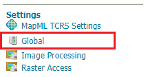
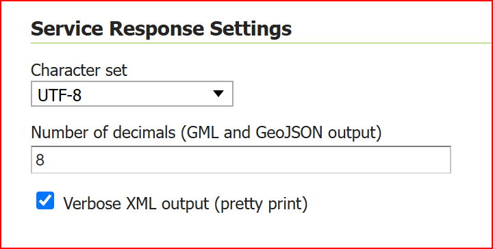
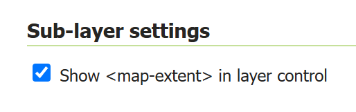
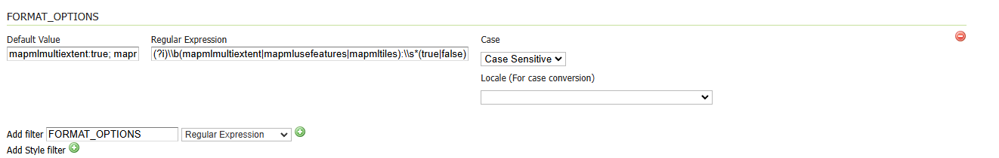

.. _mapml_installation:

Installation
--------------------

#. Visit the :website:`website download <download>` page, locate your release, and download:  :download_extension:`mapml`
   
   .. warning:: Make sure to match the version of the extension (for example |release| above) to the version of the GeoServer instance!

#. Extract the contents of the archive into the :file:`WEB-INF/lib` directory of the GeoServer installation.

#. Restart GeoServer.

Configuration
-------------

Configuration can be done using the Geoserver administrator GUI. The MapML configuration is accessible in the *MapML Settings* section under the *Publishing* tab of the Layer or Layer Group Configuration page for the layer or layer group being configured. Here is the MapML Settings section, with some example values filled in:

.. figure:: images/mapml_config_ui.png

*Attributes to <feature caption> mapping* section allows to define a template so that feature caption can include attribute values.
Double clicking on one entry of the List of Attributes, will append an *${attribute}* placeholder at the end of the Feature Caption Template String text area.

For example, for the State layer, you can define a template showing the State Name and the number of persons,
by following these steps:

  #. Write "State Name:" on the text area
  #. Double click on the *STATE_NAME* attribute from the list of attributes, which will result in appending the *${STATE_NAME}* placeholder to the previous text.
  #. Continue writing ", Persons:" on the text area
  #. Double click on the *PERSONS* attribute from the list of attributes, which will result in appending the *${PERSONS}* placeholder to the previous text.

See the following gif showing the result.

.. figure:: images/mapml_feature_caption.gif

After having saved the configuration, the WFS output will looks like this, where on mouseover, you can see the feature caption being setup on top of the defined template:

.. figure:: images/mapml_feature_captions_wfs.png

TiledCRS
--------
MapML supports 4 built-in TiledCRS:

- MapML:WGS84 (or EPSG:4326)
- MapML:OSMTILE (or EPSG:3857)
- MapML:CBMTILE (or EPSG:3978)
- MapML:APSTILE (or EPSG:5936)

In addition, is it possible to configure custom TiledCRS based on the available WMTS GridSets.
A new MapML TCRS Settings menu is available in the GeoServer UI on the Settings section:

.. figure:: images/mapml_tcrs_menu.png

It provides a selector containing available GridSets. Administrator can select GridSets from the left list that will be converted to TiledCRSs.

.. figure:: images/mapml_tcrs_selector.png

Notes:

- Gridsets containing ":" character in the name won't be listed
- Gridsets with non-numeric levels or without a common prefix won't be listed

For example, the UTM14WGS84Quad specified in the above selector has the following definition, which only contains numeric level names.

.. figure:: images/mapml_utm_gridset.png

Global Settings
---------------

The Global settings menu (above) contains a Service Response Settings section (below) which contains the Verbose XML output (pretty print) checkbox. The MapML extension respects or uses this setting when serializing text/mapml (media type) responses.  Be aware that caching on both the client and server may prevent this setting from becoming immediately obvious in devtools responses. Refreshing the browser cache can request a new version of the response, but if the response is cached on the server, for example as a vector tile, it may not be possible to obtain a pretty printed version of the data, short of deleting the tile cache, which may be undesirable.

Styles
------

Like any WMS layer or layer group available from GeoServer, a comma-separated list of styles may be supplied in the WMS GetMap `styles` parameter.  If no style name is requested, the default style will be used for that layer.  For single-layer or single-layer group requests, the set of alternate styles is presented as an option list in the layer preview map's layer control, with the currently requested style indicated.

.. figure:: images/mapml_preview_multiple_styles_menu.png

Note that in order to ensure that the default layer style is properly available to the preview map's option list, make sure that the style is moved to the ``Available Styles`` list in the ``Publishing`` tab of the Layer Configuration page.  If the style is set to ``Default`` but not explicitly made ``Available``, the style will not be available to MapML.  Similarly but a with a slight variation in requirement, for Layer Groups, the 'default' layer group style must be copied and given a name matching `default-style-` plus the layer group name.

License Info
^^^^^^^^^^^^

Together these two attributes allow the administrator to define the contents of the ``<link rel=license>`` element in the MapML header. Here is an example of the resulting XML:

  <link href="https://creativecommons.org/licenses/by/4.0/" rel="license" title="Attribution 4.0 International (CC BY 4.0)"/>

**License Title**
  The License Title will be included as the value of ``title`` attribute of the ``<link rel=license>`` element in the MapML header.

**License Link**
  The License Link will be included as the value of ``href`` attribute of the ``<link rel=license>`` element in the MapML header, and should be a valid URL referencing the license document.

Tile Settings
^^^^^^^^^^^^^

Using tiles to access the layer can increase the performance of your web map. This is especially true if there is a tile cache mechanism in use between GeoServer and the browser client.

**Use Tiles**
  If you check the "Use Tiles" checkbox and save it, the MapML format on the Layer Preview page will use tile-based references to the WMS server. Checking this checkbox sets the `FORMAT_OPTIONS=mapmlusetiles:true` parameter value in the Layer Preview URL, but you can set and use this value in WMS requests for the text/mapml format independently. The `mapmlusetiles`, `mapmlusefeatures` and `mapmlusemultiextents` FORMAT_OPTIONS parameters can be used together to control the type of requests and responses used in your web map client. For example, if your layer or layer group has a cached tile layer configured, GeoServer will generate tile references (e.g., <map-link rel="tile" tref="...request=GetTile...">) instead of WMS GetMap URLs (e.g., <map-link rel="image" tref="...request=GetMap...">); if in addition to having a cached tile layer for a layer or layer group you have also enabled caching of the `text/mapml` format, you can use `FORMAT_OPTIONS=mapmlusetiles:true;mapmlusefeatures:true` to obtain and use tiles in MapML format.

Vector Settings
^^^^^^^^^^^^^^^

MapML supports the serving of vector feature representations of the data.  This results in a smoother user navigation experience, smaller bandwidth requirements, and more options for dynamic styling on the client-side.

**Use Features**
  If the "Use Features" checkbox is checked, the output MapML on the Layer Preview page will define a feature-based reference to the WMS server. When making WMS request add `mapmlusefeatures:true` to the FORMAT_OPTIONS parameter.  Otherwise, an image-based reference will be used.  Note that when applied to raster data map-tile elements will be generated for the requested coverage area.  MapML <map-extent> element with a feature link:

.. code-block:: html

    <map-extent units="WGS84" label="Manhattan (NY) points of interest" checked="checked">
      <map-input name="z" type="zoom" min="0" max="21"/>
      <map-input name="xmin" type="location" rel="map" position="top-left" axis="longitude" units="gcrs" min="-74.0118315772888" max="-74.00153046439813"/>
      <map-input name="ymin" type="location" rel="map" position="bottom-left" axis="latitude" units="gcrs" min="40.70754683896324" max="40.719885123828675"/>
      <map-input name="xmax" type="location" rel="map" position="top-right" axis="longitude" units="gcrs" min="-74.0118315772888" max="-74.00153046439813"/>
      <map-input name="ymax" type="location" rel="map" position="top-left" axis="latitude" units="gcrs" min="40.70754683896324" max="40.719885123828675"/>
      <map-input name="w" type="width" min="1" max="10000"/>
      <map-input name="h" type="height" min="1" max="10000"/>
      <map-link tref="http://localhost:8080/geoserver/tiger/wms?format_options=mapmlfeatures:true&amp;request=GetMap&amp;crs=MapML:WGS84&amp;bbox={xmin},{ymin},{xmax},{ymax}&amp;format=text/mapml&amp;language=en&amp;version=1.3.0&amp;transparent=true&amp;service=WMS&amp;layers=poi&amp;width={w}&amp;styles=&amp;height={h}" rel="features"/>
    </map-extent>

When both "Use Tiles" and "Use Features" are set in the FORMAT_OPTIONS parameter (`mapmlusefeatures:true;mapmlusetiles:true`), the MapML extension will request tiled maps in ``text/mapml`` format.
The contents of the tiles will be clipped to the requested area, and feature attributes will be skiipped, as the MapML client cannot leverage them for the moment.

Sub-layer Settings
^^^^^^^^^^^^^^^^^^

    The sub-layer settings checkbox is shown

If the ``Show <map-extent> in layer control`` checkbox is checked (and the configuration is saved), the `mapmlusemultiextents:true` FORMAT_OPTIONS value will be used in the Layer Preview URL, and an individually accessible <map-extent> element will be generated for each requested layer.  When composing a WMS request independently, include the `mapmlusemultiextents:true` parameter within FORMAT_OPTIONS if desired.  The default value (false) is to represent the all layers in the LAYERS list as a single (hidden) <map-extent>.

.. figure:: images/mapml_wms_multi_extent.png
   :width: 75%

   This map uses `FORMAT_OPTIONS=mapmlusefeatures:true;mapmlusemultiextents:true;mapmlusetiles:true`

Client Requests
^^^^^^^^^^^^^^^

When configuring a cascaded WMS or WMTS remote layers, a new "Client Requests" setting is available.

**Remote**
  If the "Remote" checkbox is checked, the link templates embedded in MapML will refer to the remote WMS/WMTS.
  The MapML viewer will directly contact the remote server if certain criteria are met:

- No restricting DataAccessLimit security is associated to the layer (e.g. with GeoFence integration) that will do filtering, clipping or similar operations. In that case, the MapML will point to the local GeoServer so that the param is honored.
- No vendor parameters are used in the incoming request. If vendor parameters are used (e.g., request clipping with geometric mask) the MapML is pointing to the local GeoServer so that the vendor parameter is honored
- The remote Server is supporting the requested CoordinateReferenceSystem for that layer.
- GetTile requests will be sent to the remote server if there is a compatible gridset for that layer (same origin, same CRS, same tile sizes, same levels and same resolutions)

**Feature Styling**
  Basic styling of vector features is supported by the MapML extension.  The style is defined in the WMS GetMap request, and the MapML extension will convert the rules and style attributes defined in the SLD into CSS classes and apply those classes to the appropriate features.  Note that this conversion is currently limited to basic styling and does not include transformation functions, external graphics, or styling dependent on individual feature attributes (non-static style values).  See below for a more detailed compatibility table: 

+------------------+-------------------+-----------+
| Symbolizer       | Style Attribute   | Supported |
+==================+===================+===========+
| PointSymbolizer  | Opacity           | yes       |
|                  +-------------------+-----------+
|                  | Default Radius    | yes       |
|                  +-------------------+-----------+
|                  | Radius            | yes       |
|                  +-------------------+-----------+
|                  | Rotation          | no        |
|                  +-------------------+-----------+
|                  | Displacement      | no        |
|                  +-------------------+-----------+
|                  | Anchor Point      | no        |
|                  +-------------------+-----------+
|                  | Gap               | no        |
|                  +-------------------+-----------+
|                  | Initial Gap       | no        |
|                  +-------------------+-----------+
|                  | Well Known Name   | yes       |
|                  +-------------------+-----------+
|                  | External Mark     | no        |
|                  +-------------------+-----------+
|                  | Graphic Fill      | no        |
|                  +-------------------+-----------+
|                  | Fill Color        | yes       |
|                  +-------------------+-----------+
|                  | Fill Opacity      | yes       |
|                  +-------------------+-----------+
|                  | Stroke Color      | yes       |
|                  +-------------------+-----------+
|                  | Stroke Opacity    | yes       |
|                  +-------------------+-----------+
|                  | Stroke Width      | yes       |
|                  +-------------------+-----------+
|                  | Stroke Linecap    | yes       |
|                  +-------------------+-----------+
|                  | Stroke Dash Array | yes       |
|                  +-------------------+-----------+
|                  | Stroke Dash Offset| yes       |
|                  +-------------------+-----------+
|                  | Stroke Line Join  | no        |
+------------------+-------------------+-----------+
| LineSymbolizer   | Stroke Linecap    | yes       |
|                  +-------------------+-----------+
|                  | Stroke Dash Array | yes       |
|                  +-------------------+-----------+
|                  | Stroke Dash Offset| yes       |
|                  +-------------------+-----------+
|                  | Stroke Line Join  | no        |
+------------------+-------------------+-----------+
| PolygonSymbolizer| Displacement      | no        |
|                  +-------------------+-----------+
|                  | Perpendicular Offs| no        |
|                  +-------------------+-----------+
|                  | Graphic Fill      | no        |
|                  +-------------------+-----------+
|                  | Fill Color        | yes       |
|                  +-------------------+-----------+
|                  | Fill Opacity      | yes       |
|                  +-------------------+-----------+
|                  | Stroke Color      | yes       |
|                  +-------------------+-----------+
|                  | Stroke Opacity    | yes       |
|                  +-------------------+-----------+
|                  | Stroke Width      | yes       |
|                  +-------------------+-----------+
|                  | Stroke Linecap    | yes       |
|                  +-------------------+-----------+
|                  | Stroke Dash Array | yes       |
|                  +-------------------+-----------+
|                  | Stroke Dash Offset| yes       |
|                  +-------------------+-----------+
|                  | Stroke Line Join  | no        |
+------------------+-------------------+-----------+
| TextSymbolizer   | ALL               | no        |
+------------------+-------------------+-----------+
| RasterSymbolizer | ALL               | no        |
+------------------+-------------------+-----------+
| Transformation   | ALL               | no        |
| Functions        |                   |           |
+------------------+-------------------+-----------+
| Zoom             | ALL               | yes       |
| Denominators     |                   |           |
+------------------+-------------------+-----------+

WMS GetMap considerations
^^^^^^^^^^^^^^^^^^^^^^^^^

By default, each layer/style pair that is requested via the GetMap parameters is composed into a single <map-extent>...<map-link tref="...">...</map-extent> structure as exemplified above.  

If the FORMAT_OPTION parameter of the WMS request is configured with `mapmlusemultiextents:true`, a request for multiple layers or layer groups in MapML format on the Layer Preview page will result in the serialization of a MapML document containing multiple <map-extent> elements.  Each layer/style pair is represented by a <map-extent> element in the response.  The <map-extent> elements are represented in the client viewer layer control settings as sub-layers, which turn on and off independently of each other, but which are controlled by the parent <map-layer> element's state (checked / unchecked, opacity etc) (right-click or Shift+F10 to obtain context menus):

.. figure:: images/mapml_wms_multi_extent.png

Tile Caching
^^^^^^^^^^^^

In the Tile Caching tab panel of the Edit Layer or Edit Layer Group page, at the bottom of the page you will see the table of GridSets that are assigned to the layer or layer group.  

The values ``WGS84`` and ``OSMTILE`` are equivalent to the EPSG:4326 and EPSG:900913 built in GeoWebCache GridSets. 
However, for the MapML module to recognize these GridSets, you must select and use the MapML names.   For new layers or layer groups, or newly created grid subsets for a layer or layer group, the MapML values are selected by default.  For existing layers that you wish to enable the use of cached tile references by the MapML service, you will have to select and add those values you wish to support from the dropdown of available GridSets.  The set of recognized values for MapML is ``WGS84`` (equivalent to EPSG:4326), ``OSMTILE`` (equivalent to EPSG:900913), ``CBMTILE`` (Canada Base Map) and ``APSTILE`` (Alaska Polar Stereographic).

The MapML client will normally request image tiles against WMTS, but if configured to use feature output,
it will try to use tiles in ``text/mapml`` format, which should be configured as a cacheable format
in order to enable WMTS requests.

.. figure:: images/mapml_tile_caching_panel_ui.png

In order to properly pass the proper multi-extent, tiling, and feature parameters to the tiling WMS requests used to populate the cache, a FORMAT_OPTIONS parameter filter (see :ref:`gwc_webadmin_layers`) must be created with appropriate default values and a regular expression that matches the MapML requests.  

The Default Value entry should look like this::

    mapmlusemultiextents:true;mapmlusefeatures:false;mapmlusetiles:true

Here is an example regular expression that matches the MapML FORMAT_OPTIONS parameters in any order::

    (?i)\\b(mapmlusemultiextents|mapmlusefeatures|mapmlusetiles):\\s*(true|false)\\b(?:\\s*;\\s*(?i)\\b(mapmlusemultiextents|mapmlusefeatures|mapmlusetiles):\\s*(true|false)\\b)*(?:\\s*;\\s*(?i)\\b(mapmlusemultiextents|mapmlusefeatures|mapmlusetiles):\\s*(true|false)\\b)*

Starting with version 2.26.x of GeoServer, Sharding support and related configuration has been removed

Dimension Config
^^^^^^^^^^^^^^^^

**Dimension**
  The selected dimension (if any) is advertised in the mapml as an input with the appropriate value options or ranges, as configured in the *Dimension* tab of the Layer Configuration page. Only dimensions enabled in the *Dimension* tab are available as options.

Attribute to <featurecaption> mapping
^^^^^^^^^^^^^^^^^^^^^^^^^^^^^^^^^^^^^

**List of attributes**
The list allows you to read the names of the layer attributes, it doesn't really do more than that. 

**Feature Caption Template String**

To cause an attribute to be serialized in MapML vector content as the <featurecaption> element value,
you must enter its name as a ${placeholder} in the text box immediately below the attributes list. You can also add (a small amount of) plain text that will be 
copied verbatim into the <featurecaption> content.  <featurecaption> is used as the accessible name of features by screen reader software, which will often 
read out this value without the user having to expand a popup; in other words, it will be used as a visual and audible tooltip when the 
feature is focused.

MapML Resources
---------------

MapML resources will be available for any published WMS layers by making a GetMap request with the WMS output format to ``format=text/mapml``.  See :ref:`WMS` for further WMS details, :ref:`wms_getmap` for GetMap details, and :ref:`wms_output_formats` for output format reference information.
  
**SRS/CRS**

Note that the WMS SRS or CRS must be one of the built-in projections supported by MapML or one of the TCRS configured through the dedicated section. Built-in MapML CRS are:

- MapML:WGS84 (or EPSG:4326)
- MapML:OSMTILE (or EPSG:3857)
- MapML:CBMTILE (or EPSG:3978)
- MapML:APSTILE (or EPSG:5936)

The equivalent EPSG codes are provided for reference, but the MapML names are recommended, as they
imply not only a coordinate refefence system, but also a tile grid and a set of zoom levels (Tiled CRS), 
that the MapML client will use when operating in tiled mode. When using tiles, it's also recommended
to set up tile caching for the same-named gridsets.

If the native SRS of a layer is not a match for the MapML ones, remember to configure the projection
policy to "reproject native to declare". You might have to save and reload the layer configuration
in order to re-compute the native bounds correctly.

If the SRS or CRS is not one of the above, the GetMap request will fail with an ``InvalidParameterValue`` exception.
The main "MapML" link in the preview page generates a HTML client able to consume MapML resources.
The link is generated so that it always work, if the CRS configured for the layer is not supported, it will automatically fall back on MapML:WGS84.

**MapML Output Format**

The output image format for the MapML resource should be specified using the format_options parameter with a key called ``mapml-wms-format``.  If provided, the provided mime type must be a valid WMS format specifier. If not provided, it defaults to ``image/png``.   

Example::

    http://localhost:8080/geoserver/tiger/wms?service=WMS&version=1.1.0&request=GetMap&layers=tiger:giant_polygon&bbox=-180.0,-90.0,180.0,90.0&width=768&height=384&srs=EPSG:4326&styles=&format=text/mapml&format_options=mapml-wms-format:image/jpeg

MapML Visualization
-------------------

With the MapML Extension module installed, the GeoServer Layer Preview page is modified to add a WMS GetMap link to the MapML resources for each layer or layer group.  The MapML link in the Layer Preview table is generated by the MapML extension to an HTML Web map page that is created on the fly which refers to the GeoServer resource:

.. figure:: images/mapml_preview_ui.png

You can add layers to the map as you like, by dragging the URL bar value generated by the Layer Preview WMS formats dropdown menu selection of "MapML" as shown below, and dropping it onto another layer's MapML preview:

.. figure:: images/mapml_wms_format_dropdown.png

If all goes well, you should see the layers stacked on the map and in the layer control.

MapML visualization is supported by the MapML.js project. The MapML viewer is built into the GeoServer layer and layer group preview facility.  You can find out more about MapML.js at the project `website <https://maps4html.org/web-map-doc/>`. Here is a simple, self-contained example of an HTML page that uses the <mapml-viewer> and <map-layer> elements: 

.. code-block:: html

    <!DOCTYPE html>
    <html lang="en">
      <head>
        <meta charset="utf-8" >
        <title>MapML Test Map</title>
        <meta name="viewport" content="width=device-width, initial-scale=1">
        
        
      </head>
      <body>
        <mapml-viewer projection="osmtile" zoom="2" lat="61.209125" lon="-90.850837" controls>
          <map-layer label="US States" src="http://localhost:8080/geoserver/mapml/topp:states/osmtile?style=population" checked></map-layer>
        </mapml-viewer>
      </body>
    </html>
    
In the above example, the place-holders ``topp:states``, ``localhost:8080``, ``osmtile``, and ``population`` would need to be replaced with the appropriate values, and/or the ``style`` parameter could be removed entirely from the URL if not needed.  You may also like to "View Source" on the preview page to see what the markup looks like for any layer.  This code can be copied and pasted without harm, and you should try it and see what works and what the limitations are.  For further information about MapML, and the Maps for HTML Community Group, please visit http://maps4html.org.

In addition the MapML viewer is also available as output of a WFS GetFeature request. Select the ``text/html; subtype=mapml`` from the dropdown as shown below:

.. figure:: images/mapml_wfs_format_dropdown.png

.. warning:: Note that the MapML WFS output will automatically set a default max feature limit. Removing that limit can lead to browser issues.
