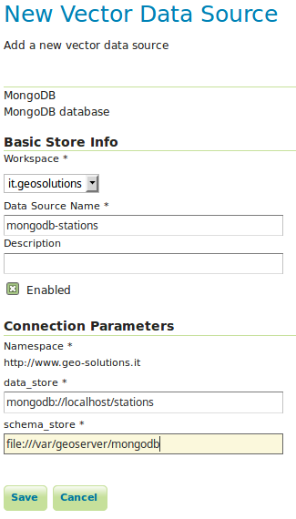

.. _mongodb:

MongoDB Data Store
==================

This module provides support for MongoDB data store. This extension is build on top of `GeoTools MongoDB plugin
<http://docs.geotools.org/latest/userguide/library/data/mongodb.html>`_.

Installation
------------

#. Download the ``mongodb`` extension for `your version of GeoServer <http://ares.opengeo.org/geoserver/>`_.

#. Unzip the archive into the WEB-INF/lib directory of the GeoServer installation.

#. Restart GeoServer.

Usage
-----

If the extension was successfully installed a new type of data store named ``MongoDB`` should be available:

.. figure:: images/mongodb_store_1.png
   :align: center

   *MongoDB data store.*

Configuring a new MongoDB data store requires providing:

#. The URL of a MongoDB database.

#. The absolute path to a data directory where GeoServer will store the schema produced for the published collections.

   *Configuring a MongoDB data store.*

For more details about the usage of this data store please check the `GeoTools MongoDB plugin documentation
<http://docs.geotools.org/latest/userguide/library/data/mongodb.html>`_.