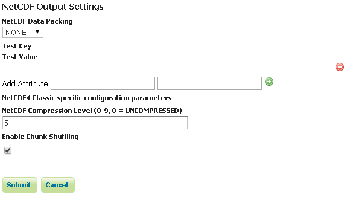
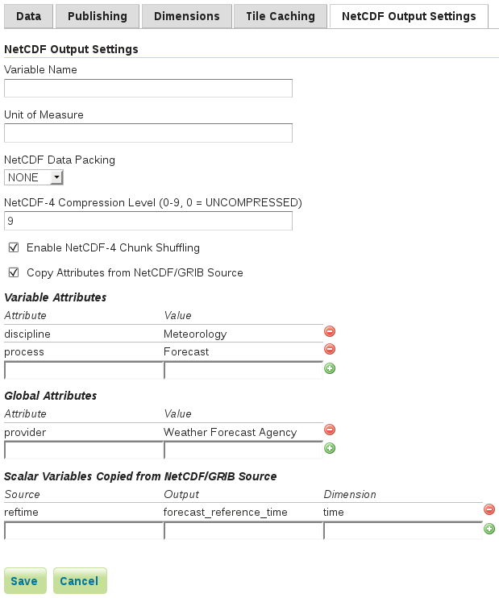
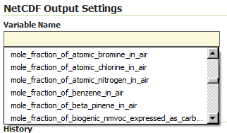
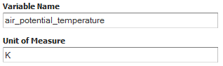

.. _netcdf-out:

NetCDF Output format
====================
This plugin brings in the ability to encode WCS 2.0.1 Multidimensional output as NetCDF files using the Unidata NetCDF Java library. 

Getting a NetCDF output file
----------------------------
Make sure to specify application/x-netcdf as value of the format parameter within the getCoverage request using the proper constant.
As an instance: 
http://localhost:8080/geoserver/wcs?request=GetCoverage&service=WCS&version=2.0.1&coverageId=it.geosolutions__V&Format=application/x-netcdf...

Current limitations
-------------------

* Input coverages/slices should share the same bounding box (lon/lat coordinates are the same for the whole ND cube)
* NetCDF output will be produced only when input coverages come from a StructuredGridCoverage2D reader (This will allows to query the GranuleSource to get the list of granules in order to setup dimensions slices for each sub-coverage)

Supporting NetCDF4-Classic output file
--------------------------------------
Starting with version 2.8 of GeoServer, NetCDF4-Classic output is supported in addition to NetCDF-3.
NetCDF4-Classic leverages on the simpler data model of NetCDF-3 by supporting the HDF5-based storage capabilities of NetCDF-4. 
See :ref:`Installing required NetCDF-4 Native libraries <nc4>` for more info on that.

NetCDF Output customization
---------------------------

Global Settings configuration
+++++++++++++++++++++++++++++
Starting with version 2.8 of GeoServer it is possible to define a few global settings for the NetCDF output format. A new section will be added to the *Global Settings* page.

   *NetCDF Output Global settings section*

From this panel, you may configure:

* Data Packing (*NONE*, *BYTE*, *SHORT*, *INT*)
* Variable attributes
* NetCDF4-Classic output specific parameters (they will be taken into account only in case the format specified in the WCS 2.0 GetCoverage request is application/x-netcdf4).

Layer configuration
++++++++++++++++++++
With version 2.8 of GeoServer it is also possible to add more customization to the layer in order to specify some properties of the NetCDF Output.
You will notice an additional tab to the layer configuration.

   *NetCDF Output settings panel*

.. note:: This tab will be initialized with the parameters defined in the *Global Settings* page. 
   
From this panel, you may configure the same parameters as for the global panel and also other 2 Layer-specific parameters:

* Output variable name. 
* variable's unit of measure.

.. note:: This panel will be available for Raster data only.

CF Standard names support
^^^^^^^^^^^^^^^^^^^^^^^^^

Note that the output name can also be chosen from the list of CF Standard names.
Check `CF standard names <http://cfconventions.org/standard-names.html>`_ page for more info on it.

Once you click on the dropdown, you may choose from the set of available standard names.

   *NetCDF CF Standard names list*

Note that once you specify the standard name, the unit will be automatically configured, using the canonical unit associated with that standard name.

   *NetCDF CF Standard names and canonical unit*

The list of standard names is populated by taking the entries from a standard name table xml.
At time of writing, a valid example is available `Here <http://cfconventions.org/Data/cf-standard-names/27/src/cf-standard-name-table.xml>`_

You have three ways to provide it to GeoServer.

#. Add a ``-DNETCDF_STANDARD_TABLE=/path/to/the/table/tablename.xml`` property to the startup script.
#. Put that xml file within the ``NETCDF_DATA_DIR`` which is the folder where all NetCDF auxiliary files are located. (`More info <http://geoserver.geo-solutions.it/multidim/en/mosaic_config/netcdf_mosaic.html#customizing-netcdf-ancillary-files-location>`_)
#. Put that xml file within the ``GEOSERVER_DATA_DIR``.

.. note:: Note that for the 2nd and 3rd case, file name must be **cf-standard-name-table.xml**.
