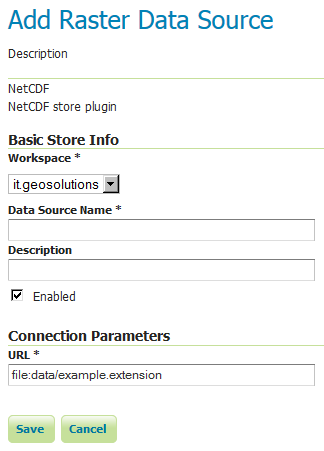
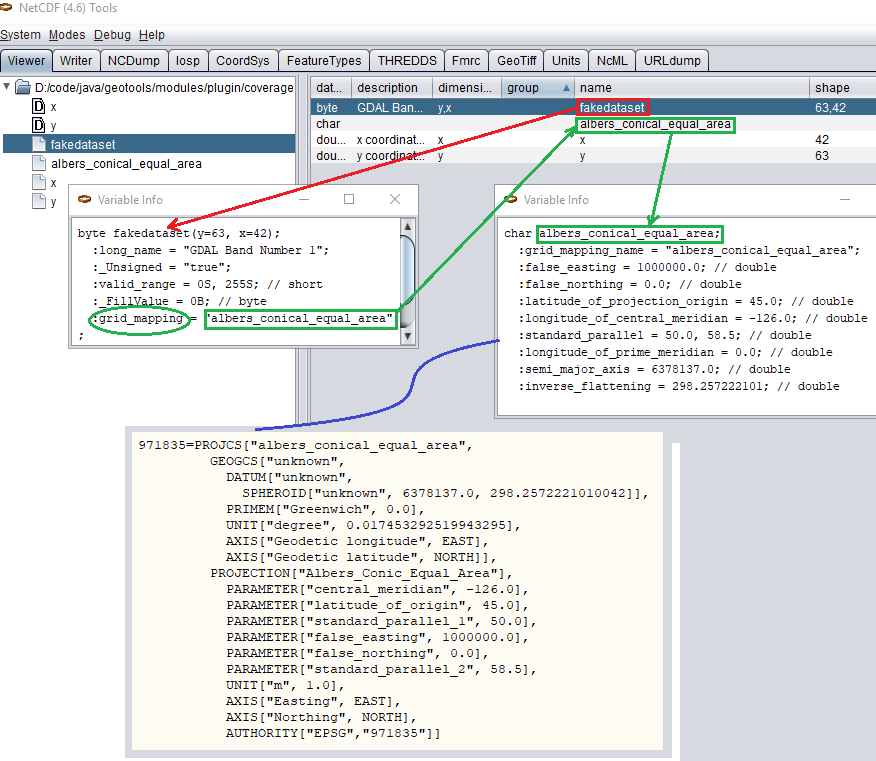

.. _netcdf:

NetCDF
======

Adding a NetCDF data store
--------------------------
To add a NetCDF data store the user must go to :guilabel:`Stores --> Add New Store --> NetCDF`.

.. figure:: netcdfcreate.png
   :align: center

   *NetCDF in the list of raster data stores*

Configuring a NetCDF data store
-------------------------------



   *Configuring a NetCDF data store*

.. list-table::
   :widths: 20 80

   * - **Option**
     - **Description**
   * - ``Workspace``
     - 
   * - ``Data Source Name``
     - 
   * - ``Description``
     - 
   * - ``Enabled``
     -  
   * - ``URL``
     - 

Notes on supported NetCDFs
--------------------------

The NetCDF plugin for GeoServer supports gridded NetCDF files having dimensions following the COARDS convention (custom, Time, Elevation, Lat, Lon). The NetCDF plugin supports plain NetCDF datasets (.nc files) as well .ncml files (which aggregate and/or modify one or more datasets) and Feature Collections. It supports Forecast Model Run Collection Aggregations (FMRC) either through the NCML or Feature Collection syntax. It supports an unlimited amount of custom dimensions, including runtime. 

`ToolsUI <ftp://ftp.unidata.ucar.edu/pub/netcdf-java/v4.6/toolsUI-4.6.jar>`_ is an useful java tool developed by UCAR which can be useful for a preliminary check on your dataset.
Opening a sample NetCDF using that tool will show an output like this in the Viewer tab:

.. figure:: dataset.png
   :align: center

   *NetCDF viewer in ToolsUI*

* This dataset has 4 dimensions (time, z, lat, lon, marked by the D icon in the left side of the GUI. They have been marked by a blue rectangle in the screenshot).
* Each dimension has an associated independent coordinate variable (marked by the green rectangle).
* Finally, the dataset has 3 geophysical variables, marked by a red rectangle, each having 4 dimensions.

The NetCDF plugin fully supports datasets where each variable's axis is identified by an independent coordinate variable, as shown in the previous example. There is limited support for coordinate variables with two dimensions (see :ref:`netcdf_multidim`), as part of the result of an aggregation (such as time,runtime - in the case of a runtime aggregation).
Two dimensional non-independent latitude-longitude coordinate variables aren't currently supported. 
A similar dataset will look like this in ToolsUI. Look at the red marked latitude and longitude coordinate variables, each one identified by a y,x 2D matrix.

.. figure:: dataset2dcoords.png
   :align: center

   *NetCDF viewer in ToolsUI for 2D coordinate variables*

.. _netcdf_multidim:

Two-Dimensional Coordinate Variables
--------------------------------------

Two-dimension coordinate variables are exposed in GeoServer as single dimensions. Their domain is exposed in GetCapabilities as a flat list of possible values. However, they imply an interdependence between the different dimensions, where some combinations of values exist (have data) and other combinations do not. For example:

+-------------------+--------------------------------+
|     Runtime       |           Time                 |
+========+==========+==========+==========+==========+
|        |          |     0    |     1    |    2     |
+--------+----------+----------+----------+----------+
| 0      | 1/1/2017 | 1/1/2017 | 1/2/2017 | 1/4/2017 |
+--------+----------+----------+----------+----------+
| 1      | 1/2/2017 | 1/2/2017 | 1/3/2017 |   XXXX   |
+--------+----------+----------+----------+----------+
| 2      | 1/3/2017 | 1/3/2017 |   XXXX   |   XXXX   |
+--------+----------+----------+----------+----------+

The time dimension would thus be exposed in GeoServer as {1/1/2017, 1/2/2017, 1/3/2017, 1/4/2017}. However, the combinations (runtime=1/1/2017, time=1/3/2017), (runtime=1/2/2017, time=1/1/2017), (runtime=1/2/2017, time=1/4/2017) , (runtime=1/3/2017, time=1/1/2017), (runtime=1/3/2017, time=1/2/2017) and (runtime=1/3/2017, time=1/4/2017) do not exist.

Some additional functionality was introduced to maximally exploit two-dimensional coordinate variables:

 * With requests that do not specify certain dimension values, we want to select default values that makes sense with regards to the dimensions values that *were* specified in the request. More specifically we want the maximum or minimum of the domain that matches the specified request's other dimension values; rather than the maximum or minimum of the entire domain.

 * The user may want to query which combination of dimension values do exist and which don't. This can be done through an Auxiliary Vector Store that publishes the entire index. 

A number of system properties allow us to configure this behavior:

 * ``org.geotools.coverage.io.netcdf.param.max``
     A comma separated list of dimensions that must be maximised when their value is absent in the request. In the layer configuration, the default value of these dimensions must be set to 'Built-in'.
 * ``org.geotools.coverage.io.netcdf.param.min``
     A comma separated list of dimensions that must be minimised when their value is absent in the request. In the layer configuration, the default value of these dimensions must be set to 'Built-in'.
 * ``org.geotools.coverage.io.netcdf.auxiliary.store``
     Set to TRUE to display the 'NetCDF Auxiliary Store' option in Geoserver. A NetCDF Auxiliary Store must be published *after* publishing the actual NetCDF store.

The NetCDF Auxiliary Store returns a WFS record like this for each possible combination of dimension values that do not include the two prime spatial dimensions::

  <topp:my-aux-store gml:id="1">
   <topp:the_geom>
    <gml:Polygon srsName="http://www.opengis.net/gml/srs/epsg.xml#4326" srsDimension="2">
     <gml:exterior><gml:LinearRing>
     <gml:posList>259.96003054 -0.04 259.96003054 70.04 310.03999998 70.04 310.03999998 -0.04 259.96003054   -0.04</gml:posList>
     </gml:LinearRing></gml:exterior>
    </gml:Polygon>
   </topp:the_geom>
   <topp:imageindex>160</topp:imageindex>
   <topp:depth>0.0</topp:depth>
   <topp:time>2017-01-01T00:00:00Z</topp:time>
   <topp:runtime>2017-01-02T00:00:00Z</topp:runtime>
  </topp:my-aux-store>

Supporting Custom NetCDF Coordinate Reference Systems
-----------------------------------------------------
Grid Mapping attributes
^^^^^^^^^^^^^^^^^^^^^^^

Starting with GeoServer 2.8.x, NetCDF related modules (both NetCDF/GRIB store, imageMosaic store based on NetCDF/GRIB dataset and NetCDF output format) allow to support custom Coordinate Reference Systems and Projections.
As reported in the `NetCDF CF documentation, Grid mappings section <http://cfconventions.org/Data/cf-conventions/cf-conventions-1.6/build/cf-conventions.html#appendix-grid-mappings>`_
a NetCDF CF file may expose gridmapping attributes to describe the underlying projection. A *grid_mapping* attribute in the variable refers to the name of a variable containing the grid mapping definition.

The GeoTools NetCDF machinery will parse the attributes (if any) contained in the underlying NetCDF dataset to setup an OGC CoordinateReferenceSystem object.
Once created, a CRS lookup will be made to identify a custom EPSG (if any) defined by the user to match that Projection.
In case the NetCDF gridMapping is basically the same of the one exposed as EPSG entry but the matching doesn't happen, you may consider tuning the comparison tolerance: See :ref:`crs_configure`, *Increase Comparison Tolerance section*.



   *Grid Mapping and related custom EPSG definition*

User defined NetCDF Coordinate Reference Systems with their custom EPSG need to be provided in :file:`user_projections\\netcdf.projections.properties` file inside your data directory (you have to create that file if missing).  

A sample entry in that property file could look like this:

      971835=PROJCS["albers_conical_equal_area", GEOGCS["unknown", DATUM["unknown", SPHEROID["unknown", 6378137.0, 298.2572221010042]], PRIMEM["Greenwich", 0.0], UNIT["degree", 0.017453292519943295], AXIS["Geodetic longitude", EAST], AXIS["Geodetic latitude", NORTH]], PROJECTION["Albers_Conic_Equal_Area"], PARAMETER["central_meridian", -126.0], PARAMETER["latitude_of_origin", 45.0], PARAMETER["standard_parallel_1", 50.0], PARAMETER["false_easting", 1000000.0], PARAMETER["false_northing", 0.0], PARAMETER["standard_parallel_2", 58.5], UNIT["m", 1.0], AXIS["Easting", EAST], AXIS["Northing", NORTH], AUTHORITY["EPSG","971835"]]


.. note:: Note the "unknown" names for GEOGCS, DATUM and SPHEROID elements. This is how the underlying NetCDF machinery will name custom elements.
.. note:: Note the number that precedes the WKT. This will determine the EPSG code.  So in this example, the EPSG code is 971835.
.. note:: When dealing with records indexing based on PostGIS, make sure the custom code isn't greater than 998999. (It took us a while to understand why we had some issues with custom codes using PostGIS as granules index. Some more details, `here <http://gis.stackexchange.com/questions/145017/why-is-there-an-upper-limit-to-the-srid-value-in-the-spatial-ref-sys-table-in-po>`_)
.. note:: If a parameter like "central_meridian" or "longitude_of_origin" or other longitude related value is outside the range [-180,180], make sure you adjust this value to belong to the standard range. As an instance a Central Meridian of 265 should be set as -95.
 
You may specify further custom NetCDF EPSG references by adding more lines to that file. 

#. Insert the code WKT for the projection at the end of the file (on a single line or with backslash characters)::
     
      971835=PROJCS["albers_conical_equal_area", \
	    GEOGCS["unknown", \
		  DATUM["unknown", \
		    SPHEROID["unknown", 6378137.0, 298.2572221010042]],  \
	      PRIMEM["Greenwich", 0.0], \
		  UNIT["degree", 0.017453292519943295], \
		  AXIS["Geodetic longitude", EAST], \
		  AXIS["Geodetic latitude", NORTH]], \
		PROJECTION["Albers_Conic_Equal_Area"], \
		PARAMETER["central_meridian", -126.0], \
		PARAMETER["latitude_of_origin", 45.0], \
		PARAMETER["standard_parallel_1", 50.0], \
		PARAMETER["false_easting", 1000000.0], \
		PARAMETER["false_northing", 0.0], \
		PARAMETER["standard_parallel_2", 58.5], \
		UNIT["m", 1.0], \
		AXIS["Easting", EAST], \
		AXIS["Northing", NORTH], \
		AUTHORITY["EPSG","971835"]]

#. Save the file.

#. Restart GeoServer.

#. Verify that the CRS has been properly parsed by navigating to the :ref:`srs_list` page in the :ref:`web_admin`.

#. If the projection wasn't listed, examine the logs for any errors.

Projected Coordinates with axis in km
"""""""""""""""""""""""""""""""""""""
For GeoServer < 2.16.x, Projected Coordinates with axis units in km are automatically converted to meters and associated ProjectedCRS has Unit in meters too. Therefore, polygons stored in the geometry table have coordinates in meters.

Starting with GeoServer 2.16.x, automatic conversion km-to-m is disabled by default in order to support km coordinates, directly. 
Therefore, make sure to define a proper custom CRS with km unit if you want to support it. (That is also needed if you want to publish the index as a vector layer).

For example::
     
      971815=PROJCS["albers_conical_equal_area", \
        GEOGCS["unknown", \
          DATUM["unknown", \
            SPHEROID["unknown", 6378137.0, 298.2572221010042]],  \
          PRIMEM["Greenwich", 0.0], \
          UNIT["degree", 0.017453292519943295], \
          AXIS["Geodetic longitude", EAST], \
          AXIS["Geodetic latitude", NORTH]], \
        PROJECTION["Albers_Conic_Equal_Area"], \
        PARAMETER["central_meridian", -126.0], \
        PARAMETER["latitude_of_origin", 45.0], \
        PARAMETER["standard_parallel_1", 50.0], \
        PARAMETER["false_easting", 1000000.0], \
        PARAMETER["false_northing", 0.0], \
        PARAMETER["standard_parallel_2", 58.5], \
        UNIT["km", 1000.0], \
        AXIS["Easting", EAST], \
        AXIS["Northing", NORTH], \
        AUTHORITY["EPSG","971815"]]

Note::
     
         UNIT["km", 1000.0], \

Set :file:`-Dorg.geotools.coverage.io.netcdf.convertAxis.km` to `true` to activate the automatic conversion or `false` to deactivate it.

.. note:: that is a global JVM setting: Any dataset with coordinates in km being configured before swapping the conversion behavior will need to be reconfigured to set the new Geometries and CRS.

Specify an external file through system properties
""""""""""""""""""""""""""""""""""""""""""""""""""
You may also specify the NetCDF projections definition file by setting a **Java system property** which links to the specified file.
As an instance: :file:`-Dnetcdf.projections.file=/full/path/of/the/customfile.properties`

WKT Attributes
^^^^^^^^^^^^^^
Some NetCDFs may include a text attribute containing the WKT definition of a Coordinate Reference System. 
When present, it will be parsed by GeoServer to setup a CRS and a lookup will be performed to see if any EPSG is matching it.


 * spatial_ref
     GDAL *spatial_ref* attribute 
 * esri_pe_string
     An attribute being defined by `NetCDF CERP Metadata Convention <https://www.jem.gov/downloads/CERP%20NetCDF%20standard/CERP_NetCDF_Metadata_Conventions_1.2.pdf>`_

NetCDF files in read-only directories
-------------------------------------

GeoServer creates hidden index files when accessing NetCDF files. Because these index files are created in the same directory as each NetCDF file, GeoServer will fail to publish NetCDF files if it lacks write access the containing directory.

To permit access to NetCDF files in read-only directories, specify an alternate writeable directory for NetCDF index files by setting the ``NETCDF_DATA_DIR`` Java system property::

    -DNETCDF_DATA_DIR=/path/to/writeable/index/file/directory

Supporting Custom NetCDF Units
------------------------------

The NetCDF format expresses units using a syntax that is not always understood by our unit parser,
and often, uses unit names using unrecognized symbols or that simply unknown to it.
The system already comes with some smarts, but in case a unit is not recognized, it's possible
to act on the configuration and extend it.

There are two property files that can be setup in order to modify unit magement, one is an alias
file, the other is a replacement file:

* An "alias" is a different symbol/name for a base unit (e.g., instead of using "g" the NetCDF files might be using "grammes")
* A (text) "replacement" is used when the unit is a derived one, needing a full expression, or the syntax of the unit is simply unrecognized

The alias file is called ``netcdf-unit-aliases.properties``, if not provided these contents are assumed::

   # Aliases for unit names that can in turn be used to build more complex units
   Meter=m
   meter=m
   Metre=m
   microgram=µg
   microgrammes=µg
   nanograms=ng
   degree=deg
   percentage=%
   celsius=°C
   ````

The replacement file is called ``netcdf-unit-replacements.properties``, if not provided the following contents are assumed::

   microgrammes\ per\ cubic\ meter=µg*m^-3
   DU=µmol*m^-2*446.2
   m2=m^2
   m3=m^3
   s2=s^2

Both files express the NetCDF unit as the key, and the standard symbol or replacement text as the value.

It is possible to place the files in three different locations:

* If the ``NETCDF_UNIT_ALIASES`` and/or ``NETCDF_UNIT_REPLACEMENTS`` system variables are defined, the respective files will be looked up at the specified location (must be full paths, including the file name)
* If the above are missing and external NetCDF data dir is defined via ``NETCDF_DATA_DIR`` then the files will be looked up in there
* If the above are missing the root of the GeoServer data directory will be searched
* If none of the above provide a file, then the built-in configuration will be used

Migrating mosaics with H2 NetCDF index files to a centralized index
-------------------------------------------------------------------

By default the NetCDF reader creates a hidden directory, either as a sidecar or in the NetCDF data dir, containing a low level
index file to speed up slices lookups, as well as a H2 database containing information about slice indexes and dimensions associated to them.
This H2 store is opened and closed every time the associated NetCDF is read, causing less than optimal performance in map rendering.

As an alternative, it's possible to store all slice metadata from H2 to a centralized database, and have GeoServer manage the store
connecting to it, thus keeping it always open. Some work is in order to make that happen thought.

First, the image mosaic needs a ``indexer.xml`` and a NetCDF auxiliary file, describing the coverages structure.
These two files can be generated using a tool available in the GeoServer classpath, that one has to invoke from 
the command line.

Given a sample NetCDF file, you can get into the mosaic directory and run the **CreateIndexer** tool (for the NetCDF projection files, see above)::

  java -cp <path-to-geoserver>/WEB-INF/lib/*.jar org.geotools.coverage.io.netcdf.tools.CreateIndexer <path-to-sample-nc-file> -p <path-to-netcdf-projections> [<path-to-output-directory>]
  
This will generate the files and it's going to be good enough if each NetCDF contains the same coverages.
If instead there are different NetCDF files containing different coverages in the same mosaic, you'll have to:

    * run the above command using a different sample NetCDF file for each coverage, generating the output in different folders,
    * manually merge them into a unified ``indexer.xml`` and ``_auxiliary.xml`` that will be placed in the mosaic directory.

Once those files are in position, a second tool can be run in order to migrate all H2 files to a centralized datatabase.
First, prepare a property file with connection parameters to the target index database.
For example, it could be a ``netcdf_index.properties`` file with the following contents::

    SPI=org.geotools.data.postgis.PostgisNGDataStoreFactory
    host=localhost
    port=5432
    database=netcdfidx
    schema=public
    user=user
    passwd=pwd
    Loose\ bbox=true
    Estimated\ extends=false
    validate\ connections=true
    Connection\ timeout=10
    preparedStatements=true
    max\ connections=20

Then, in order to migrate a specific mosaic, run the **H2Migrate** tool::

    java -cp <path-to-geoserver>/WEB-INF/lib/*.jar org.geotools.coverage.io.netcdf.tools.H2Migrate -m <path-to-mosaic-directory> -is <indexPropertyFile> -isn <storeNameForIndex> -v

This will connect to the target store using the information in indexPropertyFile, locate the granules to be migrated inspecting the mosaic contents, create a ``netcdf_index.properties``
file with ``StoreName=storeNameForIndex`` and update the mosaic to use it (basically, update the indexer.xml and all coverage property files to have a ``AuxiliaryDatastoreFile`` property
pointing to ``netcdf_indexer.properties``, as well ensure that there is a ``AuxiliaryFile`` property pointing to ``_auxiliary.xml``).

It will also generate two files, ``migrated.txt`` and ``h2.txt``:

  * ``migrated.txt`` contains the list of files successfully migrated, for audit purposes
  * ``h2.txt`` the list of H2 database files that can now be removed. The tool won't do it automatically to ensure that the migration, but with this one one could automate removal, e.g., on Linux a simple ``cat h2.txt | rm`` would do the trick (the ``<name>.log.db`` files change name often, it's likely that they will have to be hunted down and removed with other means, e.g. if on Linux, using the "find").

If the mosaic to be migrated is backed by a **OpenSearch** index, then the tool won't be able to open the mosaic (it would require running inside GeoServer), so the connection
parameters will have to be provided in a second property file, along with the list of tables containing the granules paths in the "location" attribute, e.g.:

    java -cp <path-to-geoserver>/WEB-INF/lib/\*.jar org.geotools.coverage.io.netcdf.tools.H2Migrate -m <path-to-mosaic-directory> -ms <mosaicStorePropertyFile> -mit granule -is <indexPropertyFile> -isn <storeNameForIndex> -v

The tool supports other options as well, they can be discovered by running the tool without any parameter::

  java -cp <path-to-geoserver>/WEB-INF/lib/*.jar org.geotools.coverage.io.netcdf.tools.H2Migrate -m <path-to-mosaic-directory> -is <indexPropertyFile> -isn <storeNameForIndex> -v